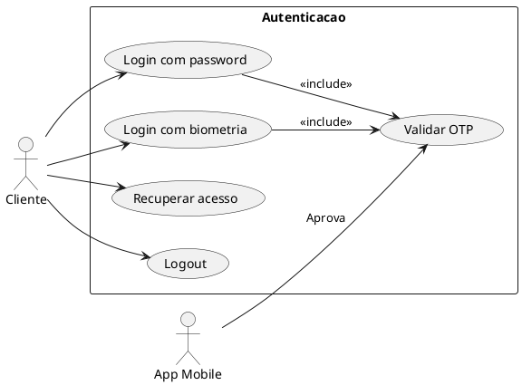
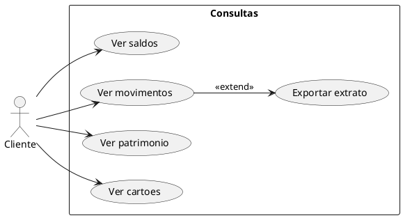
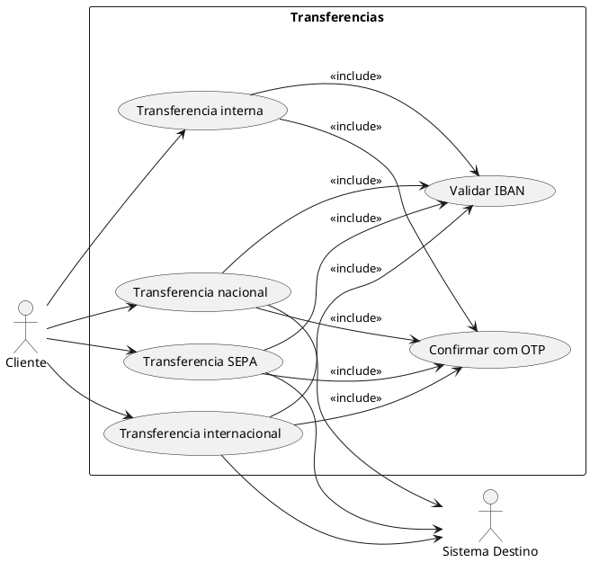
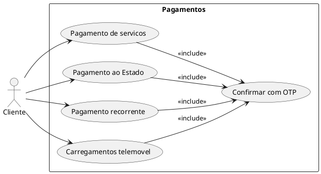
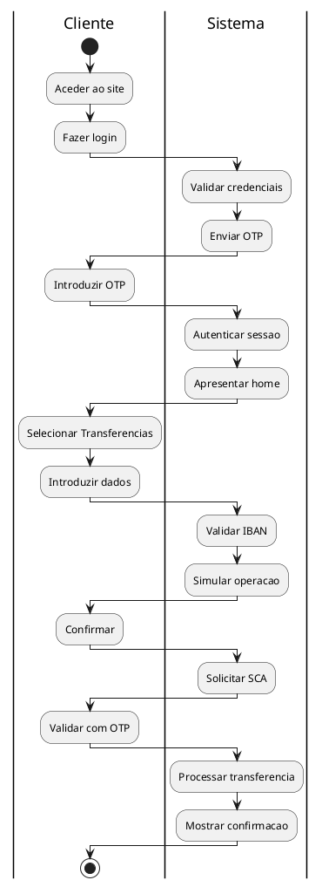
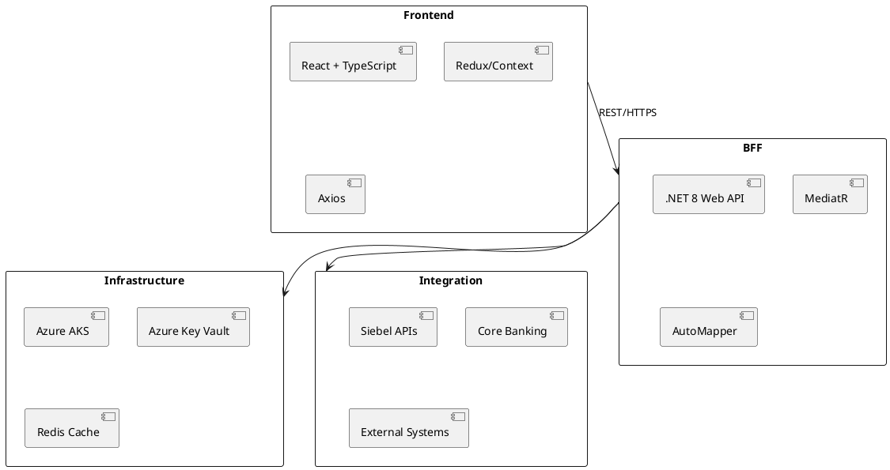

# DEF-03: Casos de Uso e Decisoes Arquiteturais

> **Status:** estrutura
> **Secao relacionada:** 03 - Visao Geral da Solucao

## Contexto

Este documento define os casos de uso principais da plataforma e as decisoes arquiteturais fundamentais.

## Questoes a Responder

1. Quais os casos de uso principais?
R.: Login, Consultas, Transferencias, Pagamentos, Gestao de conta

2. Quais as decisoes arquiteturais fundamentais?
R.: React + C# BFF, AKS, integracao com Siebel

3. Existem trade-offs importantes?
R.: _Pendente_

## Casos de Uso Principais

### UC-01: Autenticacao

### UC-02: Consultas

### UC-03: Transferencias

### UC-04: Pagamentos

## User Journey Maps

### Jornada: Transferencia Nacional

| Fase | Acao do Utilizador | Sistema | Touchpoint |
|------|-------------------|---------|------------|
| 1 | Acede ao homebanking | Apresenta login | Web |
| 2 | Faz login | Valida credenciais | Web |
| 3 | Recebe OTP | Envia SMS | SMS |
| 4 | Introduz OTP | Valida e autentica | Web |
| 5 | Seleciona "Transferencias" | Apresenta opcoes | Web |
| 6 | Escolhe "Nova transferencia" | Apresenta formulario | Web |
| 7 | Introduz IBAN | Valida IBAN, obtem nome | Web |
| 8 | Introduz montante | Simula operacao | Web |
| 9 | Confirma operacao | Solicita OTP | Web |
| 10 | Recebe OTP | Envia SMS | SMS |
| 11 | Introduz OTP | Processa transferencia | Web |
| 12 | Ve confirmacao | Mostra sucesso | Web |

### Diagrama de Jornada

## Decisoes Arquiteturais Fundamentais

### ADR-001: Frontend React

| Aspecto | Decisao |
|---------|---------|
| **Contexto** | Escolha de framework frontend |
| **Decisao** | React com TypeScript |
| **Motivo** | Restricao do cliente (DEF-02), ecossistema maduro, equipa experiente |
| **Consequencias** | Consistencia com outros projetos, grande pool de talento |

### ADR-002: Backend C# .NET

| Aspecto | Decisao |
|---------|---------|
| **Contexto** | Escolha de stack backend |
| **Decisao** | C# com .NET 8 |
| **Motivo** | Restricao do cliente (DEF-02), performance, suporte Microsoft |
| **Consequencias** | Licenciamento, ferramentas Microsoft |

### ADR-003: Padrao BFF

| Aspecto | Decisao |
|---------|---------|
| **Contexto** | Arquitetura de comunicacao frontend-backend |
| **Decisao** | Backend-for-Frontend |
| **Motivo** | Restricao do cliente (DEF-02), orquestracao, seguranca |
| **Consequencias** | Camada adicional, mas melhor separacao de concerns |

### ADR-004: Azure Kubernetes Service

| Aspecto | Decisao |
|---------|---------|
| **Contexto** | Plataforma de deployment |
| **Decisao** | AKS (OpenShift compliant) |
| **Motivo** | Restricao do cliente (DEF-02), cloud-native |
| **Consequencias** | Portabilidade futura para OpenShift |

### ADR-005: OAuth com App Mobile

| Aspecto | Decisao |
|---------|---------|
| **Contexto** | Autenticacao e autorizacao |
| **Decisao** | Mesmo modelo de token do App + autorizacao via App/OTP |
| **Motivo** | Restricao do cliente (DEF-02), consistencia, seguranca |
| **Consequencias** | Dependencia do App Mobile |

### ADR-006: Integracao via Siebel

| Aspecto | Decisao |
|---------|---------|
| **Contexto** | Integracao com Core Banking |
| **Decisao** | Reutilizar APIs Siebel existentes |
| **Motivo** | Restricao do cliente (DEF-02), reutilizacao |
| **Consequencias** | Dependencia do Siebel, consistencia com App |

## Technology Stack

### Visao Geral

### Detalhes

| Camada | Tecnologia | Versao |
|--------|------------|--------|
| Frontend | React | 18+ |
| Frontend | TypeScript | 5+ |
| Backend | .NET | 8 |
| Backend | C# | 12 |
| Container | Docker | Latest |
| Orchestration | Kubernetes | 1.28+ |
| Cloud | Azure | - |
| Cache | Redis | 7+ |

## Trade-offs

| Decisao | Trade-off |
|---------|-----------|
| BFF | + Seguranca, - Latencia adicional |
| Siebel | + Reutilizacao, - Dependencia de sistema legado |
| OAuth App | + Seguranca, - Requer App instalado |
| AKS | + Managed, - Vendor lock-in Azure |

## Decisoes

### Definido

- Stack: React + C# .NET + AKS
- Padrao BFF obrigatorio
- Integracao via APIs Siebel
- Autenticacao vinculada ao App

### Pendentes

- Detalhes de state management frontend
- Estrategia de caching detalhada
- Definicao de bounded contexts

## Referencias

- [SEC-03-visao-geral-solucao.md](../sections/SEC-03-visao-geral-solucao.md)
- [DEF-03-principios-arquiteturais.md](DEF-03-principios-arquiteturais.md)
- [DEF-02-restricoes.md](DEF-02-restricoes.md)
- [DEF-02-requisitos-funcionais.md](DEF-02-requisitos-funcionais.md)
