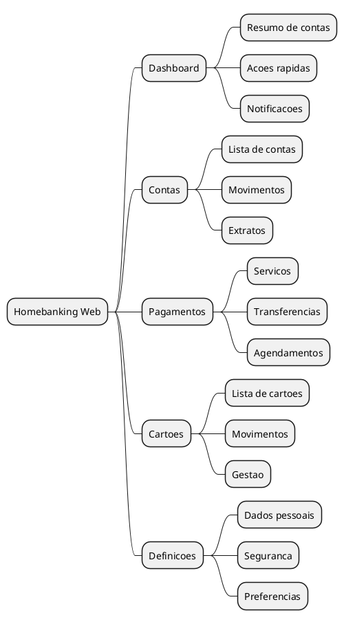

# DEF-04: Experiencia do Utilizador & Arquitetura Frontend

> **Status:** em-progresso
> **Secao relacionada:** 04 - Experiencia Utilizador & Frontend

## Contexto

Este documento define os requisitos de experiencia de utilizador, acessibilidade, arquitetura frontend e padroes de desenvolvimento para a plataforma web de Homebanking.

## Arquitetura de Informacao

### Estrutura Principal



## Acessibilidade - WCAG 2.2 Level AA

### Principios POUR

| Principio | Descricao | Implementacao |
|-----------|-----------|---------------|
| **P**erceivable | Informacao apresentavel de formas percetiveis | Alt text, contraste, legendas |
| **O**perable | Interface operavel por todos | Navegacao teclado, tempo adequado |
| **U**nderstandable | Informacao e operacao compreensiveis | Linguagem clara, comportamento previsivel |
| **R**obust | Conteudo interpretavel por tecnologias assistivas | HTML semantico, ARIA |

### Tecnologias Assistivas Suportadas

| Tecnologia | Requisitos |
|------------|------------|
| Screen readers | NVDA, JAWS, VoiceOver |
| Magnificadores de ecra | Zoom ate 200% sem perda de funcionalidade |
| Navegacao por teclado | Todas as funcoes acessiveis sem rato |
| Voice control | Comandos de voz para navegacao |

### Features de Acessibilidade Obrigatorias

| Feature | Especificacao |
|---------|---------------|
| Alt text em imagens | Descricao significativa de todas as imagens |
| Contraste adequado | Minimo 4.5:1 para texto normal, 3:1 para texto grande |
| Tamanhos de fonte ajustaveis | Suporte a preferencias do browser |
| Estrutura semantica HTML | Uso correto de headings (h1-h6), landmarks |
| Formularios com labels | Labels explicitas associadas a inputs |
| Feedback de erros | Claro, contextual, junto ao campo |
| Skip links | Navegacao rapida para conteudo principal |
| Focus indicators | Indicadores visiveis de foco |

### Testes de Acessibilidade

| Tipo | Ferramentas/Metodo |
|------|-------------------|
| Automatizados | axe-core, Lighthouse, WAVE |
| Manuais - Teclado | Navegacao completa sem rato |
| Manuais - Screen reader | Teste com NVDA/VoiceOver |
| Utilizadores reais | Testes com utilizadores com deficiencia |

## Multi-idioma e Localizacao

### Idiomas Suportados

| Idioma | Codigo | Status |
|--------|--------|--------|
| Portugues | pt-PT | Principal |
| Ingles | en-GB | Secundario |
| Frances | fr-FR | Secundario |

### Gestao de Traducoes

| Aspecto | Especificacao |
|---------|---------------|
| Sistema | Gestao centralizada de traducoes |
| Formato | JSON ou similar para chaves de traducao |
| Fallback | Portugues como idioma por defeito |
| Contexto | Traducoes contextuais para termos ambiguos |

### Formatacao Local

| Elemento | pt-PT | en-GB | fr-FR |
|----------|-------|-------|-------|
| Data | dd/MM/yyyy | dd/MM/yyyy | dd/MM/yyyy |
| Hora | HH:mm | HH:mm | HH:mm |
| Moeda | 1.234,56 EUR | EUR 1,234.56 | 1 234,56 EUR |
| Separador decimal | , | . | , |
| Separador milhares | . | , | (espaco) |

### Fusos Horarios

| Aspecto | Especificacao |
|---------|---------------|
| Servidor | UTC |
| Cliente | Timezone local do browser |
| Armazenamento | Sempre UTC |
| Apresentacao | Convertido para local |

## PWA & Capacidades Offline

### Progressive Web App

| Feature | Implementacao |
|---------|---------------|
| Manifest | Web app manifest para instalacao |
| Service Worker | Cache de assets estaticos |
| HTTPS | Obrigatorio para PWA |
| Responsive | Mobile-first design |

### Capacidades Offline

| Funcionalidade | Offline | Notas |
|----------------|---------|-------|
| Consulta de saldos | Cache | Ultima versao conhecida |
| Consulta de movimentos | Cache | Ultimos N movimentos |
| Transferencias | Nao | Requer conectividade |
| Pagamentos | Nao | Requer conectividade |
| Login | Parcial | Biometria local + sync posterior |

## Design System

### Biblioteca de Componentes

| Categoria | Exemplos |
|-----------|----------|
| Atoms | Botoes, inputs, labels, icons |
| Molecules | Cards, form fields, alerts |
| Organisms | Headers, navigation, forms |
| Templates | Layouts de pagina |
| Pages | Paginas completas |

### Guia de Estilo

| Elemento | Especificacao |
|----------|---------------|
| Cores | Paleta definida com variaveis CSS |
| Tipografia | Font family, sizes, weights |
| Espacamento | Sistema de grid e spacing |
| Sombras | Niveis de elevacao |
| Animacoes | Duracoes e easings padrao |

## Responsividade

### Breakpoints (Mobile-First)

| Nome | Min-width | Dispositivo |
|------|-----------|-------------|
| xs | 0 | Mobile portrait |
| sm | 576px | Mobile landscape |
| md | 768px | Tablet |
| lg | 992px | Desktop |
| xl | 1200px | Desktop large |
| xxl | 1400px | Desktop extra large |

### Estrategia

| Aspecto | Abordagem |
|---------|-----------|
| Design | Mobile-first |
| Grid | Flexbox/CSS Grid |
| Imagens | Responsive images (srcset) |
| Touch | Touch-friendly em mobile |

## Seguranca Frontend

### Content Security Policy (CSP)

```
Content-Security-Policy:
  default-src 'self';
  script-src 'self' 'unsafe-inline';
  style-src 'self' 'unsafe-inline';
  img-src 'self' data: https:;
  font-src 'self';
  connect-src 'self' https://api.example.com;
```

### Protecoes

| Ameaca | Protecao |
|--------|----------|
| XSS | Sanitizacao de inputs, CSP |
| CSRF | Tokens CSRF, SameSite cookies |
| Clickjacking | X-Frame-Options, CSP frame-ancestors |
| Data exposure | Nao armazenar dados sensiveis em localStorage |

### Sanitizacao de Inputs

| Tipo | Metodo |
|------|--------|
| HTML | DOMPurify ou similar |
| URLs | Validacao de schema |
| Dados | Validacao de tipos e formatos |

## Performance Frontend

### Otimizacoes

| Tecnica | Descricao |
|---------|-----------|
| Lazy loading | Carregar componentes on-demand |
| Code splitting | Dividir bundle por rotas |
| Tree shaking | Eliminar codigo nao utilizado |
| Minificacao | Minificar JS, CSS, HTML |
| Compressao | Gzip/Brotli para assets |
| Caching | Cache headers adequados |

### Metricas Alvo (Core Web Vitals)

| Metrica | Alvo | Descricao |
|---------|------|-----------|
| LCP | < 2.5s | Largest Contentful Paint |
| FID | < 100ms | First Input Delay |
| CLS | < 0.1 | Cumulative Layout Shift |
| TTFB | < 800ms | Time to First Byte |

## Gestao de Sessoes Frontend

### Storage de Tokens

| Storage | Uso | Seguranca |
|---------|-----|-----------|
| sessionStorage | Token de sessao | Mais seguro, limpa ao fechar |
| localStorage | Nao recomendado para tokens | Vulneravel a XSS |
| HttpOnly Cookie | Refresh token | Mais seguro |
| Memory | Access token | Mais seguro, perde ao refresh |

### Renovacao Automatica

| Aspecto | Especificacao |
|---------|---------------|
| Trigger | Token proximo de expirar |
| Metodo | Silent refresh via iframe ou fetch |
| Fallback | Redirect para login se falhar |

### Timeout Handling

| Evento | Acao |
|--------|------|
| Inatividade (10 min) | Warning ao utilizador |
| Inatividade (15 min) | Logout automatico |
| Token expirado | Tentativa de refresh |
| Refresh falhou | Redirect para login |

## Decisoes

### Definido

- WCAG 2.2 Level AA obrigatorio
- PWA com capacidades offline para consultas
- Mobile-first responsive design
- Suporte PT/EN/FR

### Pendentes

- Selecao de framework CSS (Bootstrap, Tailwind, custom)
- Biblioteca de componentes (Material UI, Ant Design, custom)
- Estrategia de state management
- Ferramenta de traducoes

## Referencias

- [SEC-04-experiencia-utilizador-frontend.md](../sections/SEC-04-experiencia-utilizador-frontend.md)
- WCAG 2.2 Guidelines: https://www.w3.org/TR/WCAG22/
- Core Web Vitals: https://web.dev/vitals/
