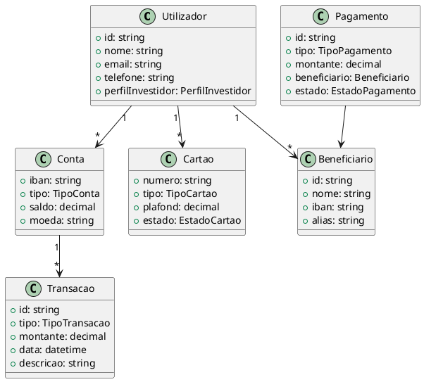
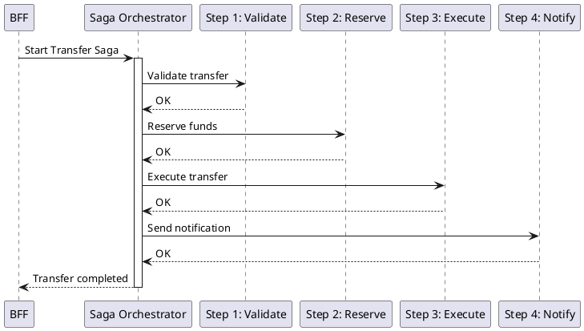

# DEF-05: Arquitetura Backend & Servicos

> **Status:** completo
> **Secao relacionada:** 05 - Arquitetura Backend & Servicos

## Contexto

Este documento define a arquitetura de backend, decomposicao de servicos, padroes BFF, modelo de dominio e estrategias de resiliencia.

## Questoes a Responder

1. Qual a decomposicao de servicos da aplicacao?
R.: Autenticacao, Contas, Pagamentos, Cartoes, Notificacoes, outros

2. Qual o padrao de arquitetura API?
R.: REST com versionamento semantico (v1, v2) na URL

3. Como funciona o BFF?
R.: Orquestracao de chamadas, agregacao de dados, gestao de sessoes

4. Quais padroes de comunicacao?
R.: Sincronos (HTTP/REST) e assincronos (event-driven)

5. Quais padroes de design serao utilizados?
R.: CQRS, MediatR, Saga, Repository, Factory, Strategy

## Decomposicao de Servicos

### Servicos Identificados

| Servico | Responsabilidade | Dependencias |
|---------|------------------|--------------|
| Autenticacao | Login, logout, MFA, tokens | Siebel, Cofre de chaves |
| Contas | Saldos, movimentos, extratos | Core Banking |
| Pagamentos | Transferencias, servicos, Estado | Core Banking, SIBS |
| Cartoes | Gestao de cartoes, movimentos | Core Banking, Visa |
| Notificacoes | Push, email, SMS | Firebase, fornecedor SMS |
| Investimentos | Acoes, fundos, ETFs | Core Banking |
| Poupanca | DPs, PPR, Objetivos | Core Banking |
| Credito | Habitacao, pessoal, margem | Core Banking |
| Beneficiarios | Gestao de beneficiarios | Core Banking |
| Perfil | Dados pessoais, preferencias | Siebel |

### Diagrama de Servicos

```plantuml
@startuml
!include https://raw.githubusercontent.com/plantuml-stdlib/C4-PlantUML/master/C4_Container.puml

LAYOUT_WITH_LEGEND()

Person(user, "Cliente", "Utilizador do Homebanking")

System_Boundary(web, "Homebanking Web") {
    Container(spa, "SPA React", "React", "Interface web")
    Container(bff, "BFF", "C# .NET", "Backend-for-Frontend")

    Container(authSvc, "Auth Service", "C#", "Autenticacao")
    Container(accountSvc, "Account Service", "C#", "Contas")
    Container(paymentSvc, "Payment Service", "C#", "Pagamentos")
    Container(cardSvc, "Card Service", "C#", "Cartoes")
    Container(notifSvc, "Notification Service", "C#", "Notificacoes")
}

System_Ext(siebel, "Siebel", "Sistema core")
System_Ext(coreBanking, "Core Banking", "Oracle")

Rel(user, spa, "Usa", "HTTPS")
Rel(spa, bff, "Chama", "REST/HTTPS")
Rel(bff, authSvc, "Orquestra")
Rel(bff, accountSvc, "Orquestra")
Rel(bff, paymentSvc, "Orquestra")
Rel(bff, cardSvc, "Orquestra")
Rel(bff, notifSvc, "Orquestra")

Rel(authSvc, siebel, "Autentica")
Rel(accountSvc, coreBanking, "Consulta")
Rel(paymentSvc, coreBanking, "Opera")
Rel(cardSvc, coreBanking, "Gere")

@enduml
```

## Arquitetura API

### Versionamento

| Aspecto | Especificacao |
|---------|---------------|
| Estrategia | URL path versioning |
| Formato | `/api/v{major}/{resource}` |
| Exemplo | `/api/v1/accounts`, `/api/v2/accounts` |
| Deprecation | Minimo 6 meses de aviso |

### Especificacao

| Aspecto | Especificacao |
|---------|---------------|
| Formato | OpenAPI 3.0 / Swagger |
| Documentacao | Swagger UI |
| Validacao | Schemas JSON |

## Arquitetura BFF (Backend-for-Frontend)

### Responsabilidades

| Responsabilidade | Descricao |
|------------------|-----------|
| Orquestracao | Chamadas a multiplos servicos backend |
| Agregacao | Combinacao de dados de diferentes fontes |
| Transformacao | Adaptacao de dados para o frontend |
| Protecao | Isolar frontend de mudancas nas APIs |
| Sessao | Gestao de sessoes e tokens no servidor |

### Diagrama BFF

```plantuml
@startuml
participant "React SPA" as SPA
participant "BFF" as BFF
participant "Auth Service" as Auth
participant "Account Service" as Account
participant "Card Service" as Card

SPA -> BFF: GET /api/v1/home
activate BFF

BFF -> Auth: Validate token
Auth --> BFF: OK

par Parallel calls
    BFF -> Account: GET /accounts
    Account --> BFF: Accounts data
and
    BFF -> Account: GET /movements
    Account --> BFF: Movements data
and
    BFF -> Card: GET /cards
    Card --> BFF: Cards data
end

BFF -> BFF: Aggregate & Transform

BFF --> SPA: Home data (aggregated)
deactivate BFF
@enduml
```

## Comunicacao

### Padroes Sincronos

| Protocolo | Uso |
|-----------|-----|
| HTTP/REST | Comunicacao principal |
| gRPC | Comunicacao interna (opcional) |

### Padroes Assincronos

| Tecnologia | Uso | Status |
|------------|-----|--------|
| RabbitMQ | Event-driven messaging | Opcao principal |
| NATS | Messaging leve | Alternativa |
| Azure Service Bus | Cloud-native (Azure) | Alternativa |

> **Nota:** Event catalog a ser criado caso haja arquitectura event-driven (eventos publicados/consumidos, schemas, brokers).

## Modelo de Dominio

### Entidades Principais



## Resiliencia

### Circuit Breaker

| Parametro | Valor Sugerido |
|-----------|----------------|
| Failure threshold | 5 falhas |
| Success threshold | 3 sucessos |
| Timeout | 30 segundos |
| Half-open requests | 3 |

### Retry Policies

| Cenario | Politica |
|---------|----------|
| Transient errors | Exponential backoff (3 retries) |
| Network timeout | Immediate retry (1 retry) |
| Rate limiting | Fixed delay (429 status) |

### Timeout Strategies

| Operacao | Timeout |
|----------|---------|
| Leitura simples | 5s |
| Leitura agregada | 15s |
| Escrita/Transacao | 30s |
| Batch operations | 60s |

### Bulkhead Isolation

Isolamento de recursos por servico para evitar cascading failures.

## Rate Limiting

### Configuracao

| Nivel | Limite | Janela |
|-------|--------|--------|
| Por utilizador | 100 req | 1 minuto |
| Por API key | 1000 req | 1 minuto |
| Por IP | 50 req | 1 minuto |
| Global | 10000 req | 1 minuto |

## Padroes de Design

### CQRS (Command Query Responsibility Segregation)

| Tipo | Implementacao |
|------|---------------|
| Commands | MediatR IRequest<TResponse> |
| Queries | MediatR IRequest<TResponse> |
| Handlers | IRequestHandler<TRequest, TResponse> |

### Saga Pattern

Para orquestracao de transacoes distribuidas (ex: transferencias).

| Componente | Responsabilidade |
|------------|------------------|
| Saga Orchestrator | Coordena a sequencia de passos |
| Steps | Passos atomicos da operacao |
| Compensation | Rollback em caso de falha |



### Outros Padroes

| Padrao | Uso |
|--------|-----|
| Repository | Acesso a dados |
| Factory | Criacao de objetos complexos |
| Strategy | Logica de negocio variavel |
| Decorator | Cross-cutting concerns |

## Decisoes

### Definido

- REST com versionamento semantico na URL (v1, v2)
- BFF para orquestracao, agregacao e protecao contra mudancas
- CQRS com MediatR (separacao Commands/Queries)
- Saga para orquestracao + Steps para passos atomicos
- OpenAPI 3.0/Swagger para especificacao e documentacao
- Repository, Factory, Strategy para objetos auxiliares
- Servicos: Autenticacao, Contas, Pagamentos, Cartoes, Notificacoes

### Pendentes

- Tecnologia de messaging assincrono (RabbitMQ/NATS/Azure Service Bus)
- Service mesh (Istio/Linkerd) - a confirmar necessidade

## Referencias

- [SEC-05-arquitetura-backend-servicos.md](../sections/SEC-05-arquitetura-backend-servicos.md)
- [DEF-05-padroes-api.md](DEF-05-padroes-api.md)
- [DEF-02-restricoes.md](DEF-02-restricoes.md)
