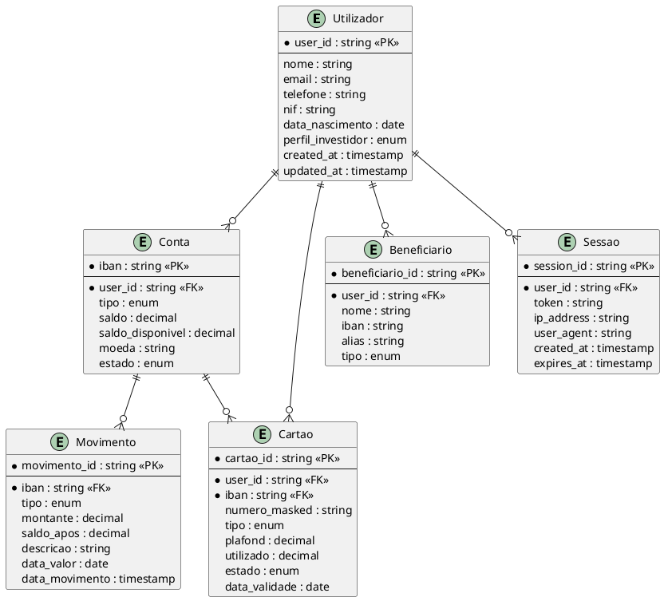

# DEF-06: Modelo e Arquitetura de Dados

> **Status:** estrutura
> **Secao relacionada:** 06 - Arquitetura de Dados

## Contexto

Este documento define o modelo de dados, estrategias de armazenamento, encriptacao, retencao e conformidade RGPD.

## Questoes a Responder

1. Qual o modelo de dados da aplicacao?
R.: _Pendente - baseado no modelo do App Mobile_

2. Quais bases de dados serao utilizadas?
R.: _Pendente_

3. Qual a estrategia de encriptacao?
R.: AES-256 em repouso, TLS 1.3 em transito (ver DEF-02-restricoes)

4. Qual a politica de retencao de dados?
R.: _Pendente - depende de requisitos regulatorios_

5. Como garantir conformidade RGPD?
R.: _Pendente_

## Modelo de Dados

### Entidades Principais

| Entidade | Descricao | Fonte |
|----------|-----------|-------|
| Utilizador | Dados do cliente | Siebel |
| Conta | Contas bancarias | Core Banking |
| Movimento | Transacoes | Core Banking |
| Cartao | Cartoes debito/credito | Core Banking |
| Beneficiario | Beneficiarios guardados | Siebel |
| Pagamento | Pagamentos realizados | Core Banking |
| Notificacao | Mensagens/alertas | Backoffice |

### ERD (Entity Relationship Diagram)

## Armazenamento

### Estrategia por Tipo de Dados

| Tipo de Dados | Storage | Tecnologia |
|---------------|---------|------------|
| Dados transacionais | Core Banking | Oracle (existente) |
| Dados de sessao | Cache | Redis |
| Dados de configuracao | Config Store | Azure App Configuration |
| Ficheiros/Documentos | Blob Storage | Azure Blob |
| Logs | Log Storage | Azure Monitor / ELK |

### Bases de Dados

| Base de Dados | Proposito | Tipo |
|---------------|-----------|------|
| Core Banking | Dados bancarios | Oracle (existente) |
| Siebel | CRM/Cliente | IBM (existente) |
| Cache | Sessoes, cache | Redis |
| Aplicacional | Dados da app | _A definir_ |

## Encriptacao

### Em Repouso (At Rest)

| Dados | Algoritmo | Key Management |
|-------|-----------|----------------|
| PII | AES-256 | Azure Key Vault |
| Financeiros | AES-256 | Azure Key Vault |
| Sessoes | AES-256 | Azure Key Vault |

### Em Transito (In Transit)

| Canal | Protocolo | Versao Minima |
|-------|-----------|---------------|
| Cliente-Servidor | TLS | 1.3 |
| Servidor-Servidor | mTLS | 1.3 |
| BD connections | TLS | 1.2+ |

### Field-Level Encryption

| Campo | Encriptacao |
|-------|-------------|
| NIF | Sim |
| Numero cartao | Sim (tokenizado) |
| Password | Hash (bcrypt/Argon2) |
| Token biometrico | Sim |

## Retencao de Dados

### Politica por Categoria

| Categoria | Retencao | Justificacao |
|-----------|----------|--------------|
| Transacoes | 10 anos | Requisito legal |
| Logs de acesso | 2 anos | Seguranca |
| Sessoes | 30 dias | Operacional |
| Dados pessoais | Ate pedido de eliminacao | RGPD |
| Logs de erro | 90 dias | Troubleshooting |

## Backup & Restore

### Estrategia

| Componente | Frequencia | Retencao | RTO | RPO |
|------------|------------|----------|-----|-----|
| Core Banking | Continuo | 30 dias | _Pendente_ | _Pendente_ |
| Cache (Redis) | N/A | N/A | N/A | N/A |
| Blobs | Diario | 30 dias | _Pendente_ | _Pendente_ |
| Configuracao | Por alteracao | Ilimitado | _Pendente_ | _Pendente_ |

## RGPD - Conformidade

### Direitos dos Titulares

| Direito | Implementacao |
|---------|---------------|
| Acesso | Export de dados pessoais |
| Retificacao | Alteracao via perfil |
| Eliminacao | Processo de right to be forgotten |
| Portabilidade | Export em formato standard |
| Oposicao | Gestao de consentimentos |

### Procedimentos

| Procedimento | Prazo | Responsavel |
|--------------|-------|-------------|
| Pedido de acesso | 30 dias | DPO |
| Pedido de eliminacao | 30 dias | DPO + TI |
| Breach notification | 72 horas | DPO + Seguranca |

## Classificacao de Dados

| Classificacao | Exemplos | Controlos |
|---------------|----------|-----------|
| Publico | FAQs, taxas | Nenhum especial |
| Interno | Logs, configs | Acesso restrito |
| Confidencial | Saldos, movimentos | Encriptacao, audit |
| Restrito | NIF, passwords | Encriptacao forte, MFA |

## Anonimizacao/Pseudonimizacao

### Tecnicas

| Tecnica | Uso |
|---------|-----|
| Tokenizacao | Numeros de cartao |
| Mascaramento | Visualizacao de dados |
| Hashing | Identificadores unicos |
| Generalizacao | Analytics |

## Decisoes

### Definido

- Encriptacao AES-256 em repouso
- TLS 1.3 em transito
- Azure Key Vault para gestao de chaves

### Pendentes

- Base de dados aplicacional
- Politica de retencao detalhada
- RTO/RPO por componente
- Procedimentos RGPD detalhados

## Referencias

- [SEC-06-arquitetura-dados.md](../sections/SEC-06-arquitetura-dados.md)
- [DEF-02-restricoes.md](DEF-02-restricoes.md) - Encriptacao
- [DEF-08-seguranca-dados-sensiveis.md](DEF-08-seguranca-dados-sensiveis.md)
- RGPD - Regulamento Geral de Protecao de Dados
