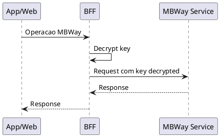

# DEF-08: Seguranca de Dados Sensiveis

> **Status:** em-progresso
> **Secao relacionada:** 08 - Seguranca

## Contexto

Este documento define as regras de seguranca para tratamento de dados sensiveis, incluindo mascaramento de informacao e encriptacao.

## Questoes a Responder

1. Como sao mascarados os numeros de cartao?
R.: Mascaramento para nao mostrar dados em claro

2. Como e feita a encriptacao/desencriptacao de chaves MBWay?
R.: Acao especifica para desencriptar codigos MBWay

3. Quais outros dados sensiveis requerem tratamento especial?
R.: _Pendente levantamento completo_

4. Quais algoritmos de encriptacao sao utilizados?
R.: _Pendente_ (ver restricoes: AES-256 para dados em repouso)

## Mascaramento de Dados

### Numeros de Cartao

| Aspecto | Especificacao |
|---------|---------------|
| Proposito | Nao mostrar dados em claro |
| Formato mascarado | `**** **** **** 1234` (ultimos 4 digitos visiveis) |
| Aplicacao | UI, logs, exports |

### Regras de Mascaramento

| Tipo de Dado | Regra | Exemplo |
|--------------|-------|---------|
| Numero cartao (16 digitos) | Mostrar apenas ultimos 4 | `**** **** **** 1234` |
| IBAN | Mostrar apenas ultimos 4 | `PT50 **** **** **** **34` |
| NIF | Mascarar digitos centrais | `1**.**5**-0` |
| Telemovel | Mascarar digitos centrais | `91* *** *78` |
| **Telemovel de Seguranca** | **Vem mascarado da API** | `9XX XXX X78` |

**Nota:** O telemóvel de segurança (utilizado para OTP/validações) já vem mascarado/escondido nas respostas das APIs do backend.

## Encriptacao MBWay

### Decrypt da Key do MBWay

| Aspecto | Especificacao |
|---------|---------------|
| Operacao | Desencriptar codigos do MBWay |
| Contexto | Operacoes MBWay que requerem chave |
| Algoritmo | _Pendente documentacao_ |

### Fluxo de Encriptacao

## Dados Sensiveis Identificados

### Categorias de Dados

| Categoria | Exemplos | Tratamento |
|-----------|----------|------------|
| PII (Personally Identifiable Information) | Nome, NIF, morada | Encriptacao em repouso |
| Dados financeiros | Saldos, movimentos | Encriptacao em transito e repouso |
| Credenciais | Passwords, PINs, tokens | Hash/Encriptacao forte |
| Dados de cartao | PAN, CVV, validade | PCI-DSS compliance |

### Conformidade Regulatoria

| Regulamento | Requisitos | Status |
|-------------|------------|--------|
| RGPD | Protecao de dados pessoais | Obrigatorio |
| PCI-DSS | Dados de cartao | Obrigatorio |
| PSD2 | Autenticacao e seguranca | Obrigatorio |

## Padroes de Encriptacao

### Definidos nas Restricoes (DEF-02)

| Contexto | Algoritmo | Referencia |
|----------|-----------|------------|
| Em transito | TLS 1.3 | RST-SEC-001 |
| Em repouso | AES-256 | RST-SEC-002 |

## Decisoes

### Implementado

- Mascaramento de numeros de cartao
- Desencriptacao de chaves MBWay

### Pendentes de Documentacao

- Algoritmo especifico para MBWay keys
- Regras completas de mascaramento por tipo de dado
- Politica de retencao de dados sensiveis
- Procedimentos de key rotation

## Referencias

- [SEC-08-seguranca.md](../sections/SEC-08-seguranca.md)
- [DEF-02-restricoes.md](DEF-02-restricoes.md) - Restricoes de seguranca
- RGPD - Regulamento Geral de Protecao de Dados
- PCI-DSS - Payment Card Industry Data Security Standard
