# DEF-09: Fluxo de Transferencia

> **Status:** em-progresso
> **Secao relacionada:** 09 - Integracao & Interfaces Externas

## Contexto

Este documento detalha o fluxo completo de uma transferencia bancaria, incluindo autenticacao, validacao de IBAN, simulacao e confirmacao via OTP.

## Diagrama de Fluxo Completo

```plantuml
@startuml
title Fluxo Transferencia - Login e Operacao

actor Utilizador
participant "App UI" as UI
participant "App Business" as BUS
participant "App Cache" as CACHE
participant "API PSD2" as ApiPsd2

== Login ==

Utilizador -> UI : Abre APP
note over UI : Ecra de login

UI --> BUS : Dados de acesso?
BUS --> CACHE : Dados de acesso?
CACHE --> BUS : Token Biometrico

BUS --> UI : Avanca
Utilizador -> UI : Preenche pass ou usa biometria
UI --> BUS : Acesso com biometria

note over BUS : Gera authorization anonimo

BUS -> ApiPsd2 : Authentication_checkLogin (AUT_004)
note right of BUS
Request:
- user, pass ou token bio
- encrypt, device_id
- app_version, so_id
- OAuth headers
end note

ApiPsd2 --> BUS : returnCode=0, apiToken

alt needStrongAuthentication = Y
    BUS --> UI : Pede OTP
    UI -> BUS : Envia OTP
    BUS -> ApiPsd2 : Login secure
    ApiPsd2 --> BUS : Confirma
end

BUS --> CACHE : Obter dados da home
CACHE -> ApiPsd2 : APIs de contexto
note right of CACHE
- Client_getClientInformation
- Account_getAccounts
- Statement_getUserStatement
- CCards_getCreditCards
- DCards_getDebitCards
- Message_getInboxMessage
end note

ApiPsd2 --> BUS : Dados
BUS --> UI : Dados
note over UI : Home

== Transferencia ==

note over UI
Ecra selecao:
- IBAN / Conta
- SPIN
- MBWay
end note

Utilizador -> UI : Opcao IBAN
BUS -> ApiPsd2 : API de beneficiarios
ApiPsd2 --> BUS : Lista de beneficiarios
BUS --> UI : Lista de beneficiarios

note over UI
Ecra entrada:
- IBAN
- Beneficiario
- Conta
end note

Utilizador -> UI : Introduz IBAN
UI -> BUS : IBAN ou Beneficiario

note over BUS
Validacao IBAN:
- Biblioteca org.apache.IBAN
- Classificacao: Nacional / Inter / SEPA
- Associacao a logo/bandeira
end note

alt IBAN Nacional (PT50 + banco 0065)
    BUS -> ApiPsd2 : API COPS (transferencia interna)
    ApiPsd2 --> BUS : Nome titular
else IBAN Nacional (outro banco)
    BUS -> ApiPsd2 : API Inter-bancaria
    ApiPsd2 --> BUS : Nome titular
else IBAN Internacional SEPA
    BUS -> ApiPsd2 : API SEPA
    ApiPsd2 --> BUS : Resposta SEPA
    BUS -> ApiPsd2 : API VOP (verificacao)
    ApiPsd2 --> BUS : Confirma / Aviso
end

BUS --> UI : Nome titular
note over UI : Mostra nome e pede confirmacao

note over UI : Pede montante
UI -> BUS : Envia montante
BUS -> ApiPsd2 : Simulacao
ApiPsd2 --> BUS : Valores simulacao (taxas, total)
BUS --> UI : Valores simulacao

note over UI : Ecra sumario

Utilizador -> UI : Confirma transacao
UI -> BUS : Confirma transacao

BUS -> ApiPsd2 : API Transferencia
note right of BUS
Request:
- home_account_number
- destination_iban
- destination_name
- amount, description
- transfer_type
- beneficiary_id
end note

ApiPsd2 --> BUS : object_id, auth_seq
BUS --> UI : Pede OTP

Utilizador -> UI : Introduz OTP
UI -> BUS : Envia OTP

BUS -> ApiPsd2 : Secure confirm (object_id, auth_type, auth_value)
ApiPsd2 --> BUS : Confirma operacao

note over UI : Ecra sucesso

@enduml
```



## Componentes do Fluxo

### Fase 1: Login e Autenticacao

| Passo | Componente | Descricao |
|-------|------------|-----------|
| 1 | App UI | Ecra de login apresentado |
| 2 | App Cache | Verificacao de token biometrico armazenado |
| 3 | App Business | Geracao de authorization anonimo |
| 4 | API PSD2 | Authentication_checkLogin (AUT_004) |
| 5 | App Business | Avaliacao de flags de resposta |
| 6 | API PSD2 | Login secure (se OTP necessario) |

### Fase 2: Carregamento de Contexto

APIs chamadas apos login para popular a Home:

| API | Descricao |
|-----|-----------|
| Client_getClientInformation | Nome e dados do cliente |
| Client_getClientContact | Contactos |
| SIBS_getConsentStatus | Estado consentimento PSD2 |
| SIBS_getConsentAccount | Contas PSD2 |
| Objective_getClientObjectives | Avisos de objetivos |
| Devices_getDevices | Dispositivos registados |
| MIFID_getInvestorProfile | Perfil do investidor |
| Schedule_getSchedules | Agendamentos |
| Permanent_getPermanentOrders | Ordens permanentes |
| CorpAction_getOngoingClosedCA | Operacoes corporativas |
| Operation_getOperationConfirmation | Operacoes pendentes |
| Account_getMovements | Movimentos de contas |
| Account_getAccounts | Lista de contas |
| CCards_getCreditCards | Cartoes de credito |
| DCards_getDebitCards | Cartoes de debito |
| Message_getInboxMessage | Mensagens |
| Statement_getUserStatement | Patrimonio |

### Fase 3: Transferencia

| Passo | API | Descricao |
|-------|-----|-----------|
| 1 | API Beneficiarios | Obter lista de beneficiarios guardados |
| 2 | Validacao local | Biblioteca org.apache.IBAN |
| 3 | API COPS / SEPA / Inter | Conforme tipo de transferencia |
| 4 | API VOP | Verificacao de nome (SEPA) |
| 5 | API Simulacao | Calculo de taxas e total |
| 6 | API Transferencia | Submissao da operacao |
| 7 | API Secure Confirm | Confirmacao com OTP |

## Detalhes de Autenticacao

### Request Authentication_checkLogin

```json
{
    "user": "5.9.85.7.4.0.5.82",
    "pass": "",
    "token": "98.110.54.101.115.111",
    "encrypt": "Y",
    "device_id": "Device Id 3",
    "app_version": "1.0",
    "so_id": "2"
}
```

Header OAuth:
```
Authorization: OAuth access_token={{access_token_anonimo}},
                      oauth_consumer_key={{client_token}},
                      oauth_timestamp={{timestamp}},
                      oauth_version={{version}},
                      oauth_signature={{assinatura}},
                      oauth_guid={{GUID}}
```

### Response Authentication_checkLogin

```json
{
    "returnCode": "0",
    "returnMsg": "Sucesso",
    "outputData": {
        "apiToken": "914e55d8ea3b4e19b1aa63c9efbad2ba",
        "mustChangePassword": "N",
        "needStrongAuthentication": "N",
        "firstLogin": "N",
        "otp_id": null,
    }
}
```

### Flags de Resposta

| Flag | Descricao | Acao |
|------|-----------|------|
| mustChangePassword | Alteracao de password obrigatoria | Ativar fluxo de alteracao |
| needStrongAuthentication | OTP necessario | Solicitar OTP, usar otp_id |
| firstLogin | Primeiro acesso | Ativar preferencias iniciais |

### Tokens

| Token | Utilizacao |
|-------|------------|
| apiToken | Token de acesso para pedidos subsequentes |

## Request Transferencia

```json
{
    "home_account_number": "conta_origem",
    "destination_iban": "PT50006500001234567890134",
    "destination_name": "Nome Destinatario",
    "amount": "100.00",
    "description": "Descricao",
    "destination_email": "email@example.com",
    "destination_phone": "912345678",
    "transfer_type": "NATIONAL",
    "beneficiary_id": "id_beneficiario"
}
```

## Response Transferencia

```json
{
    "outputData": {
        "authentication": "1,2,3",
        "auth_seq": "136",
        "object_id": "1-4EEJB0"
    },
    "returnCode": "0",
    "returnMsg": "Sucesso"
}
```

## Geracao de Assinatura OAuth

| Passo | Operacao |
|-------|----------|
| 1 | Gerar GUID |
| 2 | Gerar timestamp |
| 3 | Construir base_string |
| 4 | HMAC SHA256 com consumer_secret |
| 5 | Encode Base64 |
| 6 | URL Encode |

```
base_string: access_token%26oauth_consumer_key%26oauth_guid%26oauth_timestamp%26oauth_version%26oauth_consumer_secret
signature: encodeURIComponent(base64(hmac_sha256(base_string, consumer_secret)))
```

## Pendentes de Documentacao

- Fluxo completo de recolha de chaves do cofre
- Chamadas a API do Backoffice de gestao
- Fluxos de erro e recuperacao
- Timeout e retry policies

## Referencias

- [SEC-09-integracao-interfaces-externas.md](../sections/SEC-09-integracao-interfaces-externas.md)
- [DEF-09-regras-transferencias.md](DEF-09-regras-transferencias.md)
- [DEF-07-authentication-oauth-flow.md](DEF-07-authentication-oauth-flow.md)
