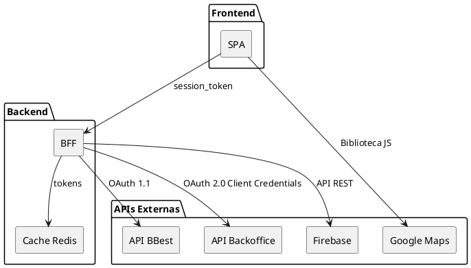
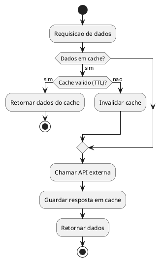

# DEF-09: Catalogo de Integracoes Externas

> **Status:** estrutura
> **Secao relacionada:** 09 - Integracao & Interfaces Externas

## Contexto

Este documento cataloga as integracoes externas da plataforma de Homebanking, incluindo APIs do Backoffice, APIs BBest e outros sistemas.

## Questoes a Responder

1. Quais sao todas as APIs externas consumidas pela plataforma?
R.: Existem mais de 400 APIs. Não é viável detalhar todas neste documento - serão documentadas conforme necessidade.

2. Qual o modelo de autenticacao para cada API?
R.: Existem 3 modelos de autenticação:
   - **Anónimo:** Para listas de valores (dropdowns, combos)
   - **OAuth 1.1:** Para APIs BBest (já descrito)
   - **OAuth 2.0 Client Credentials:** Para APIs do Backoffice de Gestão

3. Quais sao os SLAs esperados por integracao?
_A questionar_

4. Qual a estrategia de fallback para cada integracao critica?
_A questionar_

5. Quais APIs requerem configuracao de rate limiting?
_A questionar_

---

## Sistemas Integrados

### Visao Geral



---

## API BBest (Core Banking)

### Autenticacao

| Aspecto | Valor |
|---------|-------|
| Protocolo | OAuth 1.1 |
| Tokens Pre-Login | access_token_anonimo, consumer_key, secret_key |
| Tokens Pos-Login | apiToken |

### APIs Identificadas

| API | Endpoint | Descricao | Fase |
|-----|----------|-----------|------|
| Authentication_checkLogin | AUT_004 | Autenticacao inicial | Login |
| Client_getClientInformation | _Pendente_ | Dados do cliente | Home |
| Client_getClientContact | _Pendente_ | Contactos do cliente | Home |
| Account_getAccounts | _Pendente_ | Lista de contas | Home |
| Account_getMovements | _Pendente_ | Movimentos de contas | Home |
| CCards_getCreditCards | _Pendente_ | Cartoes de credito | Home |
| DCards_getDebitCards | _Pendente_ | Cartoes de debito | Home |
| Statement_getUserStatement | _Pendente_ | Patrimonio | Home |
| Message_getInboxMessage | _Pendente_ | Mensagens | Home |
| Devices_getDevices | _Pendente_ | Dispositivos registados | Home |
| MIFID_getInvestorProfile | _Pendente_ | Perfil investidor | Home |
| Schedule_getSchedules | _Pendente_ | Agendamentos | Home |
| Permanent_getPermanentOrders | _Pendente_ | Ordens permanentes | Home |
| CorpAction_getOngoingClosedCA | _Pendente_ | Operacoes corporativas | Home |
| Operation_getOperationConfirmation | _Pendente_ | Operacoes pendentes | Home |
| Objective_getClientObjectives | _Pendente_ | Avisos de objetivos | Home |
| API Beneficiarios | _Pendente_ | Lista de beneficiarios | Transferencia |
| API COPS | _Pendente_ | Nome titular (nacional) | Transferencia |
| API VOP | _Pendente_ | Verificacao nome (SEPA) | Transferencia |
| API Simulacao | _Pendente_ | Simulacao transferencia | Transferencia |
| API Transferencia | _Pendente_ | Execucao transferencia | Transferencia |
| Secure Confirm | _Pendente_ | Confirmacao OTP | Transferencia |

---

## API Backoffice (NextReality CMS)

### Autenticacao

| Aspecto | Valor |
|---------|-------|
| Protocolo | OAuth 2.0 |
| Grant Type | Client Credentials |
| Tokens | access_token (Bearer) |

### Configuracao

| Parametro | Descricao | Valor |
|-----------|-----------|-------|
| Token_Endpoint | URL para obter token | _Pendente_ |
| clientid | ID do cliente OAuth | _Pendente_ |
| client_secret | Segredo do cliente | _Pendente (vault)_ |
| ClientScopes | Escopos autorizados | _Pendente_ |
| authorizationpoint | Endpoint de autorizacao | _Pendente_ |

### APIs Identificadas

| API | Descricao | Exemplo de Uso |
|-----|-----------|----------------|
| Noticias | Conteudo noticioso | Home |
| Novidades | Novidades do banco | Home |
| Alertas | Alertas ao utilizador | Home |
| Publicidades | Cards promocionais | Home |

### Exemplo de Response (Publicidades)

```json
{
  "data": [
    {
      "id": 113,
      "title": ".",
      "page": "Home",
      "type": "Card",
      "profile": "Both",
      "activeStatus": "Active",
      "startDate": "2025-02-20T12:07:05.000+00:00",
      "mainIMGURL": "https://bancobestcmstorage.blob.core.windows.net/...",
      "mainIMGMimeType": "image/png",
      "labelTextColor": "#FFFFFF",
      "titleTextColor": "#1d19ff",
      "subtitleTextColor": "#1d19ff",
      "buttonTextColor": "#1d19ff",
      "order": 2,
      "version": "8DD67AB1025CAD3"
    }
  ],
  "paging": {
    "pageNumber": 1,
    "pageSize": 15000,
    "pageCount": 1,
    "totalRecordCount": 46
  }
}
```

---

## Sistemas Externos

### Catalogo de Integracoes

| Sistema | Protocolo | Descricao | Usado no Site |
|---------|-----------|-----------|---------------|
| Seguros | API REST / HTTPS | Produto de consulta e subscrição | Sim |
| BTP | API REST / HTTPS | Produto de consulta e subscrição | Sim |
| MBWay | - | Pagamentos móveis | **Não** |
| Visa | - | Serviços de cartão | **Não** |
| Firebase | API REST | Registo de estatísticas de acesso | Sim |
| Google Maps | Biblioteca JS | Fornece mapas para consulta (ATMs, Balcões) | Sim |

### Notas

- **MBWay e Visa** não serão integrados no WebSite (funcionalidades exclusivas do App Mobile)
- **Firebase** utilizado para analytics e estatísticas de uso
- **Google Maps** integrado via biblioteca JavaScript para localização de pontos de atendimento

---

## Estrategia de Cache

### Padrao "Cache or API"



### TTLs por Tipo de Dado

| Tipo de Dado | TTL Sugerido | Justificativa |
|--------------|--------------|---------------|
| Dados do cliente | 24h | Baixa frequencia de alteracao |
| Saldo de contas | 1-5 min | Pode alterar frequentemente |
| Movimentos | 5 min | Novas transacoes possiveis |
| Publicidades | 1h | Conteudo gerido por CMS |
| Noticias | 30 min | Conteudo noticioso |

---

## Pendentes de Documentacao

| Topico | Estado |
|--------|--------|
| Endpoints completos API BBest | _Pendente_ |
| Endpoints API Backoffice | _Pendente_ |
| SLAs por integracao | _Pendente_ |
| Estrategia de retry e circuit breaker | _Pendente_ |
| Mapeamento de erros por API | _Pendente_ |
| Certificados e mTLS | _Pendente_ |

---

## Referencias

- [SEC-09-integracao-interfaces-externas.md](../sections/SEC-09-integracao-interfaces-externas.md)
- [DEF-09-fluxo-transferencia.md](DEF-09-fluxo-transferencia.md)
- [DEF-07-autenticacao-oauth.md](DEF-07-autenticacao-oauth.md)
- [DEF-GEN-other-auth-flow.md](DEF-GEN-other-auth-flow.md) - Fonte original
