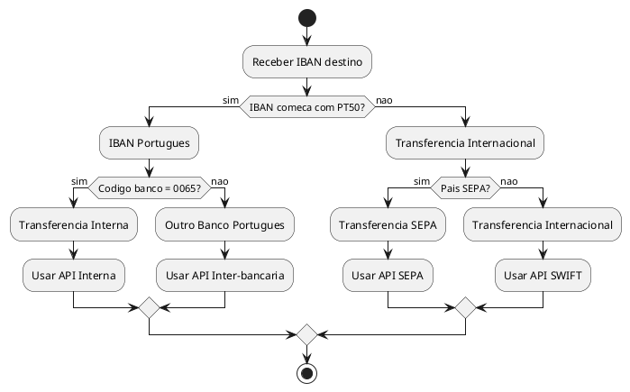

# DEF-09: Regras de Negocio para Transferencias

> **Status:** em-progresso
> **Secao relacionada:** 09 - Integracao & Interfaces Externas

## Contexto

Este documento define as regras de negocio para validacao e roteamento de transferencias, incluindo validacao de IBAN e selecao de API conforme destino.

## Questoes a Responder

1. Como e feita a validacao de IBAN?
R.: Biblioteca org.apache.IBAN Validator integrada no codigo

2. Como e determinado o tipo de transferencia?
R.: Baseado no prefixo do IBAN (PT50, PT500065, outros)

3. Quais APIs sao utilizadas para cada tipo?
R.: _Pendente mapeamento completo_

4. Quais bancos sao considerados para transferencias internas?
R.: Banco BEST (codigo 0065)

## Validacao de IBAN

### Biblioteca de Validacao

| Aspecto | Especificacao |
|---------|---------------|
| Biblioteca | org.apache.IBAN Validator |
| Integracao | Codigo nativo |
| Validacoes | Estrutura, digitos de controlo, formato por pais |

### Estrutura do IBAN Portugues

```
PT50 0065 0000 0000 0000 0001 2
│  │ │  │
│  │ │  └─ Numero de conta (11 digitos) + digito controlo
│  │ └──── Codigo do banco (4 digitos)
│  └────── Digitos de controlo IBAN (2 digitos)
└───────── Codigo do pais (2 letras)
```

## Logica de Roteamento de Transferencias

### Arvore de Decisao



### Regras de Classificacao

| Condicao | Tipo de Transferencia | API |
|----------|----------------------|-----|
| IBAN comeca com `PT50` E codigo banco = `0065` | Interna (mesmo banco) | _Pendente_ |
| IBAN comeca com `PT50` E codigo banco != `0065` | Inter-bancaria nacional | _Pendente_ |
| IBAN internacional + pais SEPA | SEPA | _Pendente_ |
| IBAN internacional + pais nao-SEPA | SWIFT/Internacional | _Pendente_ |

### Codigos Relevantes

| Codigo | Significado |
|--------|-------------|
| PT | Portugal (ISO 3166-1) |
| 50 | Digitos de controlo (variaveis) |
| 0065 | Codigo do Banco BEST |

## Correspondencia IBAN-Logo

### Logica de Selecao de Logo

| Cenario | Fonte | Exemplo |
|---------|-------|---------|
| IBAN Nacional (PT) | Logo do banco via codigo | Logo Banco BEST para 0065 |
| IBAN Internacional | Lista interna por country code | Bandeira de Andorra para AD |

### Estrutura de Dados de Logos

```
(countryCode, countryName, dialCode, flagResource, currency)
Exemplo: ("AD", "Andorra", "+376", R.drawable.flag_ad, "EUR")
```

## Paises SEPA

Lista de paises da zona SEPA para classificacao de transferencias:

_Pendente lista completa_

## Decisoes

### Regras Implementadas

- Validacao de IBAN via biblioteca Apache
- Roteamento baseado em prefixo PT50 e codigo de banco
- Logos mapeados por country code

### Pendentes de Documentacao

- Lista completa de APIs por tipo de transferencia
- Lista de paises SEPA
- Mapeamento completo de codigos de bancos portugueses

## Referencias

- [SEC-09-integracao-interfaces-externas.md](../sections/SEC-09-integracao-interfaces-externas.md)
- [DEF-02-requisitos-funcionais.md](DEF-02-requisitos-funcionais.md) - Transferencias
- ISO 13616 - IBAN standard
- SEPA regulation
