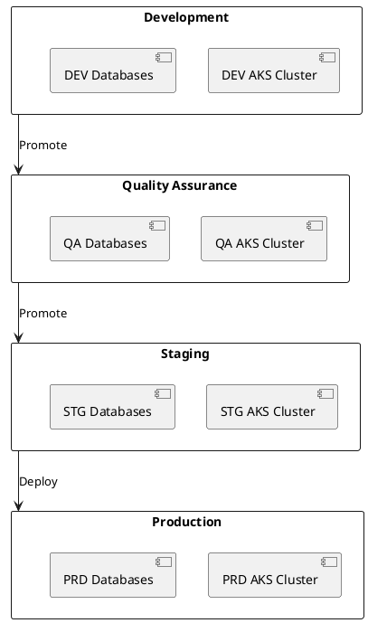
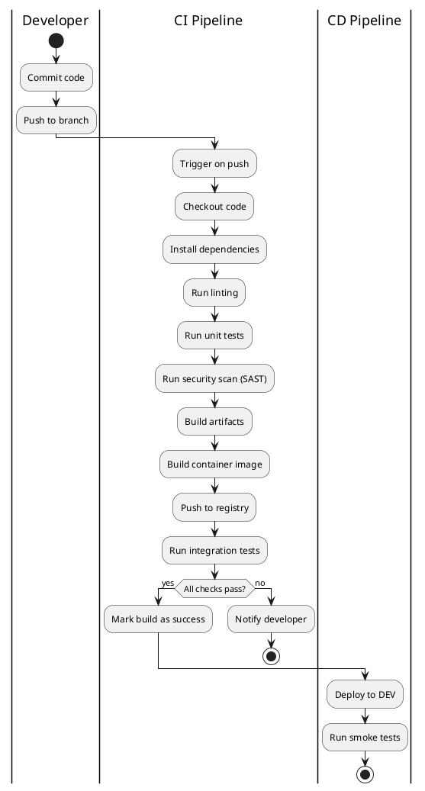
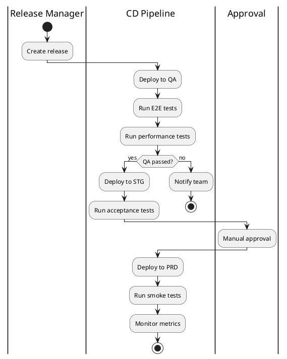
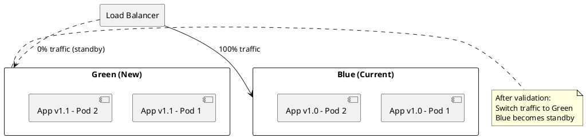

# DEF-10: Ambientes e CI/CD

> **Status:** em-progresso
> **Secao relacionada:** 10 - Arquitetura Operacional

## Contexto

Este documento define os ambientes da aplicacao, pipelines CI/CD, estrategias de deploy e gestao de configuracao.

## Questoes a Responder

1. Quantos ambientes serao necessarios?
R.: 4 ambientes - DEV (desenvolvimento), UAT (testes aceitacao), PREPROD (staging), PROD (producao)

2. Qual a ferramenta de CI/CD?
R.: GitHub Actions com workflows ja definidos

3. Qual a estrategia de deploy?
R.: Blue-Green e Canary releases com feature flags (LaunchDarkly/Unleash)

4. Como gerir secrets?
R.: Azure Key Vault (restricao do cliente - ver DEF-02-restricoes)

5. Qual a infraestrutura?
R.: Azure AKS (Kubernetes), load balancers, API Gateway, possivel service mesh (Istio/Linkerd)

6. Qual o plano de DR?
R.: Multi-region/multi-AZ, RTO 4h, RPO 15min, testes DR trimestrais

## Ambientes

### Matriz de Ambientes

| Ambiente | Proposito | Infra | Dados | Acesso |
|----------|-----------|-------|-------|--------|
| DEV | Desenvolvimento | Shared AKS | Mock/Sinteticos | Developers |
| UAT | Testes de aceitacao | Shared AKS | Sinteticos | QA Team + PO |
| PREPROD | Pre-producao/Staging | Dedicated AKS | Anonimizados | Team + Stakeholders |
| PROD | Producao | Dedicated AKS | Reais | Clientes |

### Segregacao

| Aspecto | Implementacao |
|---------|---------------|
| Namespaces | Kubernetes namespaces por ambiente/servico |
| Rede | VPCs isoladas, network policies |
| IAM | Roles e policies segregados por ambiente |
| Dados | Isolamento completo entre ambientes |

### Diagrama de Ambientes



### Configuracao por Ambiente

| Configuracao | DEV | QA | STG | PRD |
|--------------|-----|-----|-----|-----|
| Replicas | 1 | 2 | 2 | 3+ |
| CPU request | 100m | 200m | 500m | 500m |
| Memory request | 256Mi | 512Mi | 1Gi | 1Gi |
| Autoscaling | Nao | Nao | Sim | Sim |
| SSL | Self-signed | Self-signed | Cert real | Cert real |

## CI/CD Pipelines

### Pipeline de Build



### Pipeline de Release



### Stages do Pipeline

| Stage | Acoes | Trigger |
|-------|-------|---------|
| Build | Compile, test, scan, package | Push to branch |
| Deploy DEV | Deploy automatico | Build success |
| Deploy UAT | Deploy automatico | PR merge to develop |
| Deploy PREPROD | Deploy automatico | Tag/Release |
| Deploy PROD | Deploy manual | Approval |

### GitHub Actions Workflow

```yaml
# Exemplo simplificado de workflow
name: CI/CD Pipeline

on:
  push:
    branches: [main, develop]
  pull_request:
    branches: [main]

jobs:
  build:
    runs-on: ubuntu-latest
    steps:
      - uses: actions/checkout@v4
      - name: Build & Test
        run: |
          dotnet build
          dotnet test
      - name: Security Scan
        uses: github/codeql-action/analyze@v2
      - name: Build Container
        run: docker build -t app:${{ github.sha }} .
      - name: Push to ACR
        run: |
          az acr login --name novobancoacr
          docker push novobancoacr.azurecr.io/app:${{ github.sha }}

  deploy-dev:
    needs: build
    if: github.ref == 'refs/heads/develop'
    runs-on: ubuntu-latest
    steps:
      - name: Deploy to DEV
        run: kubectl set image deployment/app app=novobancoacr.azurecr.io/app:${{ github.sha }}
```

## Estrategia de Deploy

### Blue/Green Deployment



### Canary Deployment

| Fase | Trafego Canary | Duracao | Criterio |
|------|----------------|---------|----------|
| 1 | 5% | 15 min | Error rate < 1% |
| 2 | 25% | 30 min | Latency < baseline |
| 3 | 50% | 1 hora | Metrics stable |
| 4 | 100% | - | Full rollout |

### Rollback

| Trigger | Acao | Tempo |
|---------|------|-------|
| Error rate > 5% | Rollback automatico | < 5 min |
| Latency > 2x baseline | Alerta + decisao | < 15 min |
| Manual trigger | Rollback imediato | < 5 min |

## Gestao de Secrets

### Azure Key Vault

| Secret Type | Exemplo | Rotacao |
|-------------|---------|---------|
| API keys | Consumer key, Consumer secret | 90 dias |
| Connection strings | Database, Redis | 90 dias |
| Certificates | TLS certs | Anual |
| Tokens | Service tokens | 30 dias |

### Integracao com AKS

```yaml
# Exemplo: Secret Store CSI Driver
apiVersion: secrets-store.csi.x-k8s.io/v1
kind: SecretProviderClass
metadata:
  name: azure-keyvault-secrets
spec:
  provider: azure
  parameters:
    keyvaultName: "novobanco-kv"
    objects: |
      array:
        - objectName: "db-connection-string"
          objectType: "secret"
```

## Infrastructure as Code

### Tecnologias

| Componente | Ferramenta |
|------------|------------|
| Azure resources | Terraform / Bicep |
| Kubernetes | Helm charts |
| Configuration | Kustomize |

### Estrutura de Repositorios

```
infrastructure/
├── terraform/
│   ├── environments/
│   │   ├── dev/
│   │   ├── qa/
│   │   ├── stg/
│   │   └── prd/
│   └── modules/
├── helm/
│   └── charts/
│       ├── frontend/
│       ├── bff/
│       └── services/
└── kustomize/
    └── overlays/
```

## Feature Flags

### Estrategia

| Tipo | Uso | Ferramenta |
|------|-----|------------|
| Release flags | Funcionalidades em desenvolvimento | LaunchDarkly / Unleash |
| Experiment flags | A/B testing | LaunchDarkly / Unleash |
| Ops flags | Configuracao operacional | LaunchDarkly / Unleash |

> **Decisao pendente:** Escolher entre LaunchDarkly (SaaS, mais features) ou Unleash (self-hosted, open-source).

## Disaster Recovery

### Especificacoes

| Aspecto | Especificacao |
|---------|---------------|
| Tipo | Multi-region / Multi-AZ |
| RTO (Recovery Time Objective) | 4 horas |
| RPO (Recovery Point Objective) | 15 minutos |
| Testes DR | Trimestrais |

### Estrategia de Backup

| Componente | Estrategia | Retencao |
|------------|------------|----------|
| Database | Snapshots automaticos | 30 dias |
| Object Storage | Replicacao cross-region | 90 dias |
| Configuracao | Git + Vault backup | Indefinido |
| Secrets | Key Vault backup | 90 dias |

### Runbooks

| Cenario | Procedimento | Responsavel |
|---------|--------------|-------------|
| Failover AZ | Automatico via AKS | DevOps |
| Failover Region | Manual com runbook | DevOps + Arquiteto |
| Restore Database | Semi-automatico | DBA + DevOps |
| Restore Completo | Manual com checklist | Equipa completa |

## Decisoes

### Definido

- Azure como cloud provider
- Azure AKS para todos os ambientes (OpenShift compliant)
- GitHub Actions para CI/CD com workflows definidos
- Azure Key Vault para secrets
- Containers para deployment
- Blue-Green e Canary releases
- DR: RTO 4h, RPO 15min

### Pendentes

- Escolha de ferramenta de feature flags (LaunchDarkly vs Unleash)
- Service mesh (Istio/Linkerd) - confirmar necessidade
- Detalhes finais de IaC (Terraform vs Bicep)

## Referencias

- [SEC-10-arquitetura-operacional.md](../sections/SEC-10-arquitetura-operacional.md)
- [DEF-10-deployment-infrastructure.md](DEF-10-deployment-infrastructure.md)
- [DEF-02-restricoes.md](DEF-02-restricoes.md)
