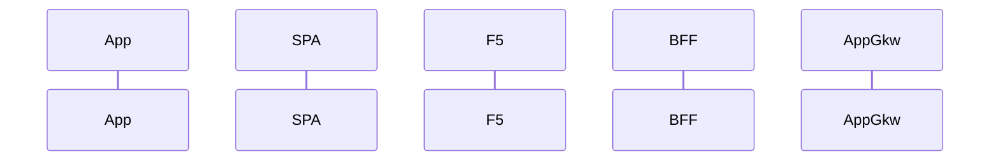

---
# Project Definitions
## Deployment Infrasctructure
Cloud: Azure
Hosting: Kubernetes 

Pending Questions:
- Where will be hosted? AKS? Local? 
- Who will create and manage the cluster?
- If created by us:
    - Service Mesh? Istio, Linkerd?
    - Ingress controller? NGINX, Traefik, Cloud Native?
    - Integration with legacy apps (Siebel)

## Authentication
Authentication Flow:

Pending Questions:
- Preferível Client ID/Client Secret?
- External Authentication

## API Scenarios

