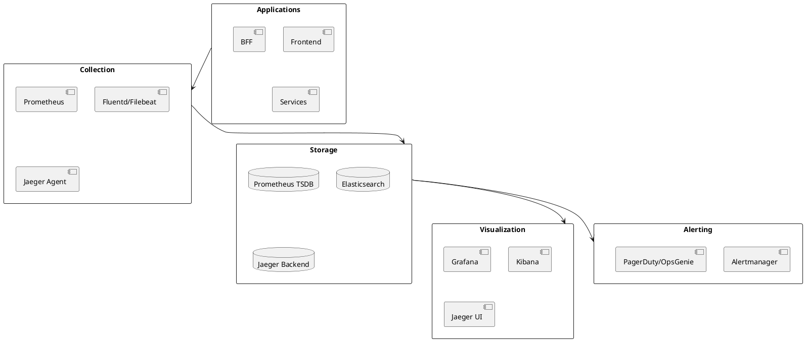

# DEF-11: Observabilidade e Operacoes

> **Status:** em-progresso
> **Secao relacionada:** 11 - Observabilidade & Operacoes

## Contexto

Este documento define a stack de observabilidade, metricas, logging, tracing, SLIs/SLOs e estrategia de alertas.

## Questoes a Responder

1. Qual a stack de observabilidade?
R.: Prometheus (metricas), Grafana (dashboards), ELK/EFK (logs), Jaeger/Tempo (tracing)

2. Quais metricas de negocio acompanhar?
R.: Logins/hora, transacoes/minuto, valor transacionado, conversao de funnel

3. Quais SLOs definir?
R.: Disponibilidade 99.9%, latencia p95 < 500ms, taxa de erro < 0.1%

4. Qual a estrategia de alertas?
R.: Taxas de erro elevadas, falhas de autenticacao, degradacao de performance, indisponibilidade de dependencias

## Stack de Observabilidade

### Componentes (Confirmado)

| Funcao | Ferramenta | Status |
|--------|------------|--------|
| Metricas | Prometheus | Definido |
| Visualizacao | Grafana | Definido |
| Logs | ELK/EFK Stack | Definido |
| Tracing | Jaeger ou Tempo | Definido |
| Alerting | Alertmanager | Definido |

> **Nota:** Stack open-source confirmada. Alternativas Azure (Azure Monitor, App Insights) disponiveis como fallback se necessario.

### Diagrama



## Golden Signals

| Signal | Metrica | Threshold |
|--------|---------|-----------|
| **Latency** | Request duration p95 | < 500ms |
| **Traffic** | Requests per second | Baseline + 50% |
| **Errors** | Error rate | < 1% |
| **Saturation** | CPU/Memory usage | < 80% |

## Metricas

### Metricas de Aplicacao

| Metrica | Tipo | Labels |
|---------|------|--------|
| `http_requests_total` | Counter | method, path, status |
| `http_request_duration_seconds` | Histogram | method, path |
| `http_requests_in_flight` | Gauge | service |
| `db_connections_active` | Gauge | database |
| `cache_hits_total` | Counter | cache_name |
| `cache_misses_total` | Counter | cache_name |

### Metricas de Negocio (Confirmado)

| Metrica | Descricao | Importancia |
|---------|-----------|-------------|
| `logins_per_hour` | Logins por hora | Alta |
| `logins_failed_total` | Logins falhados | Alta |
| `transactions_per_minute` | Transacoes por minuto | Alta |
| `transactions_amount_total` | Valor total transacionado | Alta |
| `transfers_total` | Transferencias realizadas | Alta |
| `payments_total` | Pagamentos realizados | Alta |
| `funnel_conversion_rate` | Taxa de conversao de funnel | Media |
| `session_duration_seconds` | Duracao de sessao | Media |

### Metricas de Infraestrutura

| Metrica | Fonte |
|---------|-------|
| CPU usage | Kubernetes metrics |
| Memory usage | Kubernetes metrics |
| Network I/O | Kubernetes metrics |
| Disk I/O | Kubernetes metrics |
| Pod restarts | Kubernetes events |

## Distributed Tracing

### Configuracao

| Aspecto | Especificacao |
|---------|---------------|
| Protocolo | OpenTelemetry |
| Sampling | 10% normal, 100% errors |
| Propagation | W3C Trace Context |
| Retention | 7 dias |

### Spans Instrumentados

| Componente | Spans |
|------------|-------|
| Frontend | Page loads, API calls |
| BFF | Incoming requests, outgoing calls |
| Services | Business operations, DB queries |
| External | Third-party API calls |

## Logging

### Niveis de Log

| Nivel | Uso | Exemplos |
|-------|-----|----------|
| ERROR | Erros que requerem atencao | Exceptions, falhas de integracao |
| WARN | Situacoes anormais | Timeouts, retries |
| INFO | Eventos de negocio | Login, transferencia |
| DEBUG | Debugging | Request/response details |

### Formato Estruturado

```json
{
    "timestamp": "2024-01-15T14:30:00.000Z",
    "level": "INFO",
    "service": "bff",
    "trace_id": "abc123",
    "span_id": "def456",
    "user_id": "user123",
    "message": "Transfer completed",
    "metadata": {
        "amount": 100.00,
        "destination": "PT50..."
    }
}
```

### Retencao

| Tipo | Retencao | Justificacao |
|------|----------|--------------|
| ERROR | 90 dias | Troubleshooting |
| WARN | 30 dias | Analise |
| INFO | 14 dias | Auditoria |
| DEBUG | 7 dias | Debugging |

## SLIs (Service Level Indicators) - Confirmado

### Definicoes

| SLI | Calculo | Target | Fonte |
|-----|---------|--------|-------|
| Availability | Successful requests / Total requests | 99.9% | Prometheus |
| Latency | p95 response time | < 500ms | Prometheus |
| Error Rate | Failed requests / Total requests | < 0.1% | Prometheus |
| Throughput | Requests per second | Baseline | Prometheus |

### Por Servico

| Servico | SLI Principal |
|---------|---------------|
| Login | Success rate, latency |
| Transferencias | Success rate, latency |
| Consultas | Availability, latency |
| Notificacoes | Delivery rate |

## SLOs (Service Level Objectives)

### Targets

| Servico | SLO | Target | Window |
|---------|-----|--------|--------|
| API Global | Availability | 99.9% | 30 dias |
| Login | Latency p95 | < 2s | 30 dias |
| Transferencias | Success rate | 99.5% | 30 dias |
| Consultas | Latency p95 | < 500ms | 30 dias |

### Error Budget

| SLO | Budget (30 dias) | Calculo |
|-----|------------------|---------|
| 99.9% availability | 43.2 min downtime | 30d * 24h * 60min * 0.1% |
| 99.5% success rate | 216 min failures | 30d * 24h * 60min * 0.5% |

## Alertas

### Severidades

| Severidade | Resposta | Notificacao |
|------------|----------|-------------|
| Critical | Imediata | PagerDuty + SMS |
| Warning | 1 hora | Slack + Email |
| Info | Proximo dia | Email |

### Alertas Definidos (Confirmado)

| Alerta | Condicao | Severidade |
|--------|----------|------------|
| HighErrorRate | Error rate > 5% for 5min | Critical |
| AuthFailures | Failed logins > threshold | Critical |
| HighLatency | p95 > 2s for 5min | Warning |
| PerformanceDegradation | Latency > 2x baseline | Warning |
| DependencyUnavailable | External service down | Critical |
| PodCrashLoop | Pod restarts > 3 in 10min | Critical |
| HighCPU | CPU > 80% for 15min | Warning |
| HighMemory | Memory > 80% for 15min | Warning |
| CertExpiring | Cert expires < 30 days | Warning |
| ErrorBudgetBurn | Budget burn rate > 2x | Warning |

### Routing

| Alerta | Destinatario |
|--------|--------------|
| Critical | On-call engineer |
| Warning (business hours) | Team channel |
| Warning (off hours) | Next day review |

## Dashboards

### Dashboards Principais

| Dashboard | Conteudo |
|-----------|----------|
| Overview | Golden signals, top errors |
| Services | Per-service metrics |
| Business | KPIs de negocio |
| Infrastructure | Kubernetes metrics |
| Security | Login failures, suspicious activity |

## Runbooks

### Estrutura

| Seccao | Conteudo |
|--------|----------|
| Descricao | O que significa o alerta |
| Impacto | Qual o impacto no negocio |
| Diagnostico | Passos para investigar |
| Mitigacao | Acoes imediatas |
| Resolucao | Como resolver definitivamente |
| Escalacao | Quando e para quem escalar |

## Decisoes

### Definido

- Stack OSS: Prometheus, Grafana, ELK/EFK, Jaeger/Tempo
- Structured logging em JSON com correlation IDs
- OpenTelemetry para tracing
- Golden Signals: Latencia, trafego, erros, saturacao
- SLIs: Disponibilidade 99.9%, latencia p95 < 500ms, error rate < 0.1%
- SLOs baseados em error budget
- Alertas para: error rates, auth failures, performance degradation, dependency issues

### Pendentes

- Ferramenta de on-call (PagerDuty/OpsGenie)
- Dashboards detalhados por servico
- Runbooks por servico

## Referencias

- [SEC-11-observabilidade-operacoes.md](../sections/SEC-11-observabilidade-operacoes.md)
- [DEF-02-requisitos-nao-funcionais.md](DEF-02-requisitos-nao-funcionais.md)
- Google SRE Book - SLIs/SLOs
