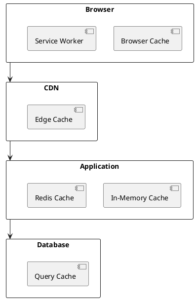
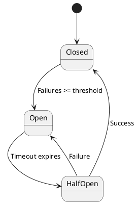

# DEF-12: Performance e Resiliencia

> **Status:** estrutura
> **Secao relacionada:** 12 - Desempenho & Fiabilidade

## Contexto

Este documento define os objetivos de performance, estrategias de caching, auto-scaling e resiliencia da plataforma.

## Questoes a Responder

1. Quais os targets de performance?
R.: _Pendente - ver DEF-02-requisitos-nao-funcionais_

2. Qual a estrategia de caching?
R.: _Pendente_

3. Como funciona o auto-scaling?
R.: _Pendente_

4. Quais padroes de resiliencia aplicar?
R.: Circuit breaker, retry, timeout (ver DEF-05)

## Objetivos de Performance

### Targets por Operacao

| Operacao | Latency p50 | Latency p95 | Latency p99 |
|----------|-------------|-------------|-------------|
| Login | < 1s | < 2s | < 3s |
| Consulta saldos | < 200ms | < 500ms | < 1s |
| Lista movimentos | < 300ms | < 800ms | < 1.5s |
| Transferencia | < 1s | < 2s | < 3s |
| Pagamento | < 1s | < 2s | < 3s |

### Targets Globais

| Metrica | Target | Justificacao |
|---------|--------|--------------|
| TTFB | < 800ms | Core Web Vital |
| LCP | < 2.5s | Core Web Vital |
| FID | < 100ms | Core Web Vital |
| CLS | < 0.1 | Core Web Vital |

## Capacidade

### Estimativas de Carga

| Metrica | Normal | Pico | Stress |
|---------|--------|------|--------|
| Utilizadores simultaneos | _Pendente_ | _Pendente_ | _Pendente_ |
| Requests/segundo | _Pendente_ | _Pendente_ | _Pendente_ |
| Transacoes/hora | _Pendente_ | _Pendente_ | _Pendente_ |

### Capacity Planning

| Componente | Normal | Pico (3x) |
|------------|--------|-----------|
| Frontend pods | 2 | 6 |
| BFF pods | 3 | 9 |
| Service pods | 2 | 6 |

## Caching Strategy

### Niveis de Cache



### Configuracao por Tipo

| Tipo de Dados | Cache | TTL | Invalidacao |
|---------------|-------|-----|-------------|
| Assets estaticos | CDN + Browser | 1 ano | Versioning |
| Dados de referencia | Redis | 1 hora | Manual |
| Dados de sessao | Redis | 30 min | Por acao |
| Saldos | Nao cachear | - | - |
| Movimentos | Redis | 5 min | Por nova transacao |

### Redis Configuration

| Parametro | Valor |
|-----------|-------|
| Max memory | 1GB |
| Eviction policy | allkeys-lru |
| Cluster mode | Enabled |
| Persistence | RDB snapshots |

## Auto-Scaling

### Horizontal Pod Autoscaler (HPA)

| Servico | Min | Max | CPU Target | Memory Target |
|---------|-----|-----|------------|---------------|
| Frontend | 2 | 10 | 70% | 80% |
| BFF | 3 | 15 | 70% | 80% |
| Auth Service | 2 | 8 | 70% | 80% |
| Account Service | 2 | 10 | 70% | 80% |

### Scaling Rules

```yaml
# Exemplo HPA
apiVersion: autoscaling/v2
kind: HorizontalPodAutoscaler
spec:
  minReplicas: 2
  maxReplicas: 10
  metrics:
  - type: Resource
    resource:
      name: cpu
      target:
        type: Utilization
        averageUtilization: 70
  - type: Resource
    resource:
      name: memory
      target:
        type: Utilization
        averageUtilization: 80
  behavior:
    scaleUp:
      stabilizationWindowSeconds: 60
    scaleDown:
      stabilizationWindowSeconds: 300
```

### Vertical Pod Autoscaler (VPA)

| Uso | Recomendacao |
|-----|--------------|
| Producao | Apenas recomendacoes |
| Dev/QA | Auto-update |

## Resiliencia

### Circuit Breaker



| Parametro | Valor |
|-----------|-------|
| Failure threshold | 5 |
| Success threshold | 3 |
| Timeout | 30s |
| Half-open requests | 3 |

### Retry Policies

| Cenario | Retries | Delay | Backoff |
|---------|---------|-------|---------|
| Network timeout | 3 | 100ms | Exponential |
| 5xx errors | 3 | 200ms | Exponential |
| Rate limited (429) | 3 | 1s | Fixed |
| Connection refused | 2 | 500ms | Linear |

### Timeout Strategies

| Camada | Timeout |
|--------|---------|
| HTTP client | 30s |
| Database query | 10s |
| Redis | 5s |
| External API | 15s |

### Bulkhead Pattern

| Recurso | Pool Size |
|---------|-----------|
| HTTP connections | 100 |
| DB connections | 20 |
| Redis connections | 50 |

## Failover

### Estrategia

| Componente | Failover |
|------------|----------|
| AKS | Multi-zone |
| Database | _Depende do Core Banking_ |
| Redis | Cluster mode |
| DNS | Azure Traffic Manager |

### Health Checks

| Tipo | Endpoint | Intervalo |
|------|----------|-----------|
| Liveness | /health/live | 10s |
| Readiness | /health/ready | 5s |
| Startup | /health/startup | 5s |

## Load Testing

### Ferramentas

| Ferramenta | Uso |
|------------|-----|
| k6 | Load testing |
| Gatling | Performance testing |
| JMeter | Stress testing |

### Cenarios

| Cenario | Duracao | Users | Ramp-up |
|---------|---------|-------|---------|
| Smoke | 5 min | 10 | Imediato |
| Load | 30 min | 100 | 5 min |
| Stress | 1 hora | 500 | 10 min |
| Spike | 15 min | 1000 | 1 min |
| Endurance | 8 horas | 100 | 10 min |

## Otimizacoes

### Frontend

| Otimizacao | Impacto |
|------------|---------|
| Code splitting | Reduce initial bundle |
| Lazy loading | Faster FCP |
| Image optimization | Reduce bandwidth |
| Tree shaking | Smaller bundles |

### Backend

| Otimizacao | Impacto |
|------------|---------|
| Connection pooling | Reduce latency |
| Query optimization | Faster DB access |
| Async processing | Better throughput |
| Response compression | Reduce bandwidth |

## Decisoes

### Definido

- Redis para caching
- HPA para auto-scaling
- Circuit breaker pattern

### Pendentes

- Targets de carga especificos
- TTLs de cache por tipo de dado
- Ferramenta de load testing
- Thresholds de scaling

## Referencias

- [SEC-12-desempenho-fiabilidade.md](../sections/SEC-12-desempenho-fiabilidade.md)
- [DEF-02-requisitos-nao-funcionais.md](DEF-02-requisitos-nao-funcionais.md)
- [DEF-05-arquitetura-backend.md](DEF-05-arquitetura-backend.md)
