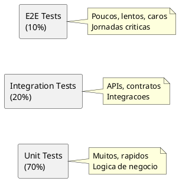

# DEF-13: Estrategia de Testes

> **Status:** estrutura
> **Secao relacionada:** 13 - Estrategia de Testes

## Contexto

Este documento define a estrategia de testes, incluindo tipos de testes, ferramentas, cobertura e responsabilidades.

## Questoes a Responder

1. Qual a cobertura de testes esperada?
R.: _Pendente_

2. Quais ferramentas de teste utilizar?
R.: _Pendente_

3. Como gerir dados de teste?
R.: _Pendente_

4. Qual a estrategia de testes de seguranca?
R.: SAST, DAST, pentests (ver DEF-08)

## Test Pyramid



## Tipos de Testes

### Testes Unitarios

| Aspecto | Especificacao |
|---------|---------------|
| Framework (Frontend) | Jest + React Testing Library |
| Framework (Backend) | xUnit / NUnit |
| Cobertura minima | 80% |
| Execucao | Por commit |
| Mocking | Todas dependencias externas |

### Testes de Integracao

| Aspecto | Especificacao |
|---------|---------------|
| Framework | xUnit + TestContainers |
| Scope | APIs, Database, Cache |
| Execucao | Por PR |
| Ambiente | Containers isolados |

### Testes de Contrato

| Aspecto | Especificacao |
|---------|---------------|
| Ferramenta | Pact |
| Consumer | Frontend, Mobile |
| Provider | BFF, Services |
| Execucao | Por PR |

### Testes E2E

| Aspecto | Especificacao |
|---------|---------------|
| Framework | Cypress / Playwright |
| Browsers | Chrome, Firefox, Safari, Edge |
| Execucao | Pre-release |
| Ambiente | Staging |

### Testes de Performance

| Aspecto | Especificacao |
|---------|---------------|
| Ferramenta | k6 / Gatling |
| Execucao | Semanal + pre-release |
| Ambiente | Staging |
| Baseline | _A definir_ |

### Testes de Seguranca

| Tipo | Ferramenta | Frequencia |
|------|------------|------------|
| SAST | SonarQube | Por commit |
| DAST | OWASP ZAP | Semanal |
| Dependency scan | Snyk / Dependabot | Diario |
| Pentest | Externo | Anual |

### Testes de Acessibilidade

| Aspecto | Especificacao |
|---------|---------------|
| Ferramenta automatizada | axe-core, Lighthouse |
| Standard | WCAG 2.2 AA |
| Execucao | Por PR + manual |

## Ferramentas

### Stack de Testes

| Camada | Ferramenta |
|--------|------------|
| Unit (Frontend) | Jest |
| Unit (Backend) | xUnit |
| Integration | TestContainers |
| Contract | Pact |
| E2E | Playwright |
| Performance | k6 |
| Security | SonarQube + ZAP |
| Accessibility | axe-core |

### CI Integration

| Ferramenta | Stage |
|------------|-------|
| Jest | Build |
| xUnit | Build |
| SonarQube | Build |
| Pact | Build |
| Playwright | Deploy QA |
| k6 | Deploy STG |

## Cobertura

### Targets por Componente

| Componente | Line Coverage | Branch Coverage |
|------------|---------------|-----------------|
| Frontend | 80% | 70% |
| BFF | 85% | 75% |
| Services | 85% | 75% |
| Shared libs | 90% | 80% |

### Exclusoes

| Tipo | Justificacao |
|------|--------------|
| Generated code | Auto-gerado |
| DTOs | Apenas propriedades |
| Configuration | Infraestrutura |

## Test Data Management

### Estrategia

| Ambiente | Dados |
|----------|-------|
| Unit tests | Mocks/Fakes |
| Integration | TestContainers com seed |
| E2E | Dados sinteticos |
| Performance | Subset anonimizado |

### Data Masking

| Dado Original | Masked |
|---------------|--------|
| Nome | Faker generated |
| NIF | Formato valido, valor fake |
| IBAN | Formato valido, valor fake |
| Email | @test.example.com |

## Jornadas Criticas (E2E)

### Prioritarias

| Jornada | Criticidade |
|---------|-------------|
| Login com password | Alta |
| Login com biometria | Alta |
| Consulta de saldos | Alta |
| Transferencia nacional | Alta |
| Transferencia internacional | Alta |
| Pagamento de servicos | Alta |
| Consulta de movimentos | Media |
| Gestao de beneficiarios | Media |
| Alteracao de dados | Media |

### Exemplo de Test Case

```typescript
// Exemplo Playwright
test('should complete national transfer', async ({ page }) => {
  // Login
  await page.goto('/login');
  await page.fill('[data-testid="username"]', 'testuser');
  await page.fill('[data-testid="password"]', 'testpass');
  await page.click('[data-testid="submit"]');

  // Navigate to transfers
  await page.click('[data-testid="transfers"]');
  await page.click('[data-testid="new-transfer"]');

  // Fill transfer details
  await page.fill('[data-testid="iban"]', 'PT50000000000000000000000');
  await page.fill('[data-testid="amount"]', '10.00');

  // Confirm
  await page.click('[data-testid="confirm"]');

  // OTP
  await page.fill('[data-testid="otp"]', '123456');
  await page.click('[data-testid="submit-otp"]');

  // Verify success
  await expect(page.locator('[data-testid="success"]')).toBeVisible();
});
```

## Testes de Regressao

### Estrategia

| Tipo | Trigger | Scope |
|------|---------|-------|
| Smoke | Cada deploy | Core flows |
| Regression suite | Pre-release | Full E2E |
| Visual regression | PR | UI screenshots |

## Responsabilidades

### RACI Matrix

| Atividade | Dev | QA | DevOps | Security |
|-----------|-----|-----|--------|----------|
| Unit tests | R/A | C | I | I |
| Integration tests | R | A | C | I |
| E2E tests | C | R/A | C | I |
| Performance tests | C | R | A | I |
| Security tests | C | C | C | R/A |
| Accessibility tests | R | A | I | I |

## Metricas de Qualidade

| Metrica | Target |
|---------|--------|
| Code coverage | > 80% |
| Test pass rate | > 99% |
| Flaky test rate | < 2% |
| Mean time to fix | < 24h |
| Critical bugs in prod | 0 |

## Decisoes

### Definido

- Jest para frontend, xUnit para backend
- Pact para contract testing
- WCAG 2.2 AA para acessibilidade

### Pendentes

- Ferramenta E2E final (Cypress vs Playwright)
- Thresholds de cobertura por equipa
- Estrategia de dados de teste
- Calendario de pentests

## Referencias

- [SEC-13-estrategia-testes.md](../sections/SEC-13-estrategia-testes.md)
- [DEF-04-experiencia-utilizador-frontend.md](DEF-04-experiencia-utilizador-frontend.md) - WCAG
- [DEF-08-conformidade-regulatoria.md](DEF-08-conformidade-regulatoria.md) - Security testing
