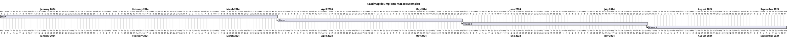
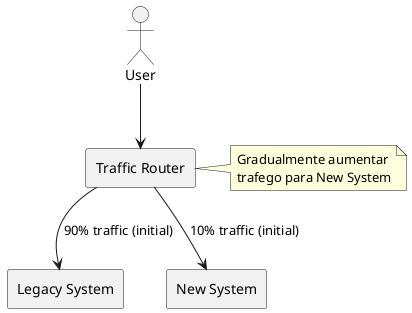
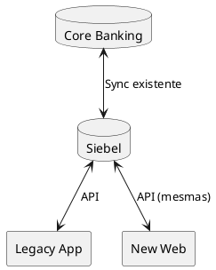
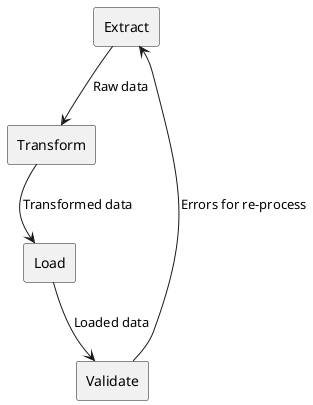
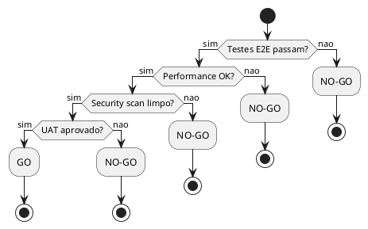

# DEF-14: Plano de Implementacao e Migracao

> **Status:** estrutura
> **Secao relacionada:** 14 - Plano de Migracao & Implementacao

## Contexto

Este documento define o roadmap de implementacao, estrategia de cutover, coexistencia com legado e procedimentos de migracao.

## Questoes a Responder

1. Qual o roadmap de implementacao?
R.: _Pendente - sem restricoes de timeline (DEF-02)_

2. Como coexistir com o sistema legado?
R.: _Pendente_

3. Qual a estrategia de cutover?
R.: _Pendente_

4. Como migrar dados?
R.: _Pendente_

## Roadmap de Implementacao

### Fases Propostas

### MVP - Funcionalidades Core

| Funcionalidade | Prioridade | Dependencias |
|----------------|------------|--------------|
| Login/Autenticacao | P0 | - |
| Consulta de saldos | P0 | Auth |
| Consulta de movimentos | P0 | Auth |
| Transferencias nacionais | P0 | Auth |
| Logout | P0 | Auth |

### Phase 1 - Operacoes Basicas

| Funcionalidade | Prioridade | Dependencias |
|----------------|------------|--------------|
| Transferencias SEPA | P1 | MVP |
| Pagamento de servicos | P1 | MVP |
| Gestao de beneficiarios | P1 | MVP |
| Notificacoes | P1 | MVP |
| Perfil do utilizador | P1 | MVP |

### Phase 2 - Funcionalidades Avancadas

| Funcionalidade | Prioridade | Dependencias |
|----------------|------------|--------------|
| Cartoes | P2 | Phase 1 |
| MBWay | P2 | Phase 1 |
| Investimentos | P2 | Phase 1 |
| Poupanca | P2 | Phase 1 |

### Phase 3 - Completo

| Funcionalidade | Prioridade | Dependencias |
|----------------|------------|--------------|
| Credito | P3 | Phase 2 |
| Open Banking (PSD2) | P3 | Phase 2 |
| Funcionalidades restantes | P3 | Phase 2 |

## Estrategia de Cutover

### Opcoes

| Estrategia | Descricao | Risco | Recomendacao |
|------------|-----------|-------|--------------|
| Big Bang | Migrar tudo de uma vez | Alto | Nao |
| Phased | Por funcionalidade | Medio | Sim |
| Parallel Run | Ambos sistemas ativos | Baixo | Sim |
| Strangler Fig | Gradual, por utilizador | Baixo | Sim |

### Estrategia Recomendada: Strangler Fig + Feature Flags

### Fases de Cutover

| Fase | % Novo Sistema | Duracao | Criterio |
|------|----------------|---------|----------|
| Pilot | 5% (internos) | 2 semanas | Zero critical bugs |
| Beta | 10% (selecionados) | 2 semanas | Error rate < 1% |
| Rollout 1 | 25% | 1 semana | Metrics stable |
| Rollout 2 | 50% | 1 semana | Metrics stable |
| Rollout 3 | 75% | 1 semana | Metrics stable |
| Full | 100% | - | Decomission legacy |

## Coexistencia com Legado

### Estrategia

| Componente | Legado | Novo | Sincronizacao |
|------------|--------|------|---------------|
| Dados de cliente | Siebel | BFF leitura | Real-time |
| Transacoes | Core Banking | Via Siebel | Real-time |
| Sessoes | App Legada | Novo sistema | Independente |

### Data Synchronization

## Migracao de Dados

### Scope

| Dado | Migracao Necessaria | Motivo |
|------|---------------------|--------|
| Clientes | Nao | Em Siebel |
| Contas | Nao | Em Core Banking |
| Transacoes | Nao | Em Core Banking |
| Preferencias app | Sim | Novo formato |
| Beneficiarios | Sim | Novo formato |
| Sessoes | Nao | Nova sessao |

### ETL Process

### Validacao

| Validacao | Metodo |
|-----------|--------|
| Contagem de registos | Count match |
| Checksum de dados | Hash comparison |
| Amostragem | Random sample verification |
| Reconciliacao | Business rules validation |

## Criterios Go/No-Go

### Pre-Release Checklist

| Categoria | Criterio | Obrigatorio |
|-----------|----------|-------------|
| Funcional | Todos os testes E2E passam | Sim |
| Performance | Latency < targets | Sim |
| Seguranca | Zero critical vulnerabilities | Sim |
| Operacional | Runbooks completos | Sim |
| Negocio | UAT aprovado | Sim |

### Decision Tree

## Rollback

### Triggers

| Trigger | Acao |
|---------|------|
| Error rate > 10% | Rollback automatico |
| Critical bug em producao | Rollback manual |
| Data corruption | Rollback imediato |

### Procedimento

| Passo | Acao | Tempo |
|-------|------|-------|
| 1 | Identificar problema | < 5 min |
| 2 | Decidir rollback | < 5 min |
| 3 | Redirecionar trafego | < 5 min |
| 4 | Verificar rollback | < 5 min |
| 5 | Comunicar stakeholders | < 15 min |

## Formacao

### Publico

| Grupo | Conteudo | Formato |
|-------|----------|---------|
| Utilizadores finais | Nova interface | Video + FAQ |
| Suporte L1 | Troubleshooting | Workshop |
| Suporte L2 | Arquitetura, logs | Workshop |
| Operacoes | Runbooks | Hands-on |

## Hypercare

### Periodo

| Fase | Duracao | Recursos |
|------|---------|----------|
| Hypercare intensivo | 2 semanas | Equipa full-time |
| Hypercare normal | 4 semanas | Equipa parcial |
| BAU | Ongoing | Operacoes normais |

### Monitoring Adicional

| Metrica | Frequencia | Threshold |
|---------|------------|-----------|
| Error rate | 1 min | < 1% |
| Latency p95 | 1 min | < targets |
| User complaints | Continuo | < 5/dia |

## Decisoes

### Definido

- Implementacao por fases
- Coexistencia com Siebel
- Rollback automatico para alta taxa de erros

### Pendentes

- Timeline especifico
- Criterios de selecao para pilot/beta
- Detalhes de migracao de dados
- Plano de comunicacao

## Referencias

- [SEC-14-plano-migracao-implementacao.md](../sections/SEC-14-plano-migracao-implementacao.md)
- [DEF-02-restricoes.md](DEF-02-restricoes.md) - Sem restricoes de timeline
- [DEF-02-requisitos-funcionais.md](DEF-02-requisitos-funcionais.md) - Funcionalidades
