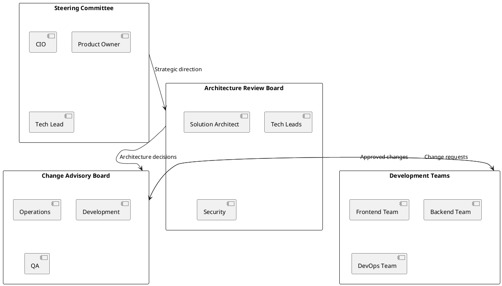
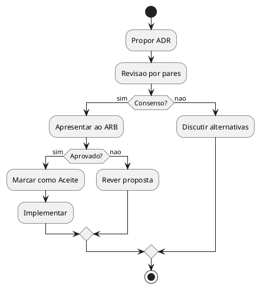
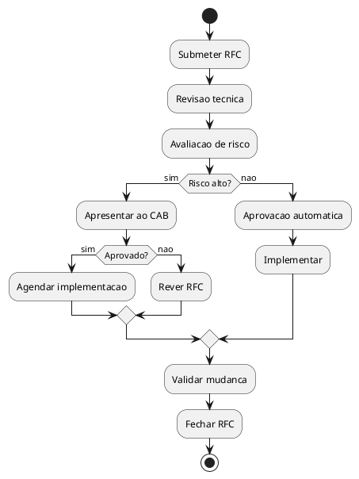

# DEF-15: Governacao e KPIs

> **Status:** em-progresso
> **Secao relacionada:** 15 - Governacao & Roadmap

## Contexto

Este documento define o modelo de governacao, gestao de decisoes arquiteturais (ADRs), KPIs de sucesso e processos de melhoria continua.

## Questoes a Responder

1. Qual o modelo de governacao?
R.: ARB (Architecture Review Board) mensal + CAB (Change Advisory Board) semanal

2. Como gerir decisoes arquiteturais?
R.: ADRs (Architecture Decision Records) versionados em repositorio

3. Quais KPIs de sucesso?
R.: Disponibilidade (uptime), Performance (latencia, throughput), Adocao utilizadores, CSAT, NPS

4. Como gerir divida tecnica?
R.: Inventario + priorizacao (impacto vs esforco) + 20% capacidade sprint + revisao trimestral

5. Qual o roadmap de produto?
R.: MVP (Q1), Phase 1 (Q2), Phase 2 (Q3-Q4), sprints 2 semanas, releases quinzenais/mensais

## Modelo de Governacao

### Estrutura



### Responsabilidades (Confirmado)

| Board | Responsabilidade | Frequencia |
|-------|------------------|------------|
| Steering Committee | Direcao estrategica, orcamento | Mensal |
| ARB | Aprovacao de decisoes arquiteturais | Mensal |
| CAB | Aprovacao de mudancas em producao | Semanal |

## Architecture Decision Records (ADRs)

### Template

```markdown
# ADR-XXX: Titulo da Decisao

## Status
Proposto | Aceite | Deprecated | Superseded

## Contexto
Qual o problema ou situacao que requer uma decisao?

## Decisao
Qual a decisao tomada?

## Consequencias
Quais as consequencias (positivas e negativas)?

## Alternativas Consideradas
Que outras opcoes foram avaliadas?

## Referencias
Links para documentacao relevante
```

### ADRs Iniciais

| ID | Titulo | Status |
|----|--------|--------|
| ADR-001 | Adocao de React para frontend | Aceite |
| ADR-002 | Adocao de C# .NET para backend | Aceite |
| ADR-003 | Padrao BFF | Aceite |
| ADR-004 | Deployment em AKS | Aceite |
| ADR-005 | CQRS com MediatR | Proposto |

### Processo de Aprovacao



## KPIs de Sucesso

### KPIs Tecnicos

| KPI | Target | Medicao |
|-----|--------|---------|
| Availability | 99.9% | Prometheus |
| MTTR | < 1 hora | Incident reports |
| Deployment frequency | > 1/semana | CI/CD metrics |
| Lead time for changes | < 1 dia | Git metrics |
| Change failure rate | < 15% | Incident reports |
| Code coverage | > 80% | SonarQube |

### KPIs de Negocio

| KPI | Target | Medicao |
|-----|--------|---------|
| User adoption | _A definir_ | Analytics |
| Task completion rate | > 95% | Analytics |
| User satisfaction (NPS) | > 50 | Surveys |
| Digital transactions | _A definir_ | Core Banking |
| Support tickets | < _baseline_ | Ticketing |

### KPIs de Seguranca

| KPI | Target | Medicao |
|-----|--------|---------|
| Critical vulnerabilities | 0 | Security scans |
| Time to patch critical | < 24h | Patch reports |
| Failed login rate | < 5% | Logs |
| Security incidents | 0 | Incident reports |

## Gestao de Divida Tecnica

### Classificacao

| Tipo | Descricao | Exemplo |
|------|-----------|---------|
| Intencional | Atalhos conscientes | Skip tests para deadline |
| Acidental | Descoberta posterior | Design flaw |
| Rotina | Acumulacao natural | Dependencies desatualizadas |

### Priorizacao

| Criterio | Peso |
|----------|------|
| Impacto em seguranca | 40% |
| Impacto em performance | 25% |
| Impacto em manutenibilidade | 20% |
| Esforco de correcao | 15% |

### Alocacao de Capacidade

| Tipo de trabalho | % Sprint |
|------------------|----------|
| Features | 70% |
| Tech debt | 20% |
| Bugs | 10% |

### Tracking

| Campo | Descricao |
|-------|-----------|
| ID | Identificador unico |
| Descricao | O que e o debt |
| Impacto | Consequencias de nao resolver |
| Esforco | Estimativa de correcao |
| Prioridade | Calculada |
| Data criacao | Quando foi identificado |

## Change Management

### Tipos de Mudanca

| Tipo | Aprovacao | Lead Time |
|------|-----------|-----------|
| Standard | Pre-aprovado | Imediato |
| Normal | CAB | 1 semana |
| Emergency | CAB expedito | 4 horas |

### Processo



## Continuous Improvement

### Retrospectivas

| Tipo | Frequencia | Participantes |
|------|------------|---------------|
| Sprint retro | Quinzenal | Equipa |
| Release retro | Por release | Todas equipas |
| Incident postmortem | Por incidente | Envolvidos |

### Metricas de Melhoria

| Metrica | Objetivo |
|---------|----------|
| Velocity trend | Crescente |
| Defect escape rate | Decrescente |
| Cycle time | Decrescente |
| Deployment success rate | Crescente |

### Lessons Learned

| Campo | Descricao |
|-------|-----------|
| Contexto | O que aconteceu |
| O que correu bem | Boas praticas a manter |
| O que correu mal | Problemas identificados |
| Acoes | O que mudar |
| Owner | Responsavel |
| Prazo | Deadline para acao |

## Roadmap de Produto (Confirmado)

### Fases

| Fase | Conteudo | Timeline |
|------|----------|----------|
| MVP | Funcionalidades core (login, consultas, transferencias basicas) | Q1 |
| Phase 1 | Features adicionais (pagamentos, cartoes, notificacoes) | Q2 |
| Phase 2 | Optimizacoes e expansoes (investimentos, credito, poupanca) | Q3-Q4 |

### Releases

| Aspecto | Especificacao |
|---------|---------------|
| Sprint duration | 2 semanas |
| Releases | Quinzenais ou mensais |
| Feature flags | Para releases graduais |

### Gestao

| Aspecto | Ferramenta |
|---------|------------|
| Backlog | Jira / Azure DevOps |
| Roadmap | ProductBoard / Jira |
| Epics/Features | Jira |
| User Stories | Jira |

### Cadencia

| Cerimonia | Frequencia |
|-----------|------------|
| Sprint Planning | Quinzenal |
| Sprint Review | Quinzenal |
| Backlog Refinement | Semanal |
| Roadmap Review | Mensal |
| Quarterly Planning | Trimestral |

## Continuous Improvement (Confirmado)

| Pratica | Descricao |
|---------|-----------|
| Retrospectivas | Por sprint e release |
| Postmortems | Apos incidentes |
| Lessons learned | Documentadas e partilhadas |

## Decisoes

### Definido

- Governanca: ARB mensal, CAB semanal
- ADRs versionados em repositorio
- Roadmap: MVP Q1, Phase 1 Q2, Phase 2 Q3-Q4
- Sprints 2 semanas, releases quinzenais/mensais
- 20% de capacidade para tech debt
- Revisao tech debt trimestral
- KPIs: Uptime, latencia, throughput, CSAT, NPS
- Retrospectivas por sprint e release
- Postmortems de incidentes

### Pendentes

- Composicao detalhada do ARB
- Baseline de KPIs
- Ferramentas de tracking especificas

## Referencias

- [SEC-15-governacao-roadmap.md](../sections/SEC-15-governacao-roadmap.md)
- [DEF-01-business-objectives.md](DEF-01-business-objectives.md)
- [DEF-02-stakeholders.md](DEF-02-stakeholders.md)
