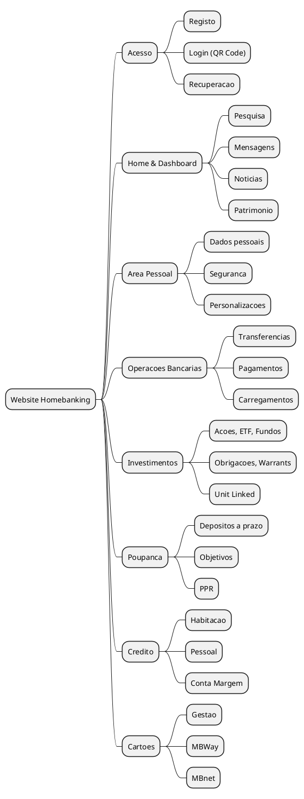

# 02. Contexto de Negocio & Requisitos

> **Status:** em-progresso
> **Definicoes utilizadas:** DEF-01-business-objectives.md, DEF-02-stakeholders.md, DEF-02-requisitos-funcionais.md, DEF-02-requisitos-nao-funcionais.md, DEF-02-restricoes.md, DEF-02-regras-calculos-negocio.md
> **Ultima atualizacao:** 2025-12-22

## Proposito

Documentar os objetivos de negocio, partes interessadas, requisitos funcionais e nao-funcionais, e restricoes do projeto de Homebanking web.

---

## 2.1 Objetivos de Negocio

### Visao Geral

O projeto visa criar uma plataforma web de Homebanking com **paridade total** com o App Mobile existente, oferecendo aos clientes do Novo Banco um canal alternativo completo para gestao das suas financas.

### Objetivos Primarios

| Objetivo | Descricao | Beneficio |
|----------|-----------|-----------|
| Paridade funcional | Todas as funcionalidades do App Mobile disponiveis no Website | Canal alternativo completo |
| Experiencia unificada | Mesmo modelo de autenticacao OAuth e fluxos de utilizador | Consistencia para o cliente |
| Visao financeira | Permitir ao cliente uma melhor visao da sua situacao financeira | Valor acrescentado |

### Publico-Alvo

- **Todos os clientes do Novo Banco** que possuam App Mobile instalado e conta vinculada
- Autenticacao parcialmente realizada via App (QR Code + Biometria)

### Metricas de Sucesso (KPIs)

| KPI | Descricao | Target | Status |
|-----|-----------|--------|--------|
| Disponibilidade | Uptime da plataforma | 99.95% | Definido |
| Adocao | % clientes a utilizar o canal web | _A definir_ | Pendente |
| Satisfacao | NPS do canal web | _A definir_ | Pendente |
| Operacoes | Volume de operacoes/mes | _A definir_ | Pendente |

---

## 2.2 Partes Interessadas (Stakeholders)

### Matriz de Stakeholders

| Stakeholder | Papel | Interesse | Influencia | Estrategia | Frequencia |
|-------------|-------|-----------|------------|------------|------------|
| Product Owner | Responsavel por requisitos de negocio e priorizacao | Alto | Alto | Envolver | Continua |
| CIO | Sponsor executivo e decisor tecnico | Alto | Alto | Consultar | Semanal |
| Compliance Officer | Garantia de conformidade regulatoria (PSD2, RGPD) | Alto | Alto | Consultar | Por milestone |
| Security Officer | Validacao de requisitos de seguranca | Alto | Alto | Consultar | Por milestone |
| Clientes do Banco | Utilizadores finais da plataforma | Alto | Baixo | Informar | Por release |

### Stakeholders por Categoria

**Executivo/Sponsor:**
- CIO - Sponsor executivo e decisor tecnico principal

**Negocio:**
- Product Owner - Responsavel pelos requisitos funcionais e priorizacao

**Compliance/Seguranca:**
- Compliance Officer - Conformidade PSD2 e RGPD
- Security Officer - Requisitos de seguranca e autenticacao

**Utilizadores:**
- Clientes do Banco - Representados pelo Product Owner nas decisoes

### Stakeholders Pendentes de Identificacao

| Categoria | Papel | Status |
|-----------|-------|--------|
| Tecnico | Arquitecto de Solucoes | A identificar |
| Tecnico | Tech Lead Frontend (React) | A identificar |
| Tecnico | Tech Lead Backend (C#) | A identificar |
| Tecnico | DevOps/SRE Lead (Azure/AKS) | A identificar |
| Operacoes | Operations Manager | A identificar |
| Externo | Equipa Siebel | A identificar |
| Externo | Equipa Core Banking | A identificar |

---

## 2.3 Requisitos Funcionais

### Visao Geral das Areas Funcionais

A plataforma web deve suportar **16 grandes areas funcionais**, com paridade total em relacao ao App Mobile:



### Catalogo de Requisitos por Dominio

#### Autenticacao e Seguranca

| ID | Requisito | Prioridade | Fase |
|----|-----------|------------|------|
| RF-AUTH-001 | Login via QR Code + Biometria | Alta | MVP |
| RF-AUTH-002 | Autenticacao MFA (App obrigatoria) | Alta | MVP |
| RF-AUTH-003 | Recuperacao de password | Alta | MVP |
| RF-AUTH-004 | Gestao de sessoes | Alta | MVP |
| RF-AUTH-005 | Logout | Alta | MVP |

#### Contas e Saldos

| ID | Requisito | Prioridade | Fase |
|----|-----------|------------|------|
| RF-ACC-001 | Consulta de saldos | Alta | MVP |
| RF-ACC-002 | Lista de contas | Alta | MVP |
| RF-ACC-003 | Detalhes de conta | Alta | MVP |
| RF-ACC-004 | Extrato de movimentos | Alta | MVP |
| RF-ACC-005 | Filtros e pesquisa | Media | MVP |
| RF-ACC-006 | Export de extrato (PDF) | Media | Fase 1 |

#### Transferencias

| ID | Requisito | Prioridade | Fase |
|----|-----------|------------|------|
| RF-TRF-001 | Transferencia entre contas proprias (Intra) | Alta | MVP |
| RF-TRF-002 | Transferencia nacional (Inter) | Alta | MVP |
| RF-TRF-003 | Transferencia SEPA | Alta | MVP |
| RF-TRF-004 | Transferencia internacional | Alta | Fase 1 |
| RF-TRF-005 | Agendamento de transferencia | Media | Fase 1 |
| RF-TRF-006 | Transferencias recorrentes | Media | Fase 1 |

#### Pagamentos

| ID | Requisito | Prioridade | Fase |
|----|-----------|------------|------|
| RF-PAY-001 | Pagamento de servicos | Alta | MVP |
| RF-PAY-002 | Pagamento por referencia | Alta | MVP |
| RF-PAY-003 | Pagamento ao Estado | Alta | MVP |
| RF-PAY-004 | Debitos diretos | Media | Fase 1 |
| RF-PAY-005 | Pagamentos agendados | Media | Fase 1 |
| RF-PAY-006 | Jogos Santa Casa | Baixa | Fase 2 |

#### Cartoes e MBWay

| ID | Requisito | Prioridade | Fase |
|----|-----------|------------|------|
| RF-CRD-001 | Lista de cartoes | Alta | MVP |
| RF-CRD-002 | Detalhes e movimentos do cartao | Alta | MVP |
| RF-CRD-003 | Bloqueio/desbloqueio | Alta | MVP |
| RF-CRD-004 | Alteracao de limites | Media | Fase 1 |
| RF-CRD-005 | MBWay - Enviar/Pedir dinheiro | Alta | MVP |
| RF-CRD-006 | MBnet - Criar/Gerir | Media | Fase 1 |

#### Investimentos

| ID | Requisito | Prioridade | Fase |
|----|-----------|------------|------|
| RF-INV-001 | Consulta de carteira | Alta | MVP |
| RF-INV-002 | Compra/Venda de acoes | Alta | MVP |
| RF-INV-003 | ETFs e Fundos | Alta | MVP |
| RF-INV-004 | Obrigacoes e Warrants | Media | Fase 1 |
| RF-INV-005 | Ofertas publicas | Media | Fase 1 |
| RF-INV-006 | Unit Linked | Baixa | Fase 2 |

#### Poupanca

| ID | Requisito | Prioridade | Fase |
|----|-----------|------------|------|
| RF-SAV-001 | Depositos a prazo | Alta | MVP |
| RF-SAV-002 | Leiloes de DP | Media | Fase 1 |
| RF-SAV-003 | Objetivos de poupanca | Media | Fase 1 |
| RF-SAV-004 | PPR | Media | Fase 1 |
| RF-SAV-005 | Robot Advisor | Baixa | Fase 2 |

### Restricoes de Requisitos

- **Paridade total** com App Mobile e obrigatoria
- **Autenticacao** deve seguir mesmo fluxo OAuth do App
- Cliente deve ter **App Mobile instalado** para autenticacao

---

## 2.4 Requisitos Nao-Funcionais (NFRs)

### Disponibilidade

| ID | Requisito | Target | Prioridade |
|----|-----------|--------|------------|
| NFR-AVL-001 | Disponibilidade geral | **99.95%** | Alta |
| NFR-AVL-002 | Janela de manutencao | _A definir_ | Media |
| NFR-AVL-003 | MTTR | _A definir_ | Alta |

### Desempenho

| ID | Requisito | Target | Prioridade |
|----|-----------|--------|------------|
| NFR-PRF-001 | Tempo de carregamento inicial | < 3s | Alta |
| NFR-PRF-002 | Latencia API (p95) | **< 1s** | Alta |
| NFR-PRF-003 | Latencia API (p99) | < 2s | Alta |
| NFR-PRF-004 | Tempo de login completo | < 30s (inclui App) | Alta |

### Escalabilidade

| ID | Requisito | Target | Prioridade |
|----|-----------|--------|------------|
| NFR-SCL-001 | Utilizadores simultaneos | _A definir_ | Alta |
| NFR-SCL-002 | Transacoes por segundo (TPS) | _A definir_ | Alta |
| NFR-SCL-003 | Pico de carga | 3x carga normal | Media |

### Seguranca

| ID | Requisito | Target | Prioridade |
|----|-----------|--------|------------|
| NFR-SEC-001 | Encriptacao em transito | TLS 1.3 | Alta |
| NFR-SEC-002 | Encriptacao em repouso | AES-256 | Alta |
| NFR-SEC-003 | Conformidade PSD2 SCA | 100% | Alta |
| NFR-SEC-004 | Conformidade RGPD | 100% | Alta |
| NFR-SEC-005 | Tempo de sessao inativo | 15 min | Alta |

### Compatibilidade

| ID | Requisito | Target | Prioridade |
|----|-----------|--------|------------|
| NFR-CMP-001 | Browsers suportados | **Chrome, Safari, Edge** | Alta |
| NFR-CMP-002 | Responsividade | Desktop + Tablet + Mobile | Alta |
| NFR-CMP-003 | Acessibilidade | WCAG 2.2 AA (_a confirmar_) | Alta |

### Recuperacao (DR)

| ID | Requisito | Target | Prioridade |
|----|-----------|--------|------------|
| NFR-DR-001 | RTO | _A definir_ | Alta |
| NFR-DR-002 | RPO | _A definir_ | Alta |

---

## 2.5 Restricoes

### Restricoes Tecnologicas

| ID | Restricao | Impacto | Flexibilidade |
|----|-----------|---------|---------------|
| RST-TEC-001 | Frontend **React** | Alto | Nenhuma |
| RST-TEC-002 | Backend **C# (.NET)** | Alto | Nenhuma |
| RST-TEC-003 | Padrao **BFF** | Alto | Nenhuma |
| RST-TEC-004 | OAuth compativel com App Mobile | Alto | Nenhuma |
| RST-TEC-005 | **Kubernetes** (OpenShift compliant, AKS inicial) | Alto | Baixa |

### Restricoes de Integracao

| ID | Restricao | Impacto | Flexibilidade |
|----|-----------|---------|---------------|
| RST-INT-001 | Core Banking **Oracle** | Alto | Nenhuma |
| RST-INT-002 | **Siebel** IBM | Alto | Nenhuma |
| RST-INT-003 | Reutilizacao de dependencias do App Mobile | Alto | Nenhuma |

### Restricoes de Infraestrutura

| ID | Restricao | Impacto | Flexibilidade |
|----|-----------|---------|---------------|
| RST-INF-001 | **Cloud-only** (sem on-premises) | Alto | Nenhuma |
| RST-INF-002 | **Microsoft Azure** | Alto | Nenhuma |
| RST-INF-003 | **AKS** (Azure Kubernetes Service) | Alto | Nenhuma |
| RST-INF-004 | Data residency **Portugal/UE** | Alto | Nenhuma |

### Restricoes Regulatorias

| ID | Restricao | Impacto | Flexibilidade |
|----|-----------|---------|---------------|
| RST-REG-001 | **PSD2 SCA** obrigatorio | Alto | Nenhuma |
| RST-REG-002 | **RGPD** obrigatorio | Alto | Nenhuma |

### Restricoes de Compatibilidade com App Mobile

| ID | Restricao | Impacto | Flexibilidade |
|----|-----------|---------|---------------|
| RST-CMP-001 | Site utiliza **mesmo modelo de token** do App | Alto | Nenhuma |
| RST-CMP-002 | Cliente **deve ter App instalado** para autenticacao | Alto | Nenhuma |
| RST-CMP-003 | **Paridade funcional** total | Alto | Nenhuma |

### Restricoes com Flexibilidade

| ID | Restricao | Flexibilidade |
|----|-----------|---------------|
| RST-BIZ-001 | Timeline | Total |
| RST-BIZ-002 | Orcamento | Total |
| RST-ORG-001 | Dimensao de equipa | Total |

---

## 2.6 Regras de Calculo de Negocio

### Calculos Identificados

| Area | Calculo | Componente | Status |
|------|---------|------------|--------|
| Conta Margem | TAE (Taxa Anual Efectiva) | MarginAccountHelper | Documentacao pendente |
| Objetivos | Probabilidades de sucesso | _A identificar_ | Pendente |
| Objetivos | Cenarios (otimista/pessimista) | _A identificar_ | Pendente |
| Reforma | Simulacao PPR | Retirement Helpers | Pendente |
| Investimentos | Rentabilidade de carteira | _A identificar_ | Pendente |
| Credito | Simulacao de prestacoes | _A identificar_ | Pendente |

> **Nota:** Documentacao detalhada das formulas matematicas pendente de levantamento junto das equipas de negocio.

---

## 2.7 Analise de Gap

### Sistema Atual vs Futuro

| Area | Sistema Atual | Sistema Futuro | Gap | Impacto |
|------|---------------|----------------|-----|---------|
| Canal Web | Inexistente/Legacy | SPA React | Novo desenvolvimento | Alto |
| Autenticacao | App Mobile apenas | App + Web (OAuth partilhado) | Extensao de fluxos | Alto |
| Backend | BFF Mobile | BFF Web (novo) | Novo desenvolvimento | Alto |
| Integracoes | Via App | Via App + Web BFF | Reutilizacao | Medio |
| Infraestrutura | AKS (App) | AKS (App + Web) | Extensao de recursos | Medio |

---

## Diagramas

### Visao Geral do Ecossistema

```plantuml
@startuml
skinparam componentStyle rectangle

actor "Cliente" as Client

package "Canais Digitais" {
    [App Mobile] as App
    [Website\n(Novo)] as Web
}

package "Backend" {
    [BFF Mobile] as BFFMobile
    [BFF Web\n(Novo)] as BFFWeb
    [Backend API] as Backend
}

package "Integracoes" {
    [Siebel] as Siebel
    [Core Banking\nOracle] as Core
    [Gateway] as GW
}

Client --> App : Biometria
Client --> Web : Browser
App --> BFFMobile
Web --> BFFWeb
BFFMobile --> GW
BFFWeb --> GW
GW --> Backend
Backend --> Siebel
Backend --> Core

note right of Web
  Novo canal com
  paridade total
end note

@enduml
```

---

## Entregaveis

- [x] Documento de objetivos de negocio
- [x] Matriz de stakeholders (interesse, influencia, comunicacao)
- [x] Catalogo de requisitos funcionais (categorizado por dominio)
- [x] Especificacao de requisitos nao-funcionais (NFRs) com metricas
- [x] Documento de restricoes tecnicas e de negocio
- [x] Analise de gap (sistema atual vs futuro)
- [ ] KPIs de sucesso detalhados - **Pendente definicao de targets**
- [ ] Priorizacao final de requisitos (MVP/Fases) - **Pendente validacao**
- [ ] Documentacao de regras de calculo - **Pendente levantamento**

---

## Questoes Pendentes

1. Quantos utilizadores simultaneos sao esperados? (NFR-SCL-001)
2. Qual o volume de transacoes esperado (TPS)? (NFR-SCL-002)
3. Qual o RTO e RPO? (NFR-DR-001, NFR-DR-002)
4. Nivel de acessibilidade WCAG confirmado?
5. Formulas detalhadas de calculos de negocio

---

## Definicoes Utilizadas

- [x] [DEF-01-business-objectives.md](../definitions/DEF-01-business-objectives.md) - Status: em-progresso
- [x] [DEF-02-stakeholders.md](../definitions/DEF-02-stakeholders.md) - Status: em-progresso
- [x] [DEF-02-requisitos-funcionais.md](../definitions/DEF-02-requisitos-funcionais.md) - Status: em-progresso
- [x] [DEF-02-requisitos-nao-funcionais.md](../definitions/DEF-02-requisitos-nao-funcionais.md) - Status: em-progresso
- [x] [DEF-02-restricoes.md](../definitions/DEF-02-restricoes.md) - Status: em-progresso
- [x] [DEF-02-regras-calculos-negocio.md](../definitions/DEF-02-regras-calculos-negocio.md) - Status: em-progresso

---

## Navegacao

| Anterior | Proximo |
|----------|---------|
| [01. Sumario Executivo](SEC-01-sumario-executivo.md) | [03. Visao Geral da Solucao](SEC-03-visao-geral-solucao.md) |
