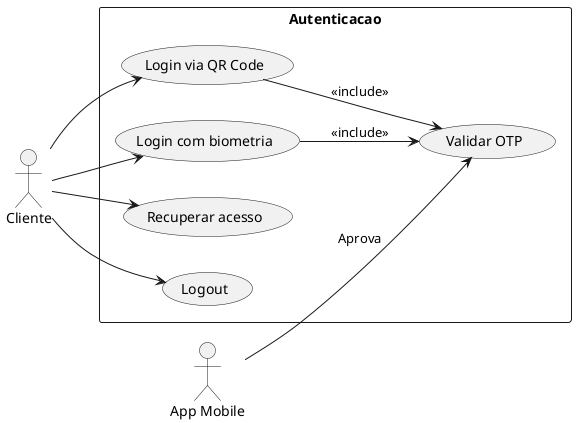
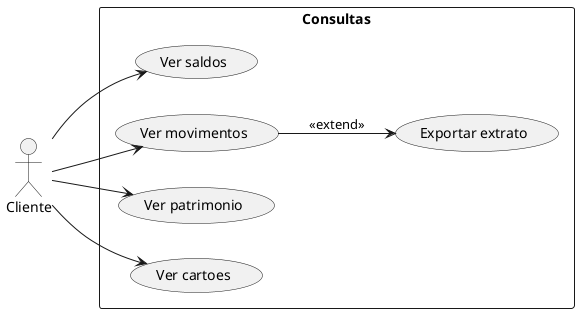
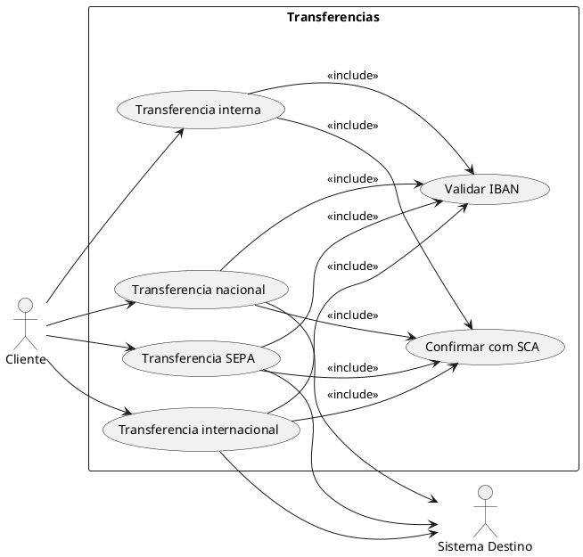
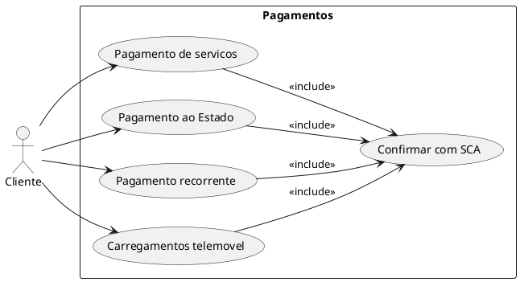
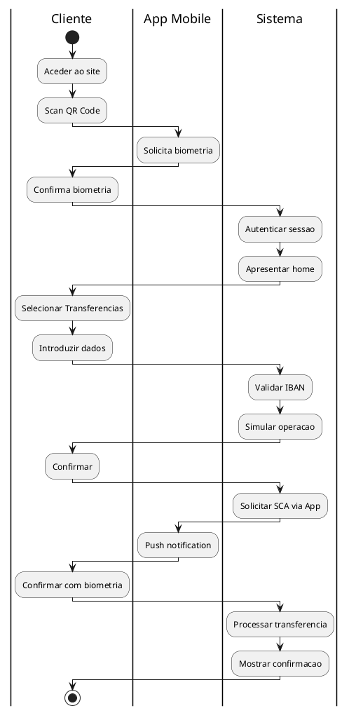
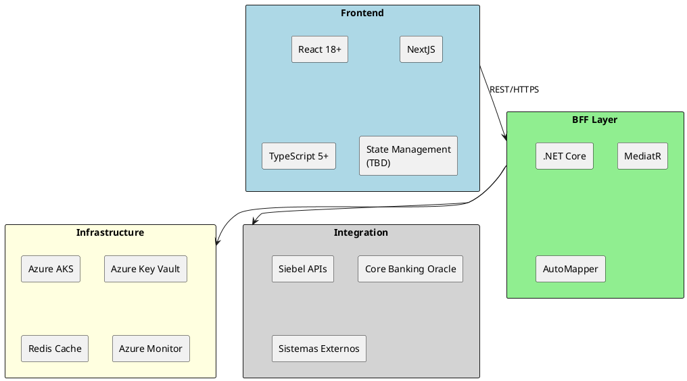

# 03. Visao Geral da Solucao

> **Status:** em-progresso
> **Definicoes utilizadas:** DEF-01-c4-context-diagram.md, DEF-01-stack-tecnologica.md, DEF-03-principios-arquiteturais.md, DEF-03-casos-uso-decisoes.md
> **Ultima atualizacao:** 2025-12-22

## Proposito

Apresentar os principios arquiteturais, diagrama conceptual, casos de uso principais e decisoes arquiteturais fundamentais da solucao.

---

## 3.1 Principios de Arquitetura

### SOLID

Os principios SOLID sao obrigatorios em todo o codigo da solucao:

| Principio | Descricao | Aplicacao |
|-----------|-----------|-----------|
| **S** - Single Responsibility | Uma classe deve ter apenas uma razao para mudar | Cada componente/servico com responsabilidade unica |
| **O** - Open/Closed | Aberto para extensao, fechado para modificacao | Uso de interfaces e abstracoes |
| **L** - Liskov Substitution | Subtipos devem ser substituiveis pelos tipos base | Contratos de interface respeitados |
| **I** - Interface Segregation | Interfaces especificas em vez de interfaces genericas | APIs granulares e focadas |
| **D** - Dependency Inversion | Depender de abstracoes, nao de implementacoes | Injecao de dependencias |

### 12-Factor App

A aplicacao segue os 12 fatores para aplicacoes cloud-native:

| Fator | Descricao | Implementacao |
|-------|-----------|---------------|
| **I. Codebase** | Uma codebase, multiplos deploys | Git com branches por ambiente |
| **II. Dependencies** | Declarar e isolar dependencias | NuGet (C#), npm (React) |
| **III. Config** | Configuracao no ambiente | Azure App Configuration / Environment Variables |
| **IV. Backing Services** | Tratar servicos como recursos anexados | Connection strings configuraveis |
| **V. Build, Release, Run** | Separar build, release e execucao | CI/CD pipelines |
| **VI. Processes** | Executar como processos stateless | Containers sem estado local |
| **VII. Port Binding** | Exportar servicos via port binding | Kestrel/containers com portas expostas |
| **VIII. Concurrency** | Escalar via modelo de processos | Horizontal pod autoscaling (AKS) |
| **IX. Disposability** | Startup rapido e shutdown gracioso | Health checks, graceful shutdown |
| **X. Dev/Prod Parity** | Manter ambientes similares | Containers identicos em todos os ambientes |
| **XI. Logs** | Tratar logs como event streams | Structured logging para Azure Monitor |
| **XII. Admin Processes** | Executar tarefas admin como processos one-off | Kubernetes Jobs |

---

## 3.2 Diagrama de Contexto C4 (Level 1)

```plantuml
@startuml
!include https://raw.githubusercontent.com/plantuml-stdlib/C4-PlantUML/master/C4_Component.puml

HIDE_STEREOTYPE()
LAYOUT_LEFT_RIGHT()

' === Person ===
Person(client, "Cliente autenticado", "Utilizador autenticado via Portal / App")

' === Containers ===
Boundary(clientSolution, "Banking Client Access") {
    Container(appMobile, "App Mobile", "iOS / Android", "APP")
    Container(webSite, "WebSite", "React + .NET", "A aplicação que iremos construir")
}
Boundary(solutionDependencies, "Dependencies") {
    Container(blob, "Blob Storage", "Azure Blob Storage", "Cofre de Chaves e Tokens")
    System_Ext(extSystems, "Sistemas Externos", "Seguros / BTP / MBWay / Visa / Firebase / Google Maps")
    Component(apisEstaticas, "APIs Estáticas", "Software System", "Têm dados que decidimos não colocar na APP em JSON")
    Container(backoffice, "Backoffice de Gestão", "Componente Angular + .NET C# + SQL Server")
    Container(siebel, "Siebel", "Component: IBM")
    ContainerDb(coreBanking, "BB Core Banking", "Conta Bancária: Oracle", "Core Banking")
}
' === Relationships ===
Rel(client, clientSolution, "")
Rel(clientSolution, solutionDependencies, "")
Rel(siebel, coreBanking, "")

@enduml
```

### Sistemas e suas Funcoes

| Sistema | Tipo | Funcao |
|---------|------|--------|
| WebSite (Novo) | Interno | Plataforma web de Homebanking |
| App Mobile | Interno | App existente para autenticacao e operacoes |
| BFF Web | Interno | Backend-for-Frontend da plataforma web |
| Siebel | Interno | Integracao com servicos bancarios |
| Core Banking | Interno | Operacoes bancarias Oracle |
| Blob Storage | Azure | Cofre de chaves e tokens |
| Sistemas Externos | Externo | Seguros, BTP, MBWay, Visa, etc. |

---

## 3.3 Casos de Uso Principais

### UC-01: Autenticacao



### UC-02: Consultas



### UC-03: Transferencias



### UC-04: Pagamentos



---

## 3.4 User Journey Maps

### Jornada: Transferencia Nacional

| Fase | Acao do Utilizador | Sistema | Touchpoint |
|------|-------------------|---------|------------|
| 1 | Acede ao homebanking | Apresenta login QR | Web |
| 2 | Scan QR Code | App Mobile abre | App |
| 3 | Confirma biometria | Valida e autentica | App |
| 4 | Sessao estabelecida | Home apresentada | Web |
| 5 | Seleciona "Transferencias" | Apresenta opcoes | Web |
| 6 | Escolhe "Nova transferencia" | Apresenta formulario | Web |
| 7 | Introduz IBAN | Valida IBAN, obtem nome | Web |
| 8 | Introduz montante | Simula operacao | Web |
| 9 | Confirma operacao | Solicita SCA | Web |
| 10 | Recebe push | Mostra detalhes | App |
| 11 | Confirma biometria | Processa transferencia | App |
| 12 | Ve confirmacao | Mostra sucesso | Web |

### Diagrama de Jornada



---

## 3.5 Decisoes Arquiteturais Fundamentais (ADRs)

### ADR-001: Frontend React com NextJS

| Aspecto | Decisao |
|---------|---------|
| **Contexto** | Escolha de framework frontend |
| **Decisao** | React com NextJS e TypeScript |
| **Motivo** | Restricao do cliente, ecossistema maduro, SSR para performance |
| **Consequencias** | Consistencia com outros projetos, grande pool de talento |

### ADR-002: Backend C# .NET Core (BFF)

| Aspecto | Decisao |
|---------|---------|
| **Contexto** | Escolha de stack backend |
| **Decisao** | .NET Core como BFF |
| **Motivo** | Restricao do cliente, performance, suporte Microsoft |
| **Consequencias** | Camada de orquestracao, tokens nunca expostos ao frontend |

### ADR-003: Padrao BFF (Backend-for-Frontend)

| Aspecto | Decisao |
|---------|---------|
| **Contexto** | Arquitetura de comunicacao frontend-backend |
| **Decisao** | BFF dedicado para o website |
| **Motivo** | Seguranca (tokens nao expostos), orquestracao de APIs |
| **Consequencias** | Camada adicional, mas melhor separacao de concerns |

### ADR-004: Azure Kubernetes Service (AKS)

| Aspecto | Decisao |
|---------|---------|
| **Contexto** | Plataforma de deployment |
| **Decisao** | AKS (OpenShift compliant) |
| **Motivo** | Cloud Azure obrigatorio, cloud-native |
| **Consequencias** | Portabilidade futura para OpenShift, managed K8s |

### ADR-005: OAuth com Vinculacao App Mobile

| Aspecto | Decisao |
|---------|---------|
| **Contexto** | Autenticacao e autorizacao |
| **Decisao** | Mesmo modelo de token do App + autorizacao via App/OTP |
| **Motivo** | PSD2 SCA, consistencia, seguranca reforçada |
| **Consequencias** | Dependencia do App Mobile para autenticacao |

### ADR-006: Integracao via Siebel

| Aspecto | Decisao |
|---------|---------|
| **Contexto** | Integracao com Core Banking |
| **Decisao** | Reutilizar APIs Siebel existentes |
| **Motivo** | Consistencia com App Mobile, reutilizacao |
| **Consequencias** | Dependencia do Siebel, paridade garantida |

---

## 3.6 Technology Stack Overview

### Diagrama de Stack



### Detalhes da Stack

| Camada | Tecnologia | Versao | Notas |
|--------|------------|--------|-------|
| **Frontend** | React | 18+ | Componentes funcionais, hooks |
| | NextJS | 14+ | SSR, routing, optimizacoes |
| | TypeScript | 5+ | Tipagem estatica |
| | State Management | _TBD_ | Redux/Zustand/Context |
| **Backend** | .NET Core | 8+ | LTS |
| | C# | 12 | - |
| | MediatR | Latest | CQRS pattern |
| **Container** | Docker | Latest | Multi-stage builds |
| **Orchestration** | Kubernetes | 1.28+ | Via AKS |
| **Cloud** | Azure | - | Regiao Portugal/UE |
| **Cache** | Redis | 7+ | Sessoes e tokens |
| **Observability** | Azure Monitor | - | Logs, metricas, traces |

---

## 3.7 Trade-offs

| Decisao | Vantagem | Desvantagem |
|---------|----------|-------------|
| BFF | Seguranca (tokens ocultos), orquestracao | Latencia adicional |
| Siebel | Reutilizacao, paridade App | Dependencia de sistema legado |
| OAuth via App | Seguranca reforçada (SCA) | Requer App instalado |
| AKS | Managed K8s, Azure native | Vendor lock-in Azure |
| NextJS | SSR, performance, SEO | Complexidade adicional |

---

## Entregaveis

- [x] Documento de principios arquiteturais (SOLID, 12-factor app)
- [x] Diagrama C4 Level 1 (System Context Diagram)
- [x] Catalogo de casos de uso principais com diagramas UML
- [x] User journey maps (transferencia nacional)
- [x] Decisoes arquiteturais fundamentais (6 ADRs)
- [x] Technology stack overview (frontend, backend, infra)
- [ ] Diagrama C4 Level 2 (Container) - **Pendente detalhamento**
- [ ] User journey maps adicionais - **Pendente**
- [ ] Detalhes de state management frontend - **Pendente decisao**

---

## Questoes Pendentes

1. Qual biblioteca de state management (Redux/Zustand/Context)?
2. Estrategia de caching detalhada?
3. Definicao de bounded contexts para DDD?
4. CQRS e Event Sourcing aplicaveis?

---

## Definicoes Utilizadas

- [x] [DEF-01-c4-context-diagram.md](../definitions/DEF-01-c4-context-diagram.md) - Status: em-progresso
- [x] [DEF-01-stack-tecnologica.md](../definitions/DEF-01-stack-tecnologica.md) - Status: em-progresso
- [x] [DEF-03-principios-arquiteturais.md](../definitions/DEF-03-principios-arquiteturais.md) - Status: em-progresso
- [x] [DEF-03-casos-uso-decisoes.md](../definitions/DEF-03-casos-uso-decisoes.md) - Status: em-progresso

---

## Navegacao

| Anterior | Proximo |
|----------|---------|
| [02. Contexto de Negocio & Requisitos](SEC-02-contexto-negocio-requisitos.md) | [04. Experiencia Utilizador & Frontend](SEC-04-experiencia-utilizador-frontend.md) |
