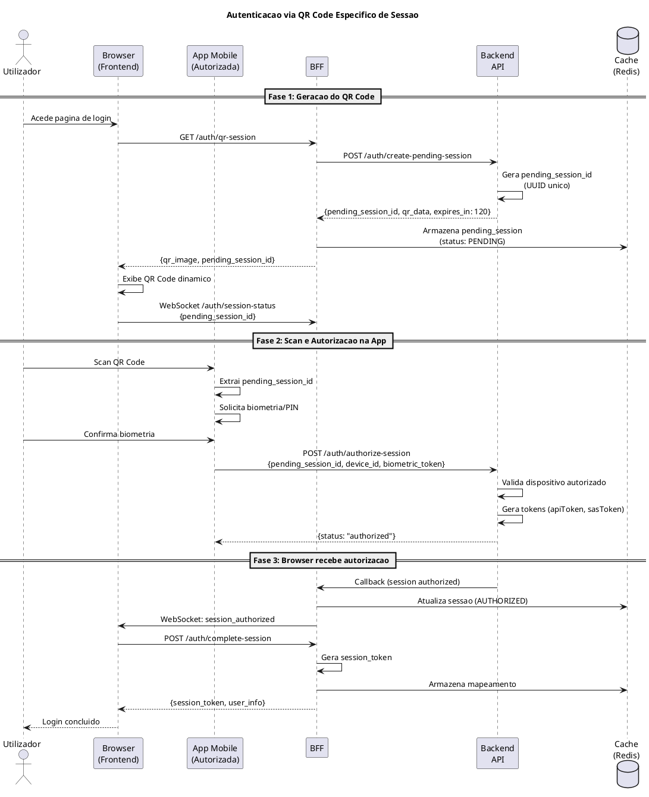
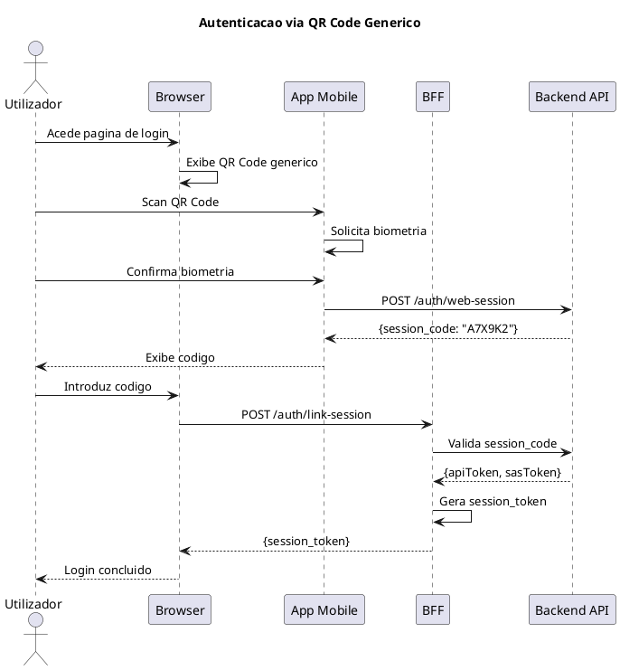
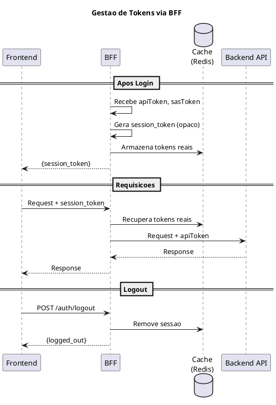
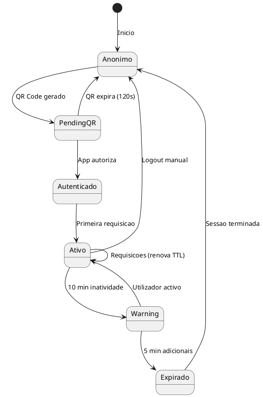
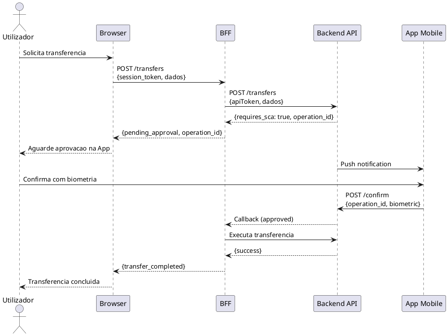
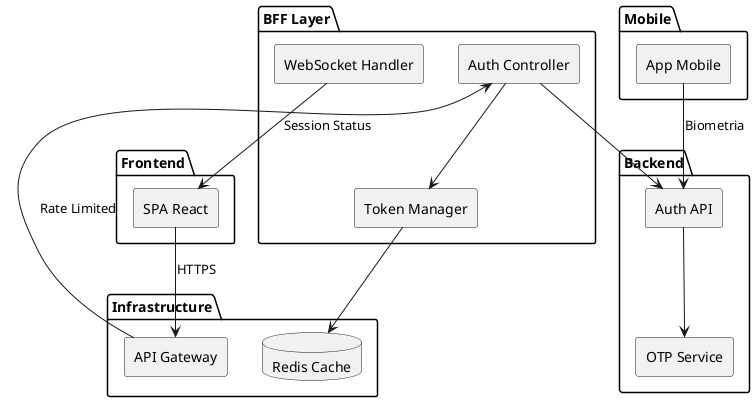

# 07. Autenticacao & Autorizacao

> **Status:** em-progresso
> **Definicoes utilizadas:** DEF-07-autenticacao-oauth.md
> **Ultima atualizacao:** 2025-12-22

## Proposito

Definir os mecanismos de autenticacao, autorizacao, gestao de sessoes e estrategias de seguranca da plataforma de Homebanking do Novo Banco.

---

## 7.1 Visao Geral

A autenticacao na plataforma segue o modelo de **Strong Customer Authentication (SCA)** exigido pela PSD2, utilizando dois ou mais factores de autenticacao. O fluxo principal utiliza a App Mobile autorizada como dispositivo de confianca para validacao biometrica.

### Principios de Seguranca

| Principio | Implementacao |
|-----------|---------------|
| Defense in depth | Multiplas camadas (Gateway, BFF, Backend) |
| Zero trust | Tokens opacos no frontend, validacao em cada camada |
| Least privilege | Sessoes com scope limitado |
| Fail secure | Fallback para fluxos mais restritivos |

---

## 7.2 Fluxos de Autenticacao

### Cenarios Suportados

| Cenario | Descricao | Recomendacao |
|---------|-----------|--------------|
| **QR Code Especifico** | QR dinamico por sessao, vinculacao automatica via WebSocket | **Principal** |
| QR Code Generico | QR fixo, codigo manual introduzido pelo utilizador | Alternativo |
| User + Pass + OTP SMS | Login tradicional com OTP via SMS | Fallback legacy |
| User + Pass + Push App | Login tradicional com aprovacao na App | Fallback |

### Fluxo Principal: QR Code Especifico de Sessao

Este fluxo oferece a melhor experiencia de utilizador mantendo elevados padroes de seguranca.

### Fluxo Alternativo: QR Code Generico

---

## 7.3 Estrategia de Tokens

### Arquitectura BFF como Intermediario

O BFF actua como camada de seguranca, garantindo que os tokens reais nunca sao expostos ao Frontend.

### Tipos de Tokens

| Token | Localizacao | Proposito | Visibilidade |
|-------|-------------|-----------|--------------|
| session_token | Frontend | Identificar sessao no BFF | Frontend |
| apiToken | Cache BFF | Autenticacao com Backend | Apenas BFF |
| sasToken | Cache BFF | Acesso ao cofre de chaves | Apenas BFF |

### Ciclo de Vida

| Evento | Accao | Responsavel |
|--------|-------|-------------|
| Login bem-sucedido | Criar session_token, armazenar tokens reais | BFF |
| Requisicao | Traduzir session_token para tokens reais | BFF |
| Proximidade de expiracao | Renovar apiToken automaticamente | BFF |
| Logout | Eliminar session_token e tokens do cache | BFF |
| Inatividade (15 min) | Invalidar sessao | BFF |

---

## 7.4 Autenticacao Forte (SCA) - PSD2

### Factores de Autenticacao

| Factor | Tipo | Implementacao |
|--------|------|---------------|
| Conhecimento | Algo que sabe | Password, PIN |
| Posse | Algo que tem | App Mobile autorizada |
| Inerencia | Algo que e | Biometria (fingerprint, face) |

### Operacoes que Requerem SCA

| Operacao | SCA | Metodo |
|----------|-----|--------|
| Login | Sim | QR Code + Biometria |
| Transferencias | Sim | Confirmacao na App |
| Pagamentos | Sim | Confirmacao na App |
| Alteracao de dados sensiveis | Sim | Confirmacao na App |
| Consultas | Nao | Sessao activa valida |

---

## 7.5 Gestao de Sessoes

### Estados da Sessao

### Timeouts

| Evento | Tempo | Accao |
|--------|-------|-------|
| QR Code expiracao | 120 seg | Gerar novo QR |
| Inatividade warning | 10 min | Notificar utilizador |
| Inatividade logout | 15 min | Terminar sessao |

### Sessoes Multiplas

- **Politica:** Permitidas
- **Justificativa:** Browser e App coexistem (App necessaria para autorizar Browser)
- **Rastreabilidade:** Cada sessao tem session_token unico

---

## 7.6 MFA (Multi-Factor Authentication)

### Metodos Suportados

| Metodo | Descricao | Uso |
|--------|-----------|-----|
| Biometria na App | Fingerprint ou Face ID | **Principal** |
| PIN na App | Codigo numerico de 6 digitos | Fallback |
| OTP SMS | Codigo enviado por SMS | Legacy |
| Push Notification | Aprovacao na App | Alternativo |

### Fluxo de Step-up Authentication

Para operacoes sensiveis (transferencias, pagamentos), e solicitada confirmacao adicional na App.

---

## 7.7 Autorizacao (RBAC)

> **Status:** A definir

### Estrutura Prevista

| Componente | Descricao |
|------------|-----------|
| Perfis | Tipos de utilizador (Particular, Empresa, etc.) |
| Permissoes | Accoes permitidas por recurso |
| Recursos | Contas, Transferencias, Pagamentos, etc. |

### Questoes Pendentes

- Quais perfis de utilizador existem?
- Ha niveis de permissao diferentes por tipo de conta?
- Existe delegacao de poderes (procuradores)?

---

## 7.8 Anti-Automacao

### Mecanismos Implementados

| Mecanismo | Descricao | Responsavel |
|-----------|-----------|-------------|
| QR Code + Dispositivo autorizado | Requer App previamente vinculada | Backend |
| Biometria | Confirma identidade fisica | App Mobile |
| Rate Limiting | Limita tentativas por IP/utilizador | Gateway |
| Device fingerprint | Identifica dispositivos suspeitos | Backend |

### Dispensa de CAPTCHA

O fluxo via QR Code dispensa CAPTCHA porque:
1. Requer dispositivo fisico (App instalada)
2. Requer dispositivo previamente autorizado pelo cliente
3. Requer autenticacao biometrica na App
4. QR Code expira em 120 segundos

---

## 7.9 Revogacao

> **Status:** A definir

### Cenarios de Revogacao

| Cenario | Accao Esperada |
|---------|----------------|
| Logout voluntario | Invalidar session_token e tokens no cache |
| Suspeita de comprometimento | Invalidar todas as sessoes do utilizador |
| Alteracao de password | Invalidar todas as sessoes |
| Dispositivo removido | Invalidar sessoes desse dispositivo |

---

## 7.10 Politicas de Password

> **Status:** A definir

### Requisitos Previstos

| Aspecto | Requisito |
|---------|-----------|
| Comprimento minimo | A definir |
| Complexidade | A definir |
| Expiracao | A definir |
| Historico | A definir |
| Bloqueio por tentativas | A definir |

---

## Diagramas

### Diagrama de Componentes - Autenticacao

---

## Entregaveis

- [x] Diagrama de sequencia: Fluxo de autenticacao QR Code Especifico
- [x] Diagrama de sequencia: Fluxo de autenticacao QR Code Generico
- [x] Diagrama de sequencia: Gestao de tokens via BFF
- [x] Diagrama de sequencia: Step-up authentication
- [x] Diagrama de estados: Ciclo de vida da sessao
- [x] Politica de gestao de sessoes (timeouts, concorrencia)
- [ ] Matriz RBAC (roles, permissions, resources) - **A definir**
- [ ] Password policy document - **A definir**
- [ ] Procedimentos de revogacao e logout - **A definir**
- [x] Estrategia anti-bot (dispensa CAPTCHA justificada)
- [x] Configuracao de rate limiting (delegado ao Gateway)

---

## Dependencias

| Componente | Responsabilidade | Status |
|------------|------------------|--------|
| App Mobile | Scan QR, biometria, autorizacao | Existente |
| Backend API | Gestao de tokens, validacao | Existente |
| BFF | Intermediario de tokens, session_token | A implementar |
| Cache (Redis) | Armazenamento de sessoes/tokens | A implementar |
| Gateway | Rate Limiting, WAF | **Dependencia externa** |
| WebSocket Server | Notificacao de sessao autorizada | A implementar |

---

## Definicoes Utilizadas

- [x] [DEF-07-autenticacao-oauth.md](../definitions/DEF-07-autenticacao-oauth.md) - Status: em-progresso

---

## Navegacao

| Anterior | Proximo |
|----------|---------|
| [06. Arquitetura de Dados](SEC-06-arquitetura-dados.md) | [08. Seguranca & Conformidade](SEC-08-seguranca-conformidade.md) |
