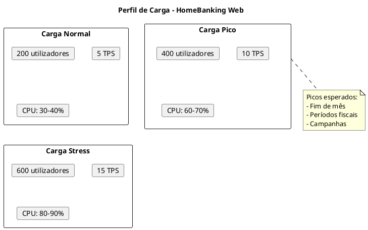
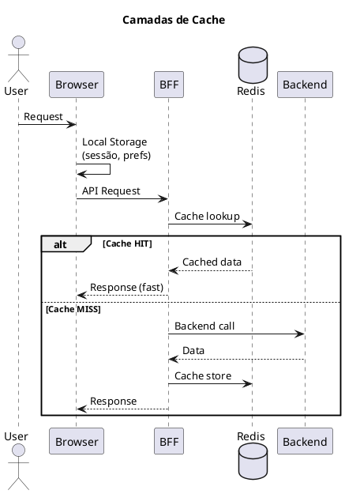
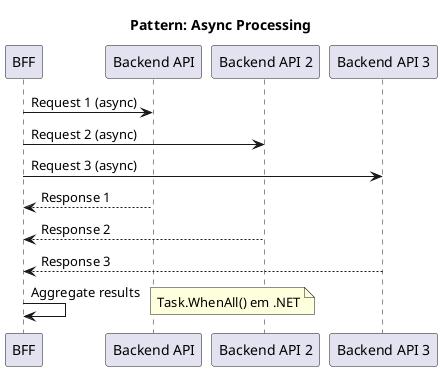
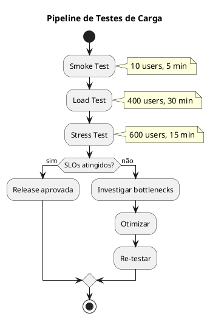

# DEF-22: Desempenho & Fiabilidade

> **Secção relacionada:** [SEC-12 - Desempenho & Fiabilidade](../sections/SEC-12-desempenho-fiabilidade.md)

## Contexto

Definir os requisitos e estratégias de desempenho e fiabilidade do HomeBanking Web, incluindo objetivos de carga, estratégias de caching, otimizações frontend e backend, auto-scaling, capacity planning e testes de carga.

---

## Objetivos de Performance

### Requisitos Base (DEF-02)

| Métrica | Target | Fonte |
|---------|--------|-------|
| Utilizadores concorrentes | 400 | DEF-02 |
| Throughput | 10 TPS | DEF-02 |
| Tempo resposta operações | < 3s | DEF-02 |
| Carregamento página inicial | < 10s | DEF-02 |
| Disponibilidade | 99.9% | DEF-02 |

### Core Web Vitals Targets

| Métrica | Target | Classificação |
|---------|--------|---------------|
| **LCP** (Largest Contentful Paint) | < 2.5s | Good |
| **FID** (First Input Delay) | < 100ms | Good |
| **CLS** (Cumulative Layout Shift) | < 0.1 | Good |
| **TTFB** (Time to First Byte) | < 800ms | Good |
| **FCP** (First Contentful Paint) | < 1.8s | Good |

### Perfil de Carga



---

## Estratégia de Caching

### Camadas de Cache



### Tipos de Cache por Componente

| Componente | Tipo | TTL | Estratégia |
|------------|------|-----|------------|
| Browser | Local Storage | Sessão | Dados de sessão, preferências |
| Browser | Service Worker | 1h | Assets estáticos (PWA) |
| BFF | Redis | Variável | Dados de API (ver tabela abaixo) |

### TTL por Tipo de Dado (Redis)

| Dado | TTL | Justificação |
|------|-----|--------------|
| Sessão do utilizador | 10 min | Inatividade timeout |
| Tokens OAuth | Variável | Alinhado com expiração |
| Configurações do sistema | 5 min | Baixa frequência de mudança |
| Dados de referência (países, bancos) | 1 hora | Dados estáticos |
| Cotações/Taxas | 1 min | Dados voláteis |

### Cache Invalidation

| Evento | Ação |
|--------|------|
| Logout | Invalidar sessão no Redis |
| Transação executada | Invalidar cache de saldos (se aplicável) |
| Deploy | Versionar assets (cache busting) |
| Configuração alterada | Invalidar cache de config |

---

## Otimização Frontend

### Bundle Optimization

| Técnica | Implementação | Impacto |
|---------|---------------|---------|
| Code Splitting | React.lazy() + Suspense | Reduz initial bundle |
| Tree Shaking | Webpack/Vite config | Remove código não utilizado |
| Lazy Loading | Componentes e rotas | Carrega sob demanda |
| Minification | Terser (JS), CSSNano | Reduz tamanho |
| Compression | gzip/Brotli | 70-90% redução |

### Budget de Bundle

| Métrica | Limite | Ação se exceder |
|---------|--------|-----------------|
| Initial JS | < 200KB (gzipped) | Code split |
| Initial CSS | < 50KB (gzipped) | Purge CSS |
| Largest chunk | < 100KB | Split ou lazy load |
| Total assets | < 1MB | Review dependencies |

### Otimização de Assets

| Asset | Estratégia |
|-------|------------|
| Imagens | WebP format, lazy loading, srcset |
| Fontes | WOFF2, font-display: swap, subset |
| Icons | SVG sprite ou icon font |
| CSS | Critical CSS inline, defer restante |

### Service Worker (PWA)

```javascript
// Estratégia de cache
const CACHE_STRATEGIES = {
  // Assets estáticos - Cache First
  static: 'CacheFirst',

  // API calls - Network First
  api: 'NetworkFirst',

  // Imagens - Stale While Revalidate
  images: 'StaleWhileRevalidate'
};
```

---

## Otimização Backend (BFF)

### Connection Pooling

| Conexão | Pool Size | Timeout |
|---------|-----------|---------|
| Redis | 10-20 | 5s |
| HTTP Client (Backend) | 100 | 30s |

### Compressão

| Tipo | Configuração |
|------|--------------|
| Response | gzip (nível 6) |
| Threshold | > 1KB |
| Content-Types | application/json, text/html |

### Async/Non-blocking



---

## Auto-Scaling

### Horizontal Pod Autoscaler (HPA)

A solução utiliza HPA baseado em métricas de CPU e memória para os componentes Frontend e BFF, com comportamento diferenciado de scale-up e scale-down para evitar oscilações.

> **Nota (DEC-025):** Os parâmetros concretos de HPA — min/max réplicas, targets de CPU e memória, e janelas de estabilização — serão fornecidos pela equipa de infraestrutura do Novo Banco.

---

## Capacity Planning

> **Nota (DEC-025):** Resource requests e limits por container/pod serão fornecidos pela equipa de infraestrutura do Novo Banco.

---

## Resiliência

### Pod Disruption Budget

A solução configura PDB por componente para garantir disponibilidade durante manutenções.

> **Nota (DEC-025):** A política de `minAvailable` por deployment será fornecida pela equipa de infraestrutura do Novo Banco.

### Padrões de Resiliência

| Padrão | Implementação | Referência |
|--------|---------------|------------|
| Circuit Breaker | Polly (.NET) | DEF-15-padroes-resiliencia |
| Retry with Backoff | Polly | DEF-15-padroes-resiliencia |
| Timeout | HttpClient timeout | DEF-15-padroes-resiliencia |
| Bulkhead | Limite de conexões | DEF-15-padroes-resiliencia |

### Configuração Circuit Breaker

```csharp
// Polly Circuit Breaker
services.AddHttpClient("BackendAPI")
    .AddPolicyHandler(Policy
        .Handle<HttpRequestException>()
        .CircuitBreakerAsync(
            handledEventsAllowedBeforeBreaking: 5,
            durationOfBreak: TimeSpan.FromSeconds(30),
            onBreak: (ex, duration) => { /* log */ },
            onReset: () => { /* log */ }
        ));
```

---

## Testes de Carga

### Estratégia de Load Testing



### Cenários de Teste

| Cenário | Users | Duração | Objetivo |
|---------|-------|---------|----------|
| Smoke | 10 | 5 min | Validar ambiente |
| Load | 400 | 30 min | Validar capacidade nominal |
| Stress | 600 | 15 min | Identificar limites |
| Soak | 200 | 4 horas | Identificar memory leaks |

### Métricas a Capturar

| Métrica | Target | Fail Criteria |
|---------|--------|---------------|
| Response Time P95 | < 3s | > 5s |
| Error Rate | < 0.1% | > 1% |
| Throughput | 10 TPS | < 8 TPS |
| CPU (peak) | < 80% | > 90% |
| Memory (peak) | < 80% | > 90% |

### Ferramenta de Load Testing

> **Nota (DEC-025):** A ferramenta de load testing aprovada, os cenários obrigatórios e os critérios de aceitação serão fornecidos pela equipa de infraestrutura do Novo Banco.

---

## Questões Pendentes de Confirmação

| ID | Questão | Responsável | Prioridade |
|----|---------|-------------|------------|
| Q-12-001 | Picos de utilização específicos (datas) | Produto | Média |
| Q-12-002 | Limites de recursos definitivos | Infraestrutura do banco (DEC-025) | Alta |
| Q-12-003 | Ferramenta de load testing aprovada | Infraestrutura do banco (DEC-025) | Média |
| Q-12-004 | Budget de bundle size | Frontend Lead | Média |

---

## Decisões

### Targets de Performance
- **Decisão:** Core Web Vitals como baseline (LCP < 2.5s, FID < 100ms, CLS < 0.1)
- **Justificação:** Standard da indústria, impacto em SEO e UX
- **Alternativas consideradas:** Métricas customizadas apenas

### Estratégia de Cache
- **Decisão:** Cache multi-camada (Browser + Redis)
- **Justificação:** Maximizar performance em todos os níveis; sem CDN na solução
- **Alternativas consideradas:** Cache apenas no BFF

### Auto-scaling
- **Decisão:** HPA baseado em métricas de CPU e memória. Parâmetros concretos fornecidos pelo banco (DEC-025).

### Testes de Carga
- **Decisão:** Executar testes de carga antes de cada release major. Ferramenta e critérios de aceitação fornecidos pelo banco (DEC-025).

---

## Decisões Relacionadas

- [DEC-006-estrategia-containers-openshift.md](../decisions/DEC-006-estrategia-containers-openshift.md) - Containers e auto-scaling
- [DEC-007-padrao-bff.md](../decisions/DEC-007-padrao-bff.md) - BFF (cache, resiliência)
- [DEC-009-stack-tecnologica-frontend.md](../decisions/DEC-009-stack-tecnologica-frontend.md) - Stack frontend
- [DEC-010-stack-tecnologica-backend.md](../decisions/DEC-010-stack-tecnologica-backend.md) - Stack backend

## Referências

- [DEF-04-requisitos-nao-funcionais.md](DEF-04-requisitos-nao-funcionais.md) - NFRs de performance
- [DEF-15-padroes-resiliencia.md](DEF-15-padroes-resiliencia.md) - Padrões de resiliência
- [DEF-16-arquitetura-dados.md](DEF-16-arquitetura-dados.md) - Cache Redis
- [DEF-20-arquitetura-operacional.md](DEF-20-arquitetura-operacional.md) - Infraestrutura
- Google Core Web Vitals
- Kubernetes HPA Documentation
- k6 Documentation
