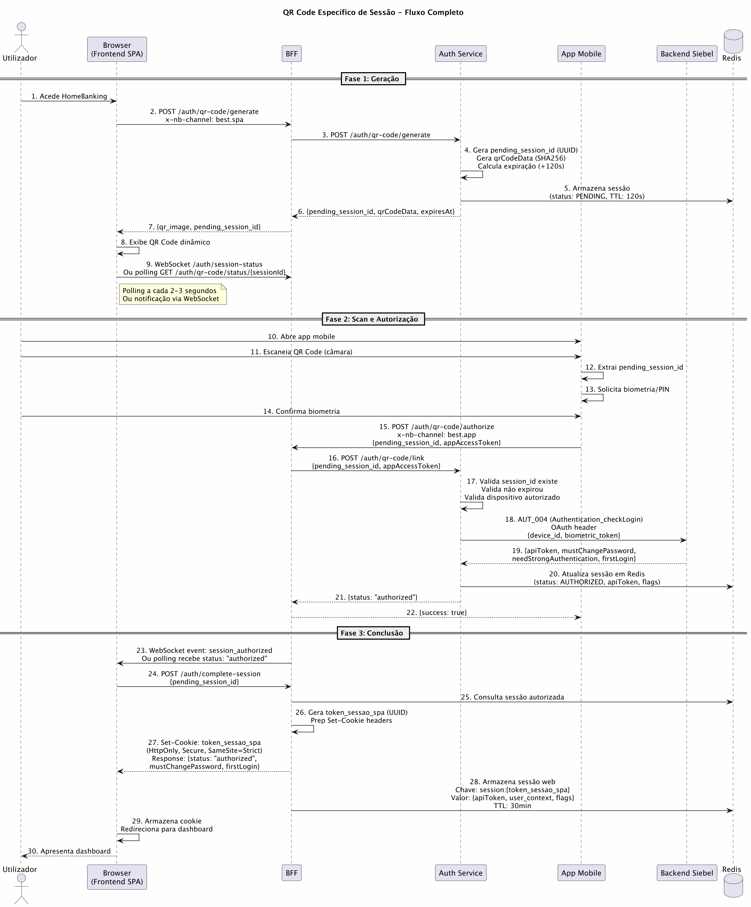
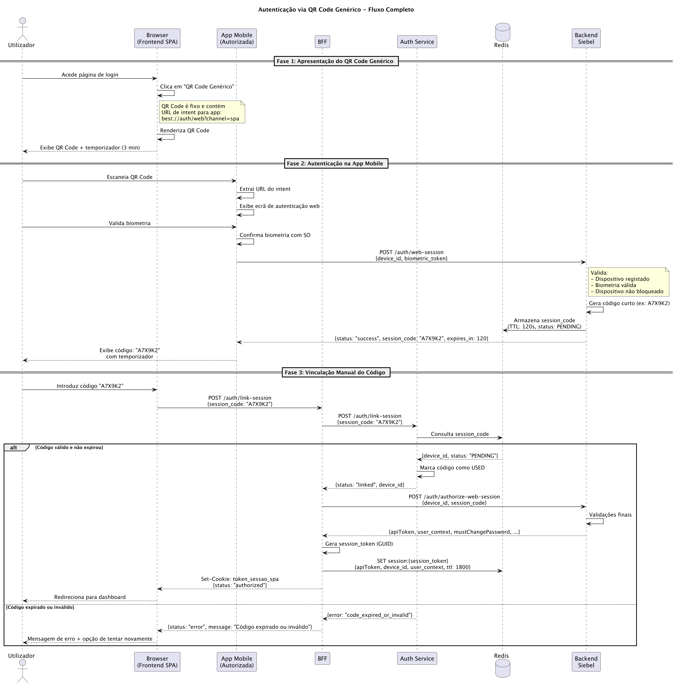
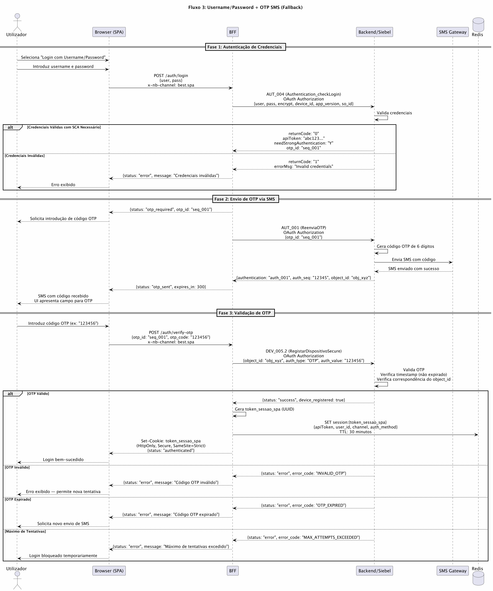
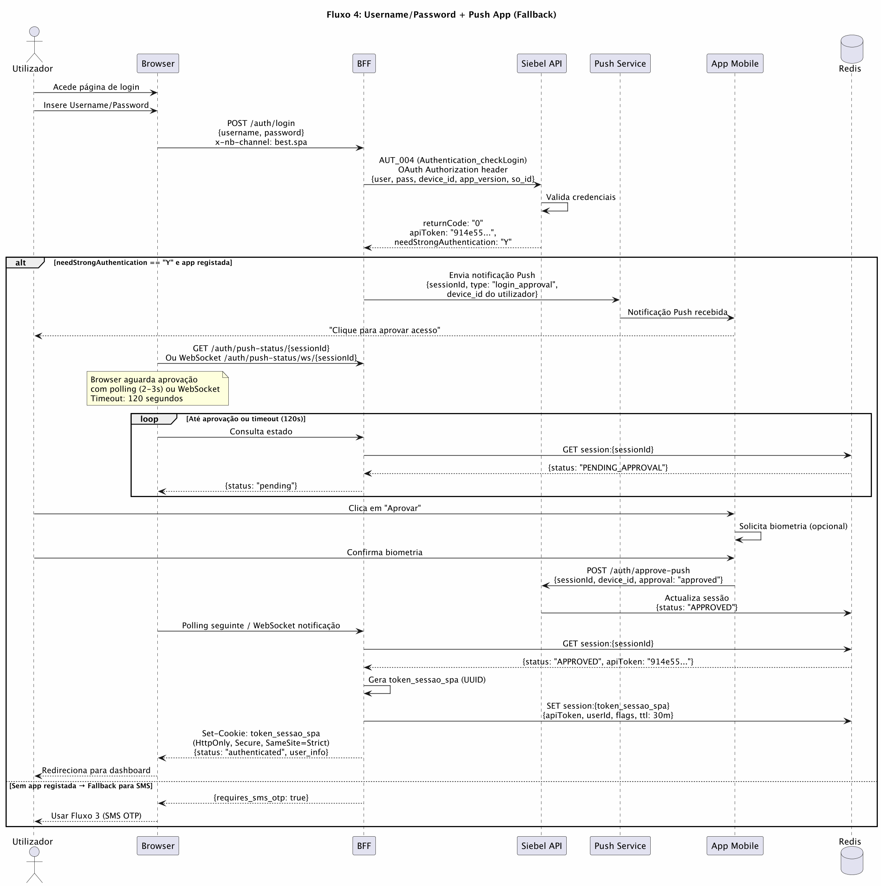

# Análise Técnica dos Fluxos de Autenticação

## HomeBanking Web — Banco Best

Este documento descreve em detalhe os quatro fluxos de autenticação suportados pelo HomeBanking Web do Banco Best, com fundamentação técnica e arquitectural para defesa junto da equipa técnica. Os fluxos estão ordenados por prioridade de uso conforme definido em [DEF-13](../definitions/DEF-13-autenticacao-oauth.md) e [DEC-001](../decisions/DEC-001-estrategia-autenticacao-web.md).

| # | Fluxo | Tipo | Quando Usar |
|---|-------|------|-------------|
| 1 | QR Code Específico de Sessão | **Principal** | Método recomendado para todos os utilizadores com app |
| 2 | QR Code Genérico | **Alternativo** | Fallback do Fluxo 1; menor complexidade técnica |
| 3 | Username/Password + OTP SMS | **Fallback** | Sem app; compatibilidade máxima |
| 4 | Username/Password + Push App | **Fallback** | Com app mas sem QR Code |

> **Nota sobre conformidade:** Todos os quatro fluxos cumprem os requisitos de **Strong Customer Authentication (SCA)** da Diretiva PSD2 com dois fatores de autenticação independentes.

---

## Fluxo 1: QR Code Específico de Sessão (Método Principal)

### 1. Visão Geral e Propósito

O **Fluxo de QR Code Específico de Sessão** é o método principal de autenticação para o HomeBanking Web do Banco Best. Este fluxo foi definido como prioritário por oferecer a melhor combinação de segurança e experiência de utilizador, baseando-se na infraestrutura já consolidada da aplicação móvel autorizada.

**Por que é o método principal:**

- **Reutilização de infraestrutura:** Aproveita a app mobile do Banco Best já instalada e vinculada do utilizador
- **Segurança máxima:** Requer biometria confirmada no dispositivo registado, cumprindo os requisitos de Strong Customer Authentication (SCA) da diretiva PSD2
- **Experiência de utilizador fluida:** Processo rápido (scan + biometria) sem necessidade de introduzir credenciais manuais
- **Eliminação de CAPTCHA:** O requisito de dispositivo físico com biometria dispensa completamente a necessidade de CAPTCHA ou rate limiting agressivo
- **Vinculação automática de sessão:** Após scan e biometria, a sessão web é automaticamente autorizada sem passos adicionais

**Problemas que resolve:**

- Segurança inadequada de métodos baseados em SMS (vulnerável a SIM swap)
- Complexidade de registo de novos dispositivos na web (já resolvido na app)
- Replicação de lógica de autenticação entre canais
- Experiência de utilizador inferior em fallbacks tradicionais

### 2. Pré-requisitos

Para utilizar com sucesso o Fluxo 1, o utilizador deve satisfazer os seguintes pré-requisitos:

| Pré-requisito | Descrição | Validação |
|---------------|-----------|-----------|
| **App Mobile Instalada** | A aplicação mobile do Banco Best deve estar instalada no dispositivo do utilizador | Necessária para scan do QR Code |
| **Conta Activa** | Utilizador deve ter uma conta válida no Banco Best | Validado durante autenticação |
| **Biometria Registada** | Utilizador deve ter biometria (fingerprint, face, PIN) registada na app mobile | Requerido pela app antes de aprovar sessão |
| **App Autorizada** | A app mobile deve estar vinculada à conta do utilizador | Confirmado durante resposta AUT_004 |
| **Dispositivo Saudável** | Dispositivo com app deve ter acesso à rede e estar funcional | Necessário para comunicação com backend |
| **Browser Moderno** | Browser com suporte a WebSocket e HTTPS | Recomendação técnica para melhor UX |

> O utilizador não precisa de introduzir nenhuma credencial manual — a autenticação é completamente baseada no dispositivo autorizado e biometria.

### 3. Descrição Técnica Passo-a-Passo

O fluxo completo envolve cinco actores principais: Utilizador, Browser (Frontend SPA), BFF (Backend For Frontend), Serviço de Autenticação (Auth Service), e App Mobile. O protocolo divide-se em três fases distintas.

**Fase 1: Geração da Sessão Pendente e QR Code**

1. Utilizador acede ao HomeBanking Web no seu browser
2. Browser submete `POST /auth/qr-code/generate` ao BFF com header `x-nb-channel: best.spa`
3. BFF reencaminha o pedido para o Auth Service (microserviço especializado)
4. Auth Service gera:
   - `pending_session_id`: UUID único para esta tentativa de autenticação
   - `qrCodeData`: Dados cifrados contendo o session ID e timestamp (inclui assinatura SHA256)
   - `expiresAt`: Timestamp de expiração (120 segundos)
   - Estado inicial: `PENDING` armazenado em Redis
5. Auth Service armazena a sessão pendente em Redis com TTL de 120 segundos
6. BFF converte `qrCodeData` em código QR (2D) e retorna ao browser
7. Browser exibe o código QR dinamicamente
8. Simultaneamente, o browser inicia polling via `WebSocket /auth/session-status/{sessionId}` ou fallback para HTTP polling em `GET /auth/qr-code/status/{sessionId}` a cada 2-3 segundos

**Fase 2: Autorização via App Mobile**

1. Utilizador abre a app mobile do Banco Best
2. Utilizador escaneia o código QR apresentado no browser usando a câmara da app
3. App extrai o `pending_session_id` do QR Code
4. App solicita ao utilizador confirmação biométrica (fingerprint, face ou PIN registado)
5. Utilizador fornece biometria (processo nativo do dispositivo)
6. App envia `POST /auth/qr-code/authorize` ao BFF com:
   - `pending_session_id`: Extraído do QR
   - `x-nb-channel: best.app`: Header identificando origem mobile
   - `appAccessToken`: Token de autenticação que a app móvel já possui
7. BFF reencaminha para Auth Service: `POST /auth/qr-code/link`
8. Auth Service valida: session ID existe em Redis, não expirou, dispositivo autorizado
9. Auth Service actualiza estado em Redis de `PENDING` para `AUTHORIZED`

**Fase 3: Conclusão no Browser e Criação da Sessão Web**

1. Auth Service notifica BFF de autorização bem-sucedida
2. BFF envia notificação via WebSocket: `{status: "authorized"}`
3. Browser recebe notificação e interrompe polling
4. Browser submete `POST /auth/complete-session` com `pending_session_id`
5. BFF valida estado em Redis (deve estar `AUTHORIZED`)
6. BFF gera `token_sessao_spa` (UUID opaco)
7. BFF envia `Set-Cookie` com atributos de segurança completos
8. BFF armazena em Redis a sessão web com `apiToken`, contexto do utilizador e flags
9. Utilizador é redirecionado para o dashboard

### 4. Diagrama de Sequência



### 5. Endpoints Envolvidos

| Endpoint | Método | Origem | Descrição |
|----------|--------|--------|-----------|
| `/auth/qr-code/generate` | `POST` | Browser via BFF | Gera novo QR Code e sessão pendente em Redis |
| `/auth/qr-code/status/{sessionId}` | `GET` | Browser via BFF | Polling para verificar se QR foi autorizado |
| `/auth/qr-code/authorize` | `POST` | App Mobile via BFF | Autoriza sessão após scan e biometria |
| `/auth/qr-code/link` | `POST` | BFF (internal) | Vincula tokens da app à sessão web |
| `/auth/complete-session` | `POST` | Browser via BFF | Finaliza autenticação após notificação |
| `AUT_004` | `POST` | Auth Service → Siebel | Validação de credenciais no backend |
| `WebSocket /auth/session-status` | Upgrade | Browser | Notificação push (alternativa a polling) |

**Headers obrigatórios em todas as chamadas ao backend:**

```
x-nb-channel: best.spa   (chamadas originadas no browser)
x-nb-channel: best.app   (chamadas originadas na app mobile)
```

### 6. Gestão de Sessão e Tokens

**Arquitectura de dois níveis:**

```
Browser                BFF (Redis)              Siebel
─────────────────      ─────────────────────    ──────────────
token_sessao_spa  ───► session:{token}          apiToken
(Cookie HttpOnly)      {apiToken, context}  ───► OAuth Bearer
                       TTL: 30 min              (fixo por sessão)
```

**Cookie de Sessão (`token_sessao_spa`):**

| Atributo | Valor | Justificação |
|----------|-------|--------------|
| HttpOnly | `true` | Inacessível via JavaScript — protege contra XSS |
| Secure | `true` | Apenas transmitido via HTTPS |
| SameSite | `Strict` | Previne CSRF — não enviado em cross-site requests |
| Path | `/` | Válido para toda a aplicação |
| Max-Age | 1800 (30 min) | Timeout absoluto de sessão |

**Contexto armazenado em Redis:**

```json
{
  "session": {
    "token_sessao_spa": {
      "apiToken": "914e55d8ea3b4e19b1aa63c9efbad2ba",
      "user_id": "12345",
      "mustChangePassword": "N",
      "needStrongAuthentication": "N",
      "firstLogin": "N",
      "created_at": 1713271200000,
      "last_activity": 1713271205000,
      "channel": "best.spa"
    }
  }
}
```

**Access Token Siebel — Sem Rotação, Header OAuth Dinâmico (DEC-013):**

O `apiToken` devolvido pelo Siebel **não expira e nunca é rotacionado** — é armazenado em Redis após o login e reutilizado durante toda a sessão. O que varia em cada chamada ao Siebel é o **header Authorization OAuth**, gerado dinamicamente pelo BFF:

1. BFF recupera o `apiToken` de Redis (valor constante durante a sessão)
2. BFF gera um novo `oauth_guid` único para o pedido
3. BFF usa o `oauth_timestamp` actual (unix time no momento da chamada)
4. BFF recalcula `oauth_signature` via HMAC-SHA256 sobre todos os campos
5. O header resultante é único por pedido — o `apiToken` subjacente permanece constante

> **Sem Refresh Token, sem renovação:** Os TTLs (15 min / 30 min) aplicam-se exclusivamente à sessão web (camada BFF-Frontend) e não ao token do Siebel.

### 7. Segurança e Conformidade PSD2/SCA

**Fatores de Autenticação Utilizados:**

| Fator | Tipo | Implementação |
|-------|------|---------------|
| **Posse** | Algo que tem | App mobile autorizada no dispositivo |
| **Inerência** | Algo que é | Biometria (fingerprint/face/PIN) confirmada |

O fluxo cumpre **SCA** porque:

1. Dois fatores distintos e independentes estão sempre presentes
2. O QR é específico da sessão (não reutilizável, TTL 120s)
3. A biometria é confirmada no dispositivo antes de qualquer aprovação
4. Cada autenticação é rastreável (device_id, timestamp, biometric_token)

**Dispensa de CAPTCHA:**

O fluxo dispensa CAPTCHA porque:
1. Requer dispositivo físico (App instalada e autorizada)
2. Requer biometria — impossível de contornar sem acesso físico ao dispositivo
3. QR expira em 120 segundos — elimina força bruta
4. Rate limiting centralizado no Gateway para tentativas AUT_004

**Proteção contra ataques:**

| Ataque | Mitigação |
|--------|-----------|
| Phishing de credenciais | Utilizador não introduz credenciais no browser |
| Session hijacking | Cookie HttpOnly + Secure + SameSite=Strict |
| SIM swap | Não utiliza SMS |
| Man-in-the-middle | HTTPS obrigatório + assinatura OAuth |
| Brute force de QR | TTL 120s + apenas app autorizada pode validar |

### 8. Decisões Arquitecturais que Sustentam este Fluxo

**DEC-001 — Estratégia de Autenticação Web:** Define QR Code como método primário, reutilizando a app mobile existente para proporcionar UX rápida e segurança robusta.

**DEC-002 — Gestão de Sessões e Tokens:** Define a arquitectura de dois níveis (session cookie no browser + access token no BFF cache), garantindo que tokens OAuth nunca são expostos ao browser.

**DEC-013 — Access Token Siebel (Sem Rotação):** O `apiToken` é armazenado em Redis após login e reutilizado durante toda a sessão. O BFF não implementa renovação nem rotação do token Siebel. A cada chamada, o BFF gera dinamicamente um novo header Authorization OAuth com `oauth_guid`, `oauth_timestamp` e `oauth_signature` (HMAC-SHA256) frescos.

### 9. Vantagens e Trade-offs

**Vantagens:**

| Vantagem | Impacto |
|----------|--------|
| UX extremamente rápida (< 10 segundos) | Alta satisfação do utilizador |
| Zero credenciais manuais no browser | Elimina phishing de credenciais |
| Biometria confirmada | Garante identidade |
| QR específico por sessão | Não reutilizável |
| Reutiliza app mobile existente | Sem nova infraestrutura |
| Conformidade SCA automática | PSD2 cumprido sem validações adicionais |
| Sem CAPTCHA necessário | Não bloqueia utilizadores legítimos |

**Trade-offs:**

| Limitação | Severidade | Mitigação |
|-----------|-----------|-----------|
| Requer app instalada | Média | Fluxo fallback disponível |
| Requer rede no dispositivo | Média | Popup informativo; fallback |
| Sessão web independente de mobile | Baixa | Intencional por design |
| Dependência de WebSocket | Baixa | Fallback automático a HTTP polling |

### 10. Casos de Erro e Expiração

| Cenário | Comportamento | Ação do Utilizador |
|---------|--------------|-------------------|
| QR expira (>120s) | Browser polling recebe `status: "expired"` | Botão "Gerar novo QR" |
| App tenta autorizar QR expirado | Auth Service rejeita (Redis key expirou) | App mostra "QR inválido ou expirado" |
| Biometria negada | App cancela operação | Utilizador pode tentar novo scan |
| BFF não comunica com Auth Service | Retry automático (3 tentativas, backoff exponencial) | Popup "Backend indisponível" se persistir |
| Sessão web expira (inatividade 10min) | Popup com temporizador de aviso | Qualquer interacção reseta o timeout |
| Sessão web expira (30min absoluto) | Redirect para login | Re-autenticação necessária |
| Código autorizado duas vezes | Segunda tentativa falha (já AUTHORIZED) | Erro apresentado |

---

## Fluxo 2: QR Code Genérico (Método Alternativo)

### 1. Visão Geral e Propósito

O Fluxo 2 de autenticação via **QR Code Genérico** é um método alternativo ao QR Code Específico de Sessão, caracterizado pela simplicidade e redução de complexidade técnica. Diferentemente do Fluxo 1, onde o QR Code é dinâmico e específico para cada tentativa de login, o QR Code Genérico é **fixo** e estático, contendo apenas a URL de intent para a aplicação mobile autorizar logins web.

Quando o utilizador escaneia este QR Code, a app mobile apresenta a interface de autenticação e, após validação biométrica, **gera um código curto alfanumérico** (ex: "A7X9K2") com validade de 120 segundos. O utilizador introduce manualmente este código no browser para vincular a sessão.

**Diferenças face ao Fluxo 1:**

| Aspeto | Fluxo 1 (QR Específico) | Fluxo 2 (QR Genérico) |
|--------|------------------------|----------------------|
| QR Code | Dinâmico, por sessão | Fixo, reutilizável |
| Vinculação | Automática | Manual (código curto) |
| Complexidade técnica | Maior (WebSocket/callbacks) | Menor (apenas HTTP POST) |
| Latência | Menor | Maior (entrada manual) |
| UX | Melhor | Aceitável |

**Quando utilizar este fluxo:**
- Quando o Fluxo 1 não está disponível ou falha
- Em ambientes onde WebSocket é restringido ou instável
- Como opção de robustez técnica em redes instáveis

### 2. Pré-requisitos

| Pré-requisito | Descrição | Obrigatório |
|---------------|-----------|-------------|
| App Mobile Instalada | Best HomeBanking App instalada | Sim |
| Dispositivo Autorizado | Telemóvel previamente registado no backend | Sim |
| Biometria Registada | Fingerprint, Face ID ou equivalente na app | Sim |
| Conectividade de Rede | Internet estável no telemóvel | Sim |
| Browser Web Moderno | Suporte TLS 1.2+, JavaScript activo | Sim |

### 3. Descrição Técnica Passo-a-Passo

O Fluxo 2 divide-se em **3 fases**:

**Fase 1: Apresentação do QR Code Genérico no Browser**

1. Utilizador acede à página de login e clica em "Usar QR Code genérico"
2. Browser renderiza o QR Code fixo (URL de intent para a app: `best://auth/web?channel=spa`)
3. Browser apresenta instruções e campo de input para código curto
4. Temporizador começa (3 minutos para conclusão)

**Fase 2: Scan e Autenticação Biométrica na App Mobile**

1. Utilizador abre app mobile e escaneia o QR Code
2. App extrai a URL do intent e abre o ecrã de autenticação web
3. App solicita biometria ao utilizador
4. Utilizador confirma biometria (iOS/Android validam localmente)
5. App envia ao Backend: `POST /auth/web-session` com `{device_id, biometric_token}`
6. Backend valida: dispositivo registado, biometria válida, dispositivo não bloqueado
7. Backend gera código curto alfanumérico (6-8 caracteres, TTL 120s) e armazena em Redis
8. App apresenta o código ao utilizador com temporizador

**Fase 3: Introdução Manual do Código e Vinculação de Sessão**

1. Utilizador introduce o código no browser
2. Browser envia ao BFF: `POST /auth/link-session` com `{session_code}`
3. BFF chama Auth Service que valida código em Redis (existe, não expirou, status PENDING)
4. Auth Service marca código como USED (previne reutilização)
5. BFF chama Backend Siebel: `POST /auth/authorize-web-session` com `{device_id, session_code}`
6. Siebel retorna `apiToken`, contexto do utilizador e flags
7. BFF gera `token_sessao_spa`, armazena sessão em Redis, envia cookie ao browser
8. Browser redireciona para dashboard

### 4. Diagrama de Sequência



### 5. Endpoints Envolvidos

| Método | Endpoint | Origem | Descrição |
|--------|----------|--------|-----------|
| `GET` | `/auth/qr-generic` | Browser | Retorna QR Code genérico (fixo) |
| `POST` | `/auth/web-session` | App Mobile → Backend | Solicita código curto após biometria |
| `POST` | `/auth/link-session` | Browser → BFF → Auth Service | Valida código e obtém dados de sessão |
| `POST` | `/auth/authorize-web-session` | BFF → Backend Siebel | Solicita geração de apiToken |

### 6. Gestão de Sessão e Tokens

O mecanismo de gestão de sessão é **idêntico ao Fluxo 1** após a criação do session cookie:

- **Cookie `token_sessao_spa`:** HttpOnly, Secure, SameSite=Strict, Max-Age=1800
- **Redis:** `session:{token_sessao_spa}` com apiToken, device_id, user_context, TTL 30min
- **Access Token Siebel (DEC-013):** O `apiToken` é fixo durante a sessão. A cada chamada ao Siebel o BFF gera header OAuth dinâmico (novo `oauth_guid`, `oauth_timestamp` e assinatura HMAC-SHA256)

**Estrutura Redis para sessões pendentes (exclusiva do Fluxo 2):**

```json
{
  "session_code": "A7X9K2",
  "device_id": "device_uuid_12345",
  "status": "PENDING",
  "created_at": "2026-04-16T10:30:45Z",
  "expires_at": "2026-04-16T10:32:45Z"
}
```

### 7. Segurança e Conformidade PSD2/SCA

**Fatores de Autenticação:**

| Fator | Tipo | Implementação |
|-------|------|---------------|
| **Posse** | Algo que tem | Dispositivo móvel registado |
| **Inerência** | Algo que é | Biometria validada localmente pelo SO |

Ambos os fluxos QR (1 e 2) satisfazem PSD2 SCA. O Fluxo 2 oferece segurança comparável ao Fluxo 1, com o trade-off de UX mais lenta em troca de maior robustez técnica.

**Diferenças de segurança face ao Fluxo 1:**

| Aspeto | Fluxo 1 | Fluxo 2 |
|--------|---------|---------|
| Vinculação de sessão | GUID único por sessão | Código curto 6-8 chars |
| Risco de intercepção | QR dinâmico — único | Código visível no ecrã (TTL 120s mitiga) |
| Race condition | Prevenida por design | Transacção atómica em Redis (USED) |
| Disponibilidade técnica | Depende de WebSocket | Apenas HTTP POST |

### 8. Decisões Arquitecturais

**DEC-001:** Posiciona QR Code (ambas as variantes) como método preferencial, aproveitando a app mobile e biometria.

**DEC-002:** A gestão de sessão após criação do cookie é idêntica ao Fluxo 1 — mesmos timeouts (10min inatividade, 30min absoluto), mesma estrutura Redis, mesmo cookie.

**DEC-013:** O `apiToken` é armazenado em Redis e reutilizado durante toda a sessão. A cada chamada ao Siebel, o BFF gera header OAuth dinâmico (GUID, timestamp e assinatura HMAC-SHA256 frescos).

### 9. Vantagens e Trade-offs

**Vantagens do Fluxo 2 face ao Fluxo 1:**

| Vantagem | Impacto |
|----------|--------|
| Simplicidade técnica — sem WebSocket | Implementação mais simples |
| Robustez de rede — apenas HTTP | Menor taxa de falha em 4G instável |
| QR Code reutilizável | Pode ser pré-renderizado/cacheado |

**Trade-offs:**

| Desvantagem | Impacto |
|-------------|--------|
| Entrada manual obrigatória | UX mais lenta, propenso a erros |
| Risco de screenshot do código | Código visível no ecrã da app (mitigado por TTL 120s) |
| Abandono por timeout | Utilizador pode não digitar a tempo |

### 10. Casos de Erro e Expiração

| Cenário | Comportamento | Ação |
|---------|--------------|------|
| Código expirado (>120s) | Erro `code_expired` | Botão "Tentar novamente" — novo scan |
| Código inválido (erro de digitação) | Erro `code_invalid` | Corrigir e reenviar |
| Código já utilizado | Erro `code_already_used` | Contactar suporte se persiste |
| Dispositivo não registado | Erro na app `device_not_authorized` | Registar dispositivo ou contactar suporte |
| Timeout do browser (>3min) | Sessão expirada | Recomeçar desde o início |

---

## Fluxo 3: Username/Password + OTP SMS (Fallback)

### 1. Visão Geral e Propósito

O **Fluxo 3: Username/Password + OTP SMS** é um método de autenticação de fallback activado quando o utilizador não consegue utilizar nenhum dos fluxos QR Code. Proporciona uma alternativa tradicional de autenticação, mantendo o cumprimento dos requisitos de SCA da PSD2.

**Quando é activado:**
- Utilizador indica que QR Code não está disponível
- Utilizador não tem a app mobile instalada
- Falhas repetidas nos fluxos QR

**Quem pode utilizar:**
- Qualquer utilizador registado com credenciais válidas e número de telemóvel registado

### 2. Pré-requisitos

| Pré-requisito | Descrição |
|---------------|-----------|
| Credenciais Registadas | Username e password válidos no Siebel |
| Número de Telemóvel | Número registado e validado na conta |
| Acesso ao SMS | Capacidade de receber SMS no número registado |
| Canais Activos | Fluxo fallback habilitado (configuração uniforme para todos) |

### 3. Descrição Técnica Passo-a-Passo

**Fase 1: Autenticação de Credenciais**

1. Utilizador submete username e password no formulário de login
2. Browser envia: `POST /auth/login` com `{user, pass}` e header `x-nb-channel: best.spa`
3. BFF chama Siebel via **AUT_004 (Authentication_checkLogin)** com OAuth:
   ```json
   {
     "user": "username",
     "pass": "password_encrypted",
     "encrypt": "Y",
     "device_id": "Device_Web_ABC123",
     "app_version": "1.0",
     "so_id": "SPA"
   }
   ```
4. Siebel retorna: `apiToken`, `needStrongAuthentication: "Y"`, `mustChangePassword`, `firstLogin`, `otp_id`

**Fase 2: Envio de OTP via SMS**

5. BFF detecta `needStrongAuthentication == "Y"` e chama **AUT_001 (ReenviaOTP)**
6. Siebel gera código OTP de 6 dígitos, envia SMS e retorna `{authentication, auth_seq, object_id}`
7. BFF retorna ao browser: `{status: "otp_required", otp_id}`
8. Browser apresenta campo de input para código OTP e temporizador

**Fase 3: Validação de OTP e Criação de Sessão**

9. Utilizador recebe SMS e introduz código OTP no browser
10. Browser envia: `POST /auth/verify-otp` com `{otp_id, otp_code}`
11. BFF chama **DEV_005.2 (RegistarDispositivoSecure)** com `{object_id, auth_type: "OTP", auth_value}`
12. Siebel valida OTP (código correcto, não expirado, object_id correspondente)
13. BFF gera `token_sessao_spa`, armazena sessão em Redis, envia cookie ao browser
14. Utilizador redirecionado para dashboard

### 4. Diagrama de Sequência



### 5. Endpoints e Operações Siebel

| Endpoint/Operação | Método | Origem | Descrição |
|-------------------|--------|--------|-----------|
| `POST /auth/login` | POST | Browser via BFF | Login com credenciais |
| **AUT_004** (Authentication_checkLogin) | POST | BFF → Siebel | Valida username/password |
| **AUT_001** (ReenviaOTP) | POST | BFF → Siebel | Solicita envio de OTP via SMS |
| `POST /auth/verify-otp` | POST | Browser via BFF | Validação do código OTP |
| **DEV_005.2** (RegistarDispositivoSecure) | POST | BFF → Siebel | Valida OTP e regista dispositivo |

### 6. Parâmetros AUT_004 (Authentication_checkLogin)

| Parâmetro | Tipo | Descrição | Valor Web |
|-----------|------|-----------|-----------|
| `user` | String | Identificador do utilizador | Username (pode ser cifrado) |
| `pass` | String | Password | Plaintext ou cifrada |
| `encrypt` | String | Flag de encriptação | "Y" ou "N" |
| `device_id` | String | Identificador do dispositivo | User-Agent MD5 ou GUID |
| `app_version` | String | Versão da aplicação | "1.0" |
| `so_id` | String | Sistema operativo | "2" (código Siebel para web/SPA) |

**Resposta bem-sucedida:**

```json
{
  "returnCode": "0",
  "returnMsg": "Login successful",
  "outputData": {
    "apiToken": "914e55d8ea3b4e19b1aa63c9efbad2ba",
    "mustChangePassword": "N",
    "needStrongAuthentication": "Y",
    "firstLogin": "N",
    "otp_id": "seq_001_timestamp_12345"
  }
}
```

### 7. Gestão de Sessão e Tokens

Idêntico ao Fluxo 1 após criação do cookie:

- **Cookie `token_sessao_spa`:** HttpOnly, Secure, SameSite=Strict, Max-Age=1800
- **Redis:** `session:{token_sessao_spa}` com `{apiToken, user_id, mustChangePassword, firstLogin, channel: "best.spa", auth_method: "username_password_otp"}`, TTL 30min
- **Access Token Siebel (DEC-013):** O `apiToken` é fixo durante a sessão. A cada chamada ao Siebel o BFF gera header OAuth dinâmico (novo `oauth_guid`, `oauth_timestamp` e assinatura HMAC-SHA256)

### 8. Segurança e Conformidade PSD2/SCA

**Fatores de Autenticação:**

| Fator | Tipo | Implementação |
|-------|------|---------------|
| **Conhecimento** | Algo que sabe | Username + Password |
| **Posse** | Algo que tem | Telemóvel com número registado (SMS) |

**Cumpre PSD2 SCA** com dois fatores independentes. No entanto, é posicionado como fallback face aos fluxos QR por razões de segurança:

| Risco | SMS OTP | QR + Biometria |
|-------|---------|----------------|
| SIM Swap | **Vulnerável** | Imune |
| Phishing de credenciais | Possível | Eliminado (sem password no browser) |
| Força bruta | Limite de tentativas | Impossível (QR expira) |

### 9. Decisões Arquitecturais

**DEC-001:** Posiciona Username/Password + SMS como fallback deliberado, mantendo acessibilidade para utilizadores sem app, enquanto o método primário oferece segurança superior.

**DEC-002:** Timeouts de sessão idênticos para todos os fluxos (10min inatividade, 30min absoluto). Tokens OAuth nunca expostos ao browser.

### 10. Vantagens e Trade-offs

| Vantagem | Descrição |
|----------|-----------|
| Acessibilidade máxima | Utilizadores sem app podem aceder |
| Familiaridade | Fluxo tradicional conhecido |
| Infraestrutura existente | Siebel já suporta SMS OTP |
| Conformidade PSD2 | Cumpre requisitos mínimos SCA |

| Limitação | Severidade | Mitigação |
|-----------|-----------|-----------|
| Vulnerabilidade SIM Swap | Alta | Educação; é fallback, não primário |
| Velocidade | Média | Aceitável para fallback |
| Dependência operadora SMS | Média | Sem alternativa se SMS falhar |

### 11. Casos de Erro

| Fase | Código | Causa | Ação |
|------|--------|-------|------|
| Credenciais | AUTH_001 | Username/password errados | Nova tentativa (máx 5) |
| Credenciais | AUTH_002 | Conta bloqueada | Contactar banco |
| OTP Envio | OTP_002 | Telemóvel não registado | Actualizar contacto |
| OTP Validação | OTP_101 | Código inválido | Nova tentativa (máx 3-5) |
| OTP Validação | OTP_102 | Código expirado | Solicitar novo SMS |
| OTP Validação | OTP_103 | Máx tentativas excedido | Bloqueio 15min |

**Limiares de bloqueio:**

| Acção | Limite | Duração do Bloqueio |
|-------|--------|---------------------|
| Credenciais erradas | 5 tentativas | Até contactar banco |
| OTP inválido | 3-5 tentativas | 15 minutos |
| Envios de SMS | 5 por sessão | 1 hora |
| Login global por IP | 10 | 1 hora (Gateway) |

---

## Fluxo 4: Username/Password + Push App (Fallback)

### 1. Visão Geral e Propósito

O **Fluxo 4: Username/Password + Push App (Fallback)** é um método de autenticação de suporte para utilizadores que têm a app mobile instalada mas não conseguem utilizar nenhum dos fluxos QR Code. Diferencia-se do Fluxo 3 (SMS OTP) por usar notificação push na app em vez de SMS.

**Quando usar o Fluxo 4 em vez do Fluxo 3:**

| Aspeto | Fluxo 3: SMS OTP | Fluxo 4: Push App |
|--------|-----------------|------------------|
| Segundo fator | Código SMS | Notificação push na app |
| SIM swap | **Vulnerável** | **Resistente** |
| Requer app | Não | Sim |
| Latência | SMS pode demorar | Push instantâneo |
| UX | Introdução manual de código | Aceitar/rejeitar directamente |

O Fluxo 4 é **mais seguro que SMS** (sem vulnerabilidade a SIM swap), mas requer que o utilizador tenha a app instalada e notificações push activas.

### 2. Pré-requisitos

| Pré-requisito | Descrição | Obrigatório |
|---------------|-----------|-------------|
| Credenciais registadas | Username e password válidos no Siebel | Sim |
| App mobile instalada | App do banco instalada e vinculada | Sim |
| Vinculação de dispositivo | Dispositivo registado na conta | Sim |
| Notificações push activas | Push notifications permitidas no dispositivo | Sim |
| Conectividade de rede | Dispositivo recebe push e comunica com backend | Sim |

### 3. Descrição Técnica Passo-a-Passo

**Fase 1: Autenticação de Credenciais**

1. Utilizador submete username/password: `POST /auth/login`
2. BFF chama **AUT_004 (Authentication_checkLogin)** no Siebel — idêntico ao Fluxo 3
3. Siebel retorna `apiToken` e `needStrongAuthentication: "Y"`
4. BFF determina que utilizador tem app registada → envia push notification

**Fase 2: Envio de Push Notification e Aprovação**

5. BFF chama Push Service com payload: `{sessionId, type: "login_approval", device_id}`
6. Push Service entrega notificação à app mobile do utilizador
7. Browser inicia polling: `GET /auth/push-status/{sessionId}` a cada 2-3 segundos  
   (alternativa mais eficiente: WebSocket `/auth/push-status/ws/{sessionId}`)
8. Utilizador recebe notificação na app e clica em "Aprovar"
9. App (opcionalmente) solicita biometria para confirmar aprovação
10. App envia ao Backend: `POST /auth/approve-push` com `{sessionId, approval: "approved"}`
11. Backend marca sessão como `APPROVED` em Redis

**Fase 3: Conclusão e Criação de Sessão**

12. BFF detecta estado `APPROVED` (via polling ou WebSocket)
13. BFF gera `token_sessao_spa`, armazena sessão em Redis, envia cookie ao browser
14. Browser redireciona para dashboard

### 4. Diagrama de Sequência



### 5. Endpoints e Operações

| Endpoint | Método | Origem | Descrição |
|----------|--------|--------|-----------|
| `/auth/login` | POST | Browser via BFF | Submete credenciais para autenticação |
| **AUT_004** (Authentication_checkLogin) | POST | BFF → Siebel | Valida username/password |
| `/auth/push-status/{sessionId}` | GET | Browser via BFF | Polling para aprovação push |
| `/auth/push-status/ws/{sessionId}` | WebSocket | Browser | Notificação em tempo real (recomendado) |
| `/auth/approve-push` | POST | App Mobile → Backend | Utilizador aprova ou rejeita login |

**Sessões pendentes em Redis:**

```json
{
  "pending_push:{sessionId}": {
    "apiToken": "914e55d8ea3b4e19b1aa63c9efbad2ba",
    "username": "user@bank.com",
    "status": "PENDING_APPROVAL",
    "createdAt": "2026-04-16T14:29:00Z",
    "expiresAt": "2026-04-16T14:31:00Z"
  }
}
```

### 6. Gestão de Sessão e Tokens

Após aprovação, idêntico aos outros fluxos:

- **Cookie `token_sessao_spa`:** HttpOnly, Secure, SameSite=Strict, Max-Age=1800
- **Redis:** `session:{token_sessao_spa}` com `{apiToken, userId, loginMethod: "push_app"}`, TTL 30min
- **Access Token Siebel (DEC-013):** O `apiToken` é fixo durante a sessão. A cada chamada ao Siebel o BFF gera header OAuth dinâmico (novo `oauth_guid`, `oauth_timestamp` e assinatura HMAC-SHA256)

**Ciclo de vida da sessão:**

```
Login aprovado → Sessão criada (TTL 30m)
  ↓
Actividade normal → TTL renovado a cada request
  ↓
10 min inatividade → Popup aviso
  ↓
30 min absoluto ou 15 min inatividade → Sessão expira
  ↓
Redirect para login
```

### 7. Segurança e Conformidade PSD2/SCA

**Fatores de Autenticação:**

| Fator | Tipo | Implementação |
|-------|------|---------------|
| **Conhecimento** | Algo que sabe | Username + Password |
| **Posse** | Algo que tem | Dispositivo móvel com app registada |

**Comparação de segurança entre todos os fluxos:**

| Fluxo | Fatores | Segurança | Vulnerabilidade |
|-------|---------|-----------|-----------------|
| 1: QR + Biometria | 2+ | ⭐⭐⭐⭐⭐ | Praticamente nenhuma |
| 2: QR Genérico | 2 | ⭐⭐⭐⭐ | Código pode ser capturado (TTL mitiga) |
| 3: Password + SMS | 2 | ⭐⭐⭐ | SIM swap, interception |
| 4: Password + Push | 2 | ⭐⭐⭐⭐ | Requer app comprometida |

**Vantagens de segurança do Fluxo 4 face ao Fluxo 3:**

| Critério | SMS OTP | Push App |
|----------|---------|----------|
| SIM Swap | ❌ Vulnerável | ✅ Imune |
| Interception | ❌ Possível | ✅ Encriptado |
| Phishing | ❌ Código pode ser revelado | ✅ Só aceitar/rejeitar |
| Latência | ⚠️ Variável | ✅ Instantânea |

**Relação com o Fluxo QR Code:**

Tanto o Fluxo 4 como os Fluxos 1 e 2 utilizam a app mobile. A diferença fundamental é:
- Fluxos 1/2: Utilizador inicia pela app (scan QR), vinculação automática
- Fluxo 4: Utilizador inicia por credenciais no browser, app confirma via push

### 8. Decisões Arquitecturais

**DEC-001:** Fluxo 4 é fallback uniforme para utilizadores com app mas sem QR Code. A disponibilidade é uniforme para todos os utilizadores (não configurável por utilizador).

**DEC-002:** Timeouts e gestão de sessão idênticos a todos os outros fluxos.

**DEC-013:** O `apiToken` é armazenado em Redis e reutilizado durante toda a sessão. A cada chamada ao Siebel, o BFF gera header OAuth dinâmico (GUID, timestamp e assinatura HMAC-SHA256 frescos).

### 9. Vantagens e Trade-offs

**Vantagens:**

| Vantagem | Impacto |
|----------|--------|
| Sem SIM swap | Segurança superior ao SMS |
| Push instantâneo | Melhor UX que aguardar SMS |
| UX de aprovação simples | Aceitar/rejeitar — sem introdução manual de código |
| Biometria opcional | App pode exigir biometria para aprovar |

**Trade-offs:**

| Limitação | Severidade | Mitigação |
|-----------|-----------|-----------|
| Requer app instalada | Média | SMS OTP como fallback adicional |
| Notificações devem estar activas | Média | Validar permissões durante setup |
| Push pode falhar | Média | Fallback para SMS OTP |
| Timeout de aprovação | Baixa | 120 segundos; retry disponível |

### 10. Casos de Erro

| Cenário | Resposta | Ação |
|---------|---------|------|
| Push não recebido (timeout 120s) | `{status: "push_timeout"}` | Opções: retry push, SMS OTP |
| Utilizador rejeita na app | `{status: "rejected"}` | Opções: tentar novamente, SMS OTP |
| Timeout de aprovação | `{status: "expired"}` | Redirect para login |
| Credenciais inválidas | `HTTP 401` | Nova tentativa (máx 5) |
| Utilizador sem app registada | `{app_available: false}` | Forçar SMS OTP |
| Conta bloqueada | `HTTP 403` | Contactar banco |

---

## Comparação Consolidada dos Quatro Fluxos

| Aspeto | Fluxo 1 | Fluxo 2 | Fluxo 3 | Fluxo 4 |
|--------|---------|---------|---------|---------|
| **Tipo** | Principal | Alternativo | Fallback | Fallback |
| **Requer app mobile** | Sim | Sim | Não | Sim |
| **Requer biometria** | Sim | Sim | Não | Opcional |
| **Requer SMS** | Não | Não | Sim | Não |
| **Segundo fator** | Biometria + dispositivo | Biometria + dispositivo | Telemóvel (SMS) | Dispositivo (push) |
| **Vulnerável SIM swap** | Não | Não | **Sim** | Não |
| **Entrada manual** | Não | Sim (código) | Sim (OTP) | Não |
| **CAPTCHA necessário** | Não | Não | Dependente | Dependente |
| **Conformidade PSD2** | ✅ | ✅ | ✅ | ✅ |
| **Segurança relativa** | ⭐⭐⭐⭐⭐ | ⭐⭐⭐⭐ | ⭐⭐⭐ | ⭐⭐⭐⭐ |
| **UX** | ⭐⭐⭐⭐⭐ | ⭐⭐⭐ | ⭐⭐⭐ | ⭐⭐⭐⭐ |

**Referências:**

- [SEC-07 — Autenticação & Autorização](../sections/SEC-07-autenticacao-autorizacao.md)
- [DEF-13 — Autenticação OAuth](../definitions/DEF-13-autenticacao-oauth.md)
- [DEF-17 — Autenticação & Autorização (Definições)](../definitions/DEF-17-autenticacao-autorizacao.md)
- [DEC-001 — Estratégia de Autenticação Web](../decisions/DEC-001-estrategia-autenticacao-web.md)
- [DEC-002 — Gestão de Sessões e Tokens](../decisions/DEC-002-gestao-sessoes-tokens.md)
- [DEC-013 — Access Token Siebel: Sem Rotação, Header OAuth Dinâmico](../decisions/DEC-013-rotacao-de-access-token-por-resposta-do-backend.md)
- PSD2 RTS on Strong Customer Authentication
