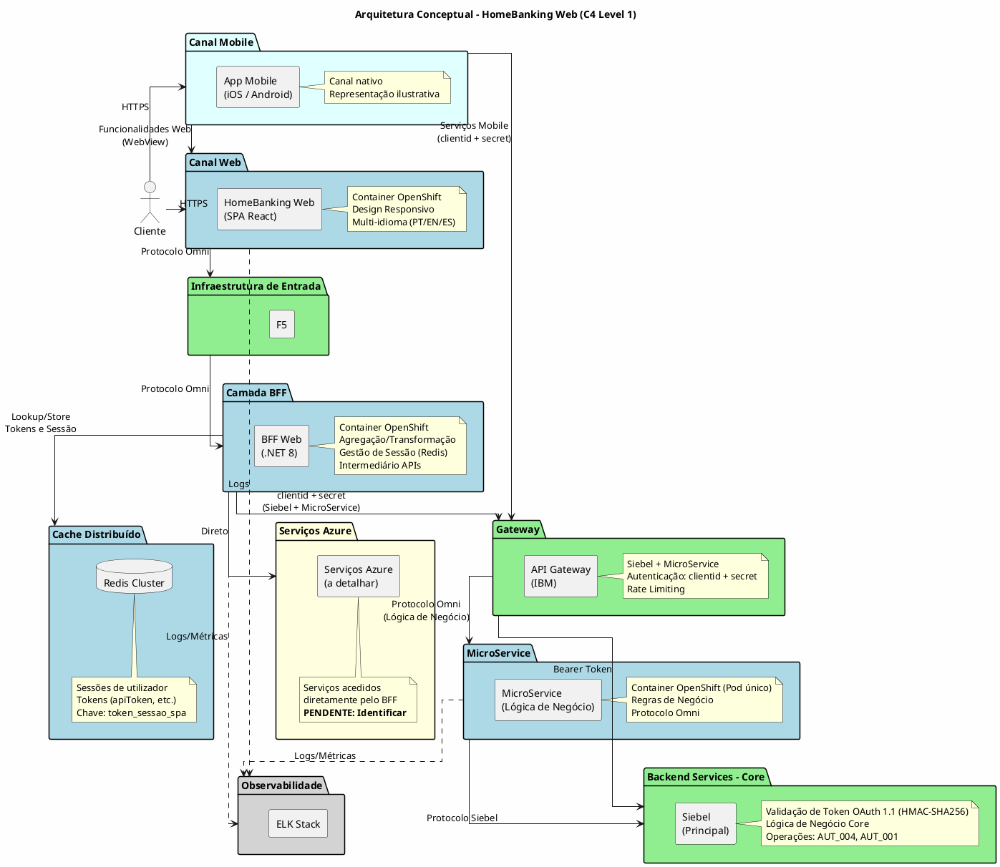
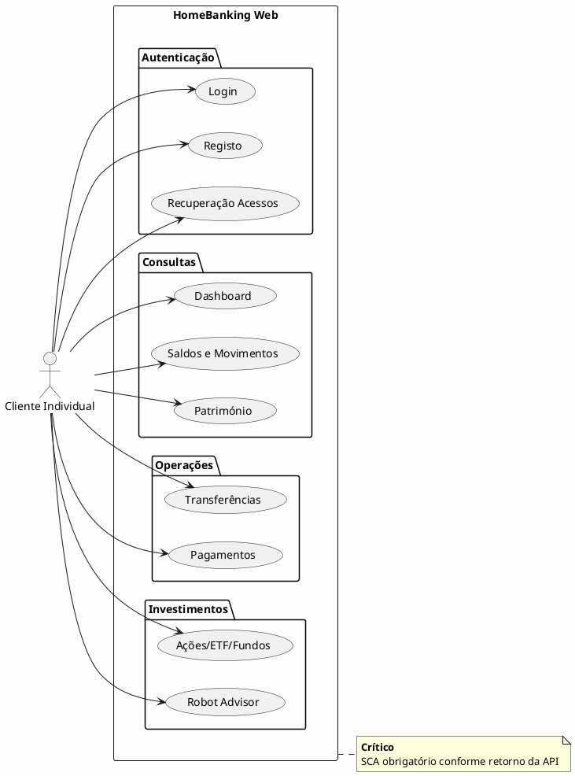

# 3. Visão Geral da Solução

## Definições e Decisões

> **Definições requeridas:**
> - [DEF-05-principios-arquitetura.md](../definitions/DEF-05-principios-arquitetura.md) - Status: completed
> - [DEF-06-casos-uso-principais.md](../definitions/DEF-06-casos-uso-principais.md) - Status: completed
>
> **Decisões relacionadas:**
> - [DEC-006-estrategia-containers-openshift.md](../decisions/DEC-006-estrategia-containers-openshift.md) - Status: accepted
> - [DEC-007-padrao-bff.md](../decisions/DEC-007-padrao-bff.md) - Status: accepted
> - [DEC-008-stack-observabilidade-elk.md](../decisions/DEC-008-stack-observabilidade-elk.md) - Status: accepted
> - [DEC-011-diagrama-arquitetura-unico.md](../decisions/DEC-011-diagrama-arquitetura-unico.md) - Status: accepted

## Propósito

Apresentar os princípios de arquitetura, diagrama conceptual e casos de uso principais da solução HomeBanking Web.

## Conteúdo

### 3.1 Princípios de Arquitetura

| Princípio | Decisão | Descrição |
|-----------|---------|-----------|
| **Cloud Strategy** | Containers OpenShift | Arquitetura orientada a containers, assente em OpenShift |
| **API Strategy** | BFF (Backend for Frontend) | Camada de agregação específica para o canal web, isolando sistemas legados |
| **Build vs Buy** | Preferência Build | Avaliação caso a caso, construir quando soluções de mercado forem caras ou inadequadas |
| **Acoplamento Legados** | Via BFF apenas | Frontend isolado de complexidades dos sistemas legados |
| **Observabilidade** | Stack ELK | Logs de aplicação e métricas centralizados |
| **Segurança** | _A definir_ | Avaliar Zero Trust e Defense in Depth |
| **Resiliência** | _A definir_ | Necessita aprofundamento |
| **Portabilidade** | _A definir_ | Necessita aprofundamento |

### 3.2 Diagrama Conceptual

> **Nota:** Este é o diagrama de referência principal da arquitetura. Todas as outras secções devem referenciar este diagrama em vez de duplicá-lo (ver [DEC-011](../decisions/DEC-011-diagrama-arquitetura-unico.md)).
A representação do canal mobile é meramente ilustrativa para efeitos de clareza em como se ligam os canais na arquitetura proposta.

#### Legenda

| Cor | Significado |
|-----|-------------|
| Azul | Componentes novos (a desenvolver): SPA, BFF, MS, Redis |
| Verde | Componentes existentes (reutilizar): F5, API Gateway, Siebel |
| Amarelo | Componentes a detalhar (pendente): Serviços Azure |
| Cinza | Infraestrutura transversal |

#### Protocolos de Comunicação

> **Nota sobre Protocolos:**
> - **Protocolo Omni:** Padronização sobre REST utilizada para comunicação SPA↔F5↔BFF e BFF→Gateway→MicroService
> - **OAuth + SHA256:** Utilizado para comunicação BFF↔Siebel (autenticação PSD2)
> - **OAuth 1.1 HMAC:** Utilizado para comunicação BFF↔Siebel (APIs bancárias)
> - **BEST:** Protocolo existente para comunicação BFF↔API Gateway
> - **Siebel:** Protocolo existente para comunicação API Gateway/MS↔Siebel

#### Fluxo de Autenticação

| Origem | Destino | Mecanismo | Protocolo |
|--------|---------|-----------|-----------|
| SPA | F5 | Cookie de Sessão (token_sessao_spa, HttpOnly, Secure, SameSite=Strict) | Omni |
| F5 | BFF | Cookie de Sessão (propagado) | Omni |
| BFF | Redis | Lookup por token_sessao_spa → tokens do utilizador | - |
| BFF | API Gateway (IBM) | ClientID + ClientSecret | Omni / BEST |
| API Gateway | MicroService | Protocolo Omni (roteado pelo GW) | Omni |
| API Gateway | Siebel | Bearer Token (propagado) - **Siebel valida** | Siebel |

> **Esclarecimento API Gateway:** O API Gateway IBM faz **apenas routing** dos pedidos para Siebel e MicroService, sem realizar autenticação. Toda a autenticação (validação de clientid+secret do BFF e validação do Bearer Token do utilizador) é realizada pelo **Siebel**.

> **Cenário Secundário - Web na App:** Embora não seja o fluxo primário, está prevista a possibilidade de haver funcionalidade web a correr dentro da app mobile nativa (WebView). Este cenário requer integração específica para navegação e biometria. Os detalhes serão definidos em fase posterior.

#### Pendências de Detalhe

| Item | Descrição | Responsável |
|------|-----------|-------------|
| Serviços Azure | Identificar quais serviços Azure são acedidos diretamente pelo BFF | Banco Best |
| Responsabilidades do MicroService | Identificar as responsabilidades específicas do MicroService | Banco Best/NextReality |

### 3.3 Componentes Principais

| Componente | Tipo | Responsabilidade | Tecnologia |
|------------|------|------------------|------------|
| **HomeBanking Web** | Frontend SPA | Interface do utilizador, experiência web responsiva | React |
| **F5** | Infraestrutura | Entrada de tráfego web | Existente |
| **BFF Web** | Backend | Lógica de UI, agregação, transformação, orquestração | .NET 8 |
| **Redis Cluster** | Cache | Sessões distribuídas, tokens | Existente |
| **MicroService** | Backend | Lógica de Negócio, regras de domínio (Pod único) | .NET 8 |
| **API Gateway** | Infraestrutura | Roteamento para Siebel e MicroService | IBM (Existente) |
| **Siebel** | Backend | Lógica de negócio core | Existente |
| **ELK Stack** | Observabilidade | Logs centralizados, métricas, dashboards | Existente |

### 3.4 Casos de Uso Principais

#### 3.4.1 Atores

| Ator                | Descrição                        | Prioridade |
| ------------------- | -------------------------------- | ---------- |
| Cliente Individual  | Cliente particular do Best | Principal  |
| Cliente Empresarial | _Futuro_                         | Secundário |

#### 3.4.2 Casos de Uso por Categoria

#### 3.4.3 Casos de Uso Críticos

| Caso de Uso | Criticidade | Requisitos Especiais |
|-------------|-------------|----------------------|
| **Login** | Alta | SCA obrigatório, ponto de entrada |
| **Transferências** | Alta | SCA obrigatório, operação financeira core |

#### 3.4.4 Requisitos de Autenticação

- **SCA (Strong Customer Authentication):** Obrigatório para todo o acesso à aplicação
- **Conformidade:** PSD2

### 3.5 Integração com Infraestrutura Existente

> **Diagrama:** Ver secção 3.2 (Diagrama Conceptual) para a visão completa da arquitetura.

A integração segue o modelo definido no diagrama de referência (secção 3.2), com clara separação entre componentes novos e existentes:

| Componente | Origem | Ação | Observação |
|------------|--------|------|------------|
| Frontend Web (SPA React) | Novo | Desenvolver | Container OpenShift |
| BFF Web (.NET 8) | Novo | Desenvolver | Container OpenShift |
| MicroService (.NET 8) | Novo | Desenvolver | Pod único OpenShift, Protocolo Omni |
| Redis Cluster | Novo | Desenvolver | Sessões e tokens |
| F5 | Existente | Reutilizar | Entrada de tráfego web |
| API Gateway (IBM) | Existente | Reutilizar | Para Siebel e MicroService |
| Siebel | Existente | Reutilizar | Backend principal, lógica core |
| Serviços Azure | Existente | Reutilizar | Acesso direto pelo BFF |
| ELK Stack | Existente | Reutilizar | Logs e métricas |

## Entregáveis

- [x] Lista de princípios arquiteturais documentados
- [x] Diagrama conceptual de alto nível (C4 Level 1)
- [x] Descrição dos componentes principais
- [x] Diagrama de casos de uso
- [x] Mapeamento de integração com sistemas existentes

## Definições Utilizadas

- [x] [DEF-05-principios-arquitetura.md](../definitions/DEF-05-principios-arquitetura.md) - Status: completed
- [x] [DEF-06-casos-uso-principais.md](../definitions/DEF-06-casos-uso-principais.md) - Status: completed

## Decisões Referenciadas

- [x] [DEC-006-estrategia-containers-openshift.md](../decisions/DEC-006-estrategia-containers-openshift.md) - Status: accepted
- [x] [DEC-007-padrao-bff.md](../decisions/DEC-007-padrao-bff.md) - Status: accepted
- [x] [DEC-008-stack-observabilidade-elk.md](../decisions/DEC-008-stack-observabilidade-elk.md) - Status: accepted
- [x] [DEC-016-microservice-como-pod-unico.md](../decisions/DEC-016-microservice-como-pod-unico.md) - Status: accepted

## Itens Pendentes

| Item | Documento | Responsável |
|------|-----------|-------------|
| Princípios de Segurança (Zero Trust, Defense in Depth) | DEF-05-principios-arquitetura | Área de Segurança |
| Estratégia de Resiliência | DEF-05-principios-arquitetura | Arquitetura |
| Requisitos de Portabilidade | DEF-05-principios-arquitetura | Arquitetura |
| Casos de Uso com Terceiros | DEF-06-casos-uso-principais | Integração |
| Requisitos Offline | DEF-06-casos-uso-principais | Arquitetura |
