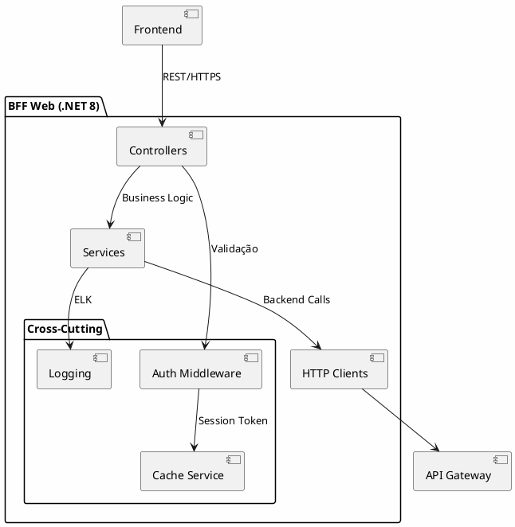
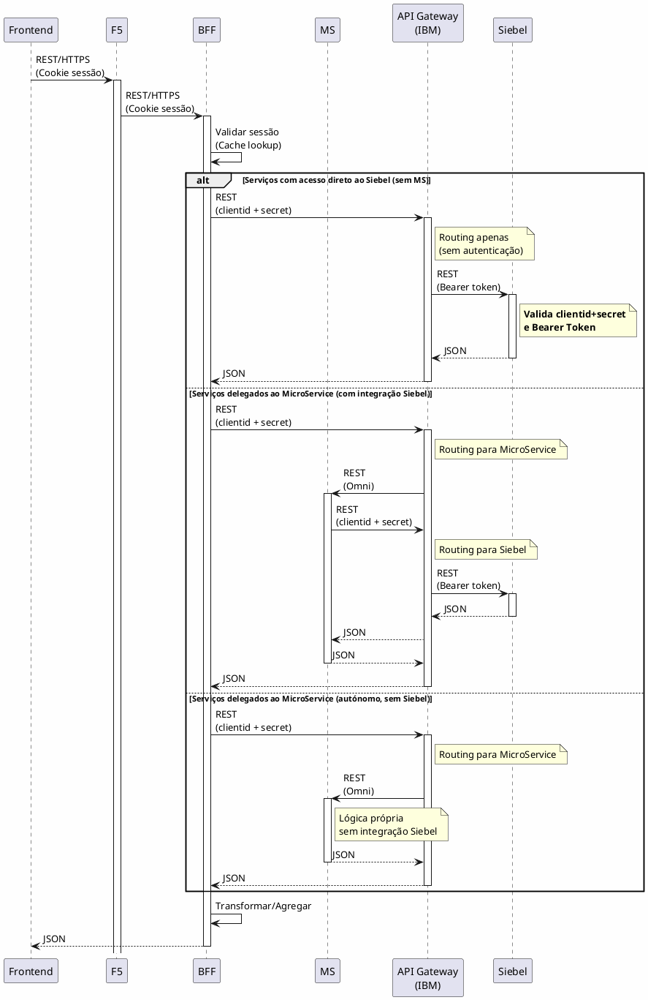

# 5. Arquitetura Backend & Serviços

## Propósito

Definir a decomposição de serviços, arquitetura de API, comunicação, modelo de domínio, rate limiting, resiliência, versionamento e especificação de APIs para o HomeBanking Web.

## Conteúdo

### 5.1 Decomposição de Serviços

> **Diagrama de Arquitetura:** Ver [Secção 3.2 - Diagrama Conceptual](SEC-03-visao-geral-solucao.md#32-diagrama-conceptual) para a visão geral da arquitetura.

A decomposição de serviços segue a arquitetura de referência definida na secção 3.2:

| Componente | Tipo | Ação | Tecnologia |
|------------|------|------|------------|
| Frontend Web | Novo | Desenvolver | React + TypeScript |
| BFF Web | Novo | Desenvolver | C# .NET 8 |
| API Gateway | Existente | Reutilizar | IBM |
| Siebel (Backend Principal) | Existente | Reutilizar | Valida tokens |
| Outros Backend Services | Existente | Reutilizar | A identificar |
| Serviços Azure | Existente | Reutilizar | Acesso direto pelo BFF |

#### Notas de Integração

| Fluxo | Autenticação | Observação |
|-------|--------------|------------|
| Frontend → BFF | Cookie de sessão | HttpOnly, Secure |
| BFF → API Gateway (IBM) | ClientID + ClientSecret | Para serviços via Siebel |
| BFF → MicroService | Via API Gateway IBM | MicroService acedido via Gateway (Protocolo Omni) |
| BFF → Serviços Azure | Direto | Serviços a identificar |
| API Gateway → Siebel | Bearer Token | **Siebel valida o token** |

> **Nota - Autenticação:** A autenticação é orquestrada pelo MicroService, que interage com o Siebel (AUT_004, AUT_001). O BFF gere a sessão web (cookies, cache de tokens) e propaga o cookie de sessão; a lógica de autenticação reside no MicroService e a validação final no Siebel.

### 5.2 Arquitetura BFF

#### 5.2.1 Visão Geral



#### 5.2.2 Stack Tecnológica

| Componente | Tecnologia |
|------------|------------|
| **Runtime** | .NET 8 |
| **Linguagem** | C# |
| **Container** | Assente em OpenShift |
| **Observabilidade** | ELK Stack |

#### 5.2.3 Responsabilidades

| Responsabilidade | Implementado | Observação |
|------------------|--------------|------------|
| Agregação de chamadas | Sim | Combinar múltiplas chamadas backend |
| Transformação de dados | Sim | Adaptar formato para frontend |
| Cache | Sim | Sessão e tokens |
| Autenticação/Autorização | Sim | OAuth 1.1, validação de sessão |
| Rate Limiting | Não | Responsabilidade do Gateway |

### 5.3 Arquitetura API

#### 5.3.1 Estilo e Formato

| Aspecto | Decisão |
|---------|---------|
| **Estilo** | REST |
| **Formato** | JSON |
| **Compressão** | gzip |
| **Especificação** | OpenAPI 3.1 |

#### 5.3.2 Versionamento

| Aspecto | Decisão | Exemplo |
|---------|---------|---------|
| **Estratégia** | URL path | `/web/ocb/bst/` |
| **Deprecação** | _A definir_ | - |

#### 5.3.3 Estrutura de Endpoints

```
/api/v1/
├── auth/
│   ├── login
│   ├── logout
│   ├── refresh
│   └── validate
├── accounts/
│   ├── {id}
│   ├── {id}/balance
│   └── {id}/movements
├── payments/
│   ├── transfers
│   └── bills
├── investments/
│   ├── portfolio
│   ├── orders
│   └── products
└── documents/
    ├── statements
    └── receipts
```

### 5.4 Comunicação entre Serviços




| Comunicação | Protocolo | Autenticação | Observação |
|-------------|-----------|--------------|------------|
| Frontend → BFF | REST/HTTPS | Cookie de sessão (HttpOnly, Secure) | - |
| BFF → API Gateway (IBM) | REST | ClientID + ClientSecret | Ponto de entrada para Siebel e MicroService |
| API Gateway → MicroService | REST (Omni) | Roteado pelo GW | MicroService pode ou não precisar do Siebel |
| MicroService → API Gateway (IBM) | REST | ClientID + ClientSecret | Apenas quando MicroService necessita do Siebel |
| API Gateway → Siebel | REST | Bearer Token (propagado) | **Siebel valida o token** |

> **Nota:** O BFF não tem API Gateway à frente. O API Gateway (IBM) é o ponto de entrada para Siebel **e** MicroService — o BFF roteia ambos via Gateway.
> **Nota:** Não há dados críticos no BFF

> **Nota Importante - Validação de Token:** O API Gateway (IBM) faz **apenas routing**, sem realizar autenticação. Toda a autenticação (validação de clientid+secret e validação do Bearer Token do utilizador) é realizada pelo **Siebel**. Serviços backend que não suportem Bearer Token diretamente são acedidos exclusivamente através do Siebel, que actua como camada de mediação.

### 5.5 Modelo de Domínio

O modelo de domínio segue as entidades já existentes nos backend services da app mobile:

| Domínio | Entidades Principais |
|---------|---------------------|
| **Autenticação** | User, Session, Credentials |
| **Contas** | Account, Balance, Movement |
| **Pagamentos** | Transfer, Payment, Beneficiary |
| **Investimentos** | Portfolio, Order, Product, Position |
| **Documentos** | Statement, Receipt |

### 5.6 Rate Limiting

| Aspecto | Decisão |
|---------|---------|
| **Responsabilidade** | API Gateway IBM (para chamadas aos Backend Services) |
| **No BFF** | Não implementado (BFF não tem APIGW à frente) |
| **Limites** | _A definir_ |
| **Comunicação** | Mensagem de erro informando necessidade de aguardar |

> **Nota:** O BFF não tem API Gateway à frente, pelo que o rate limiting é aplicado apenas nas chamadas do BFF para os Backend Services através do API Gateway IBM.

### 5.7 Resiliência

| Padrão | Status | Observação |
|--------|--------|------------|
| **Retry** | Não implementado | Erros transientes propagados ao utilizador (DEC-022) |
| **Timeout** | Implementado | Configurável por endpoint |
| **Fallback** | Parcial | Apenas autenticação |
| **Health Checks** | Implementado | Liveness + Readiness probes |
| **Circuit Breaker** | A definir | Proposta: Polly |
| **Bulkhead** | A avaliar | Depende da organização de serviços |

> **Nota - Organização de Serviços:** A arquitetura define um único MicroService Pod (DEC-016). A necessidade de Bulkhead deve ser avaliada internamente ao MicroService, por domínio funcional (ex: separação de threads/pools para operações críticas vs operações de consulta).

### 5.8 Versionamento API

| Aspecto | Decisão |
|---------|---------|
| **Estratégia** | URL path versioning |
| **Formato** | `/api/v{major}/resource` (rever em tempo de projeto) |
| **Política Deprecação** | _A definir_ |

### 5.9 Especificação API

| Aspecto | Decisão |
|---------|---------|
| **Formato** | OpenAPI 3.1 |
| **Geração** | Automatizada via Pipeline |
| **Publicação** | Swagger UI / ReDoc |

**Nota:** Especificações OpenAPI completas serão documentadas separadamente.

### 5.10 Dependências Críticas

| Dependência | Tipo | Impacto se Indisponível |
|-------------|------|------------------------|
| **API Gateway** | Externa | Serviço inoperante |
| **Backend Services** | Externa | Serviço inoperante |
| **Cache Store** | Externa | Sessões inválidas |
| **ELK Stack** | Externa | Degradação graceful (sem logs) |

> **Pendência:** Validar com negócio se degradação graceful sem logs é aceitável ou se é necessário fallback alternativo.

### 5.11 Autenticação e Sessão

#### Gestão de Sessão

| Aspecto | Decisão |
|---------|---------|
| **Identificador** | Cookie de sessão (HttpOnly, Secure) |
| **Token Storage** | Cache distribuído (chave = Session ID) |
| **Validação** | App ou OTP (SCA) |
| **Propagação** | Bearer token para backend services |

## Itens Pendentes

| Item | Responsável | Prioridade |
|------|-------------|------------|
| Circuit Breaker (biblioteca) | Arquitetura | Média |
| Comunicação assíncrona (se necessário) | Arquitetura | Média |
| Política deprecação API | Arquitetura | Baixa |

## Decisões Referenciadas

- [DEC-007-padrao-bff.md](../decisions/DEC-007-padrao-bff.md) - BFF Pattern
- [DEC-010-stack-tecnologica-backend.md](../decisions/DEC-010-stack-tecnologica-backend.md) - Stack Backend
- [DEC-011-diagrama-arquitetura-unico.md](../decisions/DEC-011-diagrama-arquitetura-unico.md) - Diagrama de referência único
- [DEC-016-microservice-como-pod-unico.md](../decisions/DEC-016-microservice-como-pod-unico.md) - MicroService como Pod único (via Gateway)
- [DEC-022-sem-estrategia-de-resubmissoes.md](../decisions/DEC-022-sem-estrategia-de-resubmissoes.md) - Sem estratégia de resubmissões
