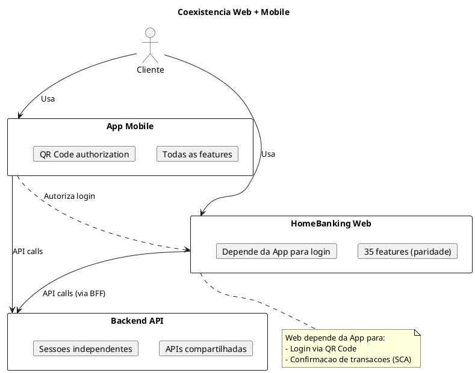

# 14. Plano de Migração & Implementação

## Definições e Decisões

> **Definicao:** [DEF-24-plano-migracao-implementacao.md](../definitions/DEF-24-plano-migracao-implementacao.md)

## Propósito

Definir o plano de migração e implementação do HomeBanking Web, incluindo roadmap, estratégia de cutover, coexistência com app mobile, critérios go/no-go, procedimentos de rollback, beta testing e período de hypercare.

## Conteúdo

### 14.1 Roadmap de Implementação
| Fase | Entregas |
|------|---------|
| **0: Setup** |  Infraestrutura, onboarding na pipeline CI/CD existente do cliente (DEC-014), ambientes, design system base |
| **1: Features** |  Restantes 35 funcionalidades (paridade mobile) |
| **2: Beta/UAT** |  Testes UAT, correções, pentest |
| **3: Go-Live** |  Cutover, lançamento controlado |
| **5: Hypercare** |  Suporte intensivo, monitorização, ajustes |

### 14.3 Estratégia de Cutover

A estratégia de cutover adotada é **Big Bang** (DEC-024): o HomeBanking Web será ativado simultaneamente para todos os utilizadores no momento do go-live. Esta abordagem resulta de exigência do cliente, simplicidade operacional e limitações técnicas que inviabilizam um rollout faseado.

Os detalhes operacionais, janelas de manutenção e procedimentos específicos são coordenados com as equipas do Banco Best. A aprovação do go/no-go é, neste modelo, crítica e não negociável — não existe possibilidade de regressão gradual por segmento de utilizadores após a ativação.

### 14.4 Coexistência com App Mobile

| Aspeto | Comportamento |
|---------|---------------|
| Sessões simultâneas | Permitidas (Web + Mobile) |
| Logout | Independente por canal |
| Tokens | Separados (App vs Web BFF) |

**Nota:** Ainda estamos a aprofundar a forma como a APP Mobile executar funcionalidades 100% WEB em contexto nativo.

### 14.5 Migração de Dados

O canal web é **stateless** e não requer migração de dados própria — todos os dados de negócio residem no backend existente que já serve a App Mobile. Quaisquer procedimentos de migração de configurações ou dados de suporte seguem os padrões e políticas definidos pelo Banco Best.

### 14.6 Critérios Go/No-Go

Os critérios de go/no-go, checklist pré-go-live e o comité de aprovação seguem os padrões de governance definidos pelo Banco Best. A equipa de desenvolvimento garante que os artefactos técnicos (testes E2E, pentest, SLOs, runbooks) estão prontos e validados antes de submeter ao processo de aprovação do cliente.

### 14.7 Procedimentos de Rollback

Os procedimentos de rollback seguem os padrões operacionais do Banco Best. Do lado da aplicação, a equipa disponibiliza suporte técnico através de feature flags (rollback instantâneo por feature) e de `kubectl rollout undo` (rollback de deployment), conforme os mecanismos de deploy da plataforma OpenShift do cliente (DEC-014).

### 14.8 Beta Testing

A estratégia de beta testing, incluindo fases, critérios de seleção de participantes e canais de recolha de feedback, é definida e coordenada pelo Banco Best. A equipa de desenvolvimento participa fornecendo suporte técnico, correção de bugs e análise de métricas durante o período de testes.

### 14.9 Hypercare Period

O período de hypercare após go-live é gerido de acordo com os padrões do Banco Best. A equipa de desenvolvimento assegura disponibilidade técnica para resolução de incidentes, ajustes de performance e suporte a operações durante o período acordado com o cliente.

## Decisões Referenciadas

- [DEC-006-estrategia-containers-openshift.md](../decisions/DEC-006-estrategia-containers-openshift.md) - Deploy strategy
- [DEC-014-adocao-de-cicd-e-deployment-existentes-do-cliente.md](../decisions/DEC-014-adocao-de-cicd-e-deployment-existentes-do-cliente.md) - Onboarding na pipeline é coordenado com o cliente
- [DEC-024-estrategia-cutover-big-bang.md](../decisions/DEC-024-estrategia-cutover-big-bang.md) - Estratégia de cutover Big Bang

## Definições Utilizadas

- [DEF-24-plano-migracao-implementacao.md](../definitions/DEF-24-plano-migracao-implementacao.md) - Detalhes completos
- [DEF-04-requisitos-nao-funcionais.md](../definitions/DEF-04-requisitos-nao-funcionais.md) - SLAs
- [DEF-20-arquitetura-operacional.md](../definitions/DEF-20-arquitetura-operacional.md) - CI/CD e Deploy
