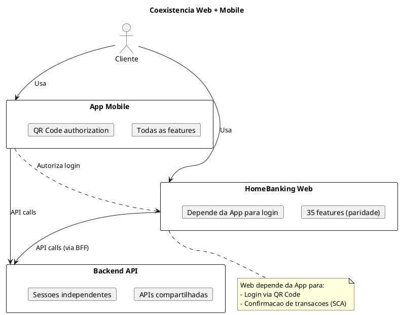

# 14. Plano de Migracao & Implementacao

## Definições e Decisões

> **Definicao:** [DEF-24-plano-migracao-implementacao.md](../definitions/DEF-24-plano-migracao-implementacao.md)

## Proposito

Definir o plano de migracao e implementacao do HomeBanking Web, incluindo roadmap, estrategia de cutover, coexistencia com app mobile, criterios go/no-go, procedimentos de rollback, beta testing e periodo de hypercare.

## Conteudo

### 14.1 Roadmap de Implementacao
| Fase | Entregas |
|------|---------|
| **0: Setup** |  Infraestrutura, onboarding na pipeline CI/CD existente do cliente (DEC-014), ambientes, design system base |
| **1: Features** |  Restantes 35 funcionalidades (paridade mobile) |
| **2: Beta/UAT** |  Testes UAT, correcoes, pentest |
| **3: Go-Live** |  Cutover, lancamento controlado |
| **5: Hypercare** |  Suporte intensivo, monitorizacao, ajustes |

### 14.3 Estrategia de Cutover

A estrategia de cutover segue os padroes e processos definidos pelo Banco Best, incluindo a abordagem de lancamento gradual (Phased Rollout) com Feature Flags. Os detalhes operacionais, janelas de manutencao e procedimentos especificos sao coordenados com as equipas do Banco Best.

### 14.4 Coexistencia com App Mobile

| Aspecto | Comportamento |
|---------|---------------|
| Sessoes simultaneas | Permitidas (Web + Mobile) |
| Logout | Independente por canal |
| Tokens | Separados (App vs Web BFF) |

**Nota:** Ainda estamos a aprofundar a forma como a APP Mobile executar funcionalidades 100% WEB em contexto nativo.

### 14.5 Migracao de Dados

O canal web e **stateless** e nao requer migracao de dados propria — todos os dados de negocio residem no backend existente que ja serve a App Mobile. Quaisquer procedimentos de migracao de configuracoes ou dados de suporte seguem os padroes e politicas definidos pelo Banco Best.

### 14.6 Criterios Go/No-Go

Os criterios de go/no-go, checklist pre-go-live e o comite de aprovacao seguem os padroes de governance definidos pelo Banco Best. A equipa de desenvolvimento garante que os artefactos tecnicos (testes E2E, pentest, SLOs, runbooks) estao prontos e validados antes de submeter ao processo de aprovacao do cliente.

### 14.7 Procedimentos de Rollback

Os procedimentos de rollback seguem os padroes operacionais do Banco Best. Do lado da aplicacao, a equipa disponibiliza suporte tecnico atraves de feature flags (rollback instantaneo por feature) e de `kubectl rollout undo` (rollback de deployment), conforme os mecanismos de deploy da plataforma OpenShift do cliente (DEC-014).

### 14.8 Beta Testing

A estrategia de beta testing, incluindo fases, criterios de selecao de participantes e canais de recolha de feedback, e definida e coordenada pelo Banco Best. A equipa de desenvolvimento participa fornecendo suporte tecnico, correcao de bugs e analise de metricas durante o periodo de testes.

### 14.9 Hypercare Period

O periodo de hypercare apos go-live e gerido de acordo com os padroes do Banco Best. A equipa de desenvolvimento assegura disponibilidade tecnica para resolucao de incidentes, ajustes de performance e suporte a operacoes durante o periodo acordado com o cliente.

## Decisoes Referenciadas

- [DEC-006-estrategia-containers-openshift.md](../decisions/DEC-006-estrategia-containers-openshift.md) - Deploy strategy
- [DEC-014-adocao-de-cicd-e-deployment-existentes-do-cliente.md](../decisions/DEC-014-adocao-de-cicd-e-deployment-existentes-do-cliente.md) - Onboarding na pipeline é coordenado com o cliente

## Definicoes Utilizadas

- [DEF-24-plano-migracao-implementacao.md](../definitions/DEF-24-plano-migracao-implementacao.md) - Detalhes completos
- [DEF-04-requisitos-nao-funcionais.md](../definitions/DEF-04-requisitos-nao-funcionais.md) - SLAs
- [DEF-20-arquitetura-operacional.md](../definitions/DEF-20-arquitetura-operacional.md) - CI/CD e Deploy
