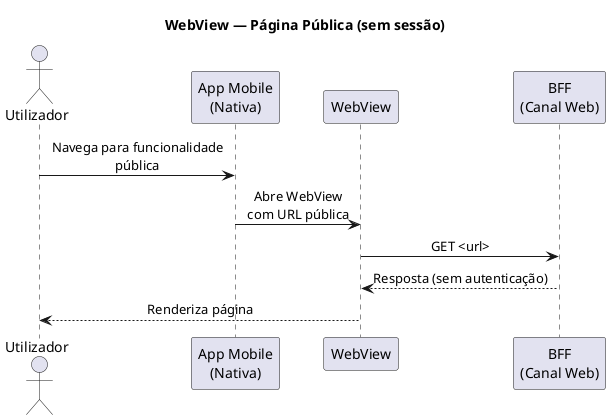
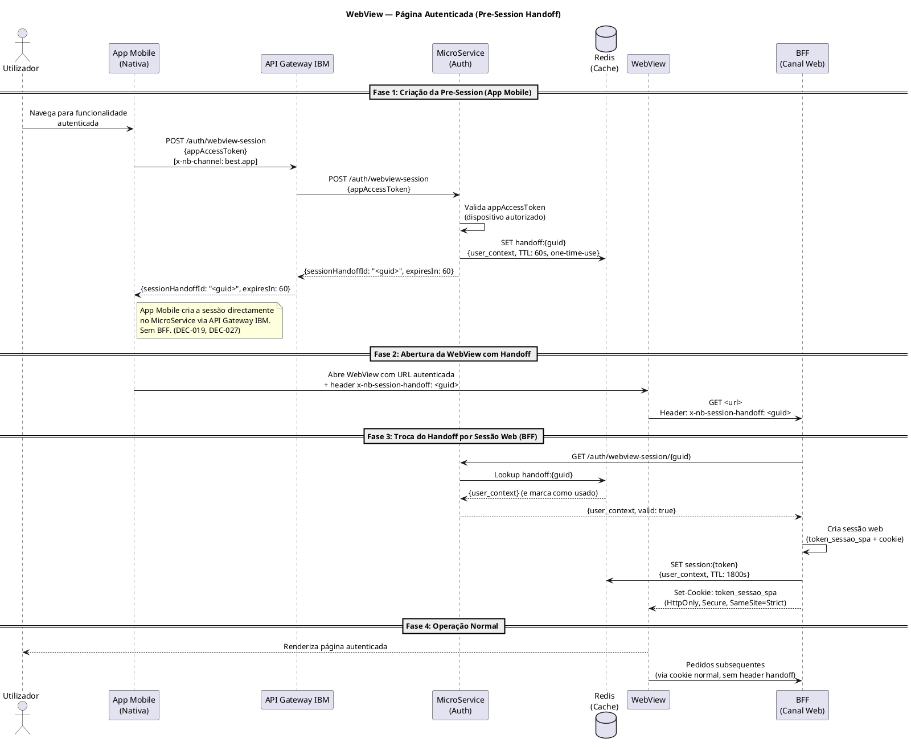
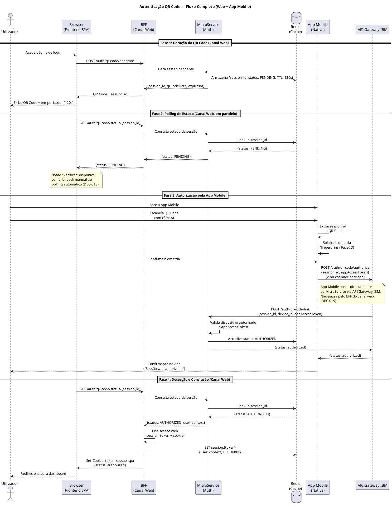

# 16. App Mobile — Funcionalidades e Autenticação

Esta secção documenta o papel da App Mobile nativa (iOS e Android) no contexto do projeto HomeBanking Web: como participa no fluxo de autenticação do canal web via QR Code, como navega para páginas web autenticadas via mecanismo de pre-session (DEC-027), e como se prevê que a App Mobile execute funcionalidades que residem 100% na camada web.

---

## 16.1 Papel da App Mobile no Ecossistema

O HomeBanking Web é um canal independente da App Mobile nativa. No entanto, os dois canais partilham o mesmo backend e a App Mobile tem um papel central em dois cenários:

1. **Autorizador de sessões web** — a App é o segundo fator de autenticação do canal web via QR Code (DEC-001).
2. **Host de funcionalidades web** — funcionalidades 100% web que possam ser executadas dentro da App Mobile através de WebView (cenário a detalhar).

A App Mobile tem a sua própria arquitectura de integração e **não utiliza o BFF do canal web** em nenhum momento — o BFF é exclusivo do canal web. Quando a App Mobile precisa de comunicar com o backend, faz-o directamente via API Gateway IBM com as suas próprias credenciais (DEC-019).

---

## 16.2 Funcionalidades 100% Web na App Mobile (WebView)

Existe um conjunto de funcionalidades que são desenvolvidas exclusivamente para o canal web (tecnologia 100% Web) mas que deverão estar disponíveis dentro da App Mobile nativa. A abordagem é a incorporação via **WebView** nativa, onde a App carrega uma URL do HomeBanking Web num contentor de browser embutido.

A navegação da App para páginas web divide-se em dois casos, conforme a página exige ou não autenticação (DEC-027).

### 16.2.1 Caso A — Páginas Públicas

Para páginas que não requerem sessão autenticada (ex: informação institucional, calculadoras, landing pages), a App Mobile abre a WebView directamente para a URL sem qualquer mecanismo de sessão.

### 16.2.2 Caso B — Páginas Autenticadas (Pre-Session Handoff)

Para páginas que requerem sessão autenticada, a App Mobile utiliza o mecanismo de **pre-session** (DEC-027): cria uma sessão web antecipadamente e passa o identificador à WebView via header HTTP.

### 16.2.3 Header de Handoff

| Atributo | Valor |
|----------|-------|
| **Nome do header** | `x-nb-session-handoff` |
| **Valor** | GUID devolvido pelo endpoint `/auth/webview-session` |
| **Enviado por** | App Mobile ao abrir a WebView |
| **Lido por** | BFF no primeiro pedido da WebView |
| **TTL** | 60 segundos (one-time-use — inválido após primeira troca) |
| **Âmbito** | Apenas no pedido inicial; pedidos subsequentes usam o cookie normal |

### 16.2.4 Considerações de Integração Restantes

| Dimensão | Consideração | Estado |
|----------|-------------|--------|
| **Navegação** | Gestos e navegação nativos vs comportamento web (back, deep links) | A definir |
| **Biometria** | A WebView pode invocar biometria nativa da App para operações sensíveis | A definir |
| **Aparência** | A WebView deve ter aspecto integrado (sem barras de browser, cor do status bar, etc.) | A definir |
| **Conectividade** | Comportamento offline/degradado dentro da WebView | A definir |

> Estes pontos serão detalhados em coordenação com a equipa de desenvolvimento da App Mobile do Banco Best, e as decisões resultantes documentadas como DECs neste projeto.

---

## 16.3 Autenticação via QR Code — Papel da App Mobile

O fluxo de autenticação QR Code é o mecanismo primário de login no HomeBanking Web (DEC-001). A App Mobile é o autorizador neste fluxo, e o seu papel é distinto do canal web.

### 16.3.1 Visão Geral do Fluxo

O fluxo envolve dois actores a operar em paralelo e de forma assíncrona:

- **Canal Web (Browser + BFF):** gera o QR Code, apresenta-o ao utilizador, e aguarda confirmação via polling HTTP.
- **App Mobile:** lê o QR Code com a câmara, solicita biometria ao utilizador, e confirma a autorização diretamente no MicroService.

### 16.3.2 Responsabilidades da App Mobile no Fluxo QR Code

| Etapa | Responsabilidade da App | Detalhe |
|-------|------------------------|---------|
| Leitura do QR Code | Câmara nativa | Extrai o `session_id` codificado no QR Code |
| Autenticação do utilizador | Biometria nativa (DEC-023) | Fingerprint ou Face ID — **sem PIN** |
| Confirmação de autorização | POST directo ao MicroService (DEC-019) | Via API Gateway IBM com `appAccessToken` próprio |
| Feedback ao utilizador | UI nativa da App | Confirma que a sessão web foi autorizada |

### 16.3.3 Credenciais e Segurança

A App Mobile autentica-se no API Gateway IBM com as suas **próprias credenciais** (`appAccessToken`), distintas das credenciais do BFF. Esta separação garante que:

- O BFF do canal web não tem visibilidade nem controlo sobre as credenciais da App Mobile.
- Comprometer o BFF não compromete a App Mobile e vice-versa.
- Cada canal tem o seu contexto de autorização isolado.

A confirmação biométrica é processada nativamente pelo sistema operativo (iOS/Android) — a App nunca acede ao template biométrico, apenas recebe o resultado da validação do SO.

### 16.3.4 Fallback de Autenticação

Quando o utilizador não pode ou não consegue utilizar o QR Code, estão disponíveis métodos alternativos (DEC-001):

| Método Fallback | Disponibilidade | Nota |
|----------------|----------------|------|
| SMS OTP | Dependente das configurações do utilizador | Backend gere o envio do OTP |
| App Push Notification | Dependente das configurações do utilizador | A App recebe push e o utilizador confirma |

---

## 16.4 Checklist de Decisões e Dependências

| Item | Referência | Estado |
|------|-----------|--------|
| Estratégia de autenticação QR Code | DEC-001 | Accepted |
| QR Code com fallback de verificação manual | DEC-018 | Accepted |
| App Mobile acede MicroService directamente | DEC-019 | Accepted |
| Sem PIN como input de autenticação | DEC-023 | Accepted |
| Handoff de sessão App Mobile → WebView via pre-session | DEC-027 | Accepted |
| Header `x-nb-session-handoff` para identificação da pre-session | DEC-027 | Accepted |
| Lista de funcionalidades 100% web disponíveis na App | A definir | Pendente |
